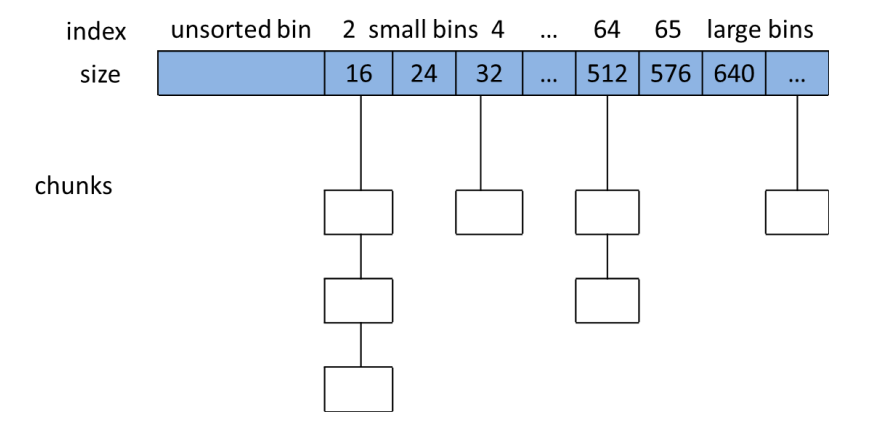

# 实验2 内存管理与内存分配器实现

## 实验目的

- 使用显式空闲链表实现一个64位堆内存分配器
  - 实现两种基本搜索算法
  - 实现堆内存的动态扩容
  - 实现实时的分配器内存使用情况统计
- 学会以动态链接库的形式制作库并使用
- 体会系统实验数据的测量和分析过程

## 实验环境

- OS: Ubuntu 24.04.4 LTS
- 无需在QEMU下调试

## 实验时间安排

> 注：此处为实验发布时的安排计划，请以课程主页和课程群内最新公告为准

-  4.25晚实验课，讲解实验、检查实验
-  4.27晚实验课，检查实验
-  5.2假期期间，无实验课及实验检查
-  5.9晚实验课，检查实验
-  5.16晚及之后实验课，补检查实验

> 补检查分数照常给分，但会有标记记录此次检查未按时完成，标记会在最后综合分数时作为一种参考。


## 友情提示

- **本实验难度较大，目的是为了拉开区分度，将同学们的平时投入体现在期末总评之中，同时锻炼较为优秀的同学的系统设计能力与代码能力。本实验在设计时的目标并不是让所有同学都能轻易拿到满分。**
- 如果同学们遇到了问题，请先查询在线文档。在线文档地址：[https://docs.qq.com/sheet/DU1JrWXhKdFFpWVNR](https://docs.qq.com/sheet/DU1JrWXhKdFFpWVNR)

# 目录

[TOC]

# 实验总览

> 为了大家无需完整阅读长篇实验文档就能开始实验，我们将需要大家完成的任务整理到了本节中。

本次实验要求大家实现一个自己的内存分配器，具体而言，你需要：

* 补全提供代码中的`./malloclab/memlib.c`和`./malloclab/mm.c`两个文件，正确实现`mm_malloc`和`mm_free`的功能。（参考代码中TODO部分。）
  * 实验中内存分配器是基于显式空闲链表实现的，你可参考[第二部分](#第二部分 内存分配器代码与实现流程)中的具体介绍。
  * 你需要分别实现 best-fit 和 first-fit 两种分配策略，请参考[分配策略](#2.3.5 分配策略)。
* 在`mm.c`中适当位置添加记录内存用量的代码，以统计分配器内存使用率。
* 使用`./trace/run.sh`对自己的内存分配器进行测试，并比较 best-fit 和 first-fit 两种策略的性能差异。请参考[调用方法](#3.2 基于动态链接库的malloc库调用方法介绍)。

为了降低同学们的上手难度，我们还提供了一个**更简单版本的内存分配器**代码（`./malloclab-simple`）。你也可以选择先完成这部分代码，以简单了解内存分配器的结构和接口。

> **这部分代码不是必做的，完成`./malloclab`中的内容就能获得全部分数，但只完成`./malloclab-simple`也能获得部分分数。请参考[实验评分标准](#4.2 实验评分标准)**。我们鼓励你在4月27日前完成该部分。（根据基础不同，我们预计完成该部分所需时间在30分钟~3小时之间。）

> 注：简单版本的代码只分配内存，不会对内存进行回收。代码量共100行左右，能更清晰地展示内存分配器的基本结构。

为了完成这部分代码，你需要：

* 补全`./malloclab-siimple/mm.c`中的代码。（参考代码中TODO部分。）
* 阅读`./example.c`，使用`make`编译并运行`./example`。
* 使用`./trace/run-simple.sh`测试正确性。（可能需要先`chmod a+x ./trace/run-simple.sh`为脚本增加执行权限。）

对简单版本的内存分配器的进一步介绍，请参考[简单的内存分配器](#2.0 简单的内存分配器)。

------

# 第一部分 内存管理及内存分配器的基本概念与原理

## 1.1 内存管理总览

我们在理论课程中涉及到了操作系统内存管理的最重要抽象**虚拟地址**以及其底层实现机制**页表**。实际上，真实的操作系统（我们以Linux为例）在内存管理上增加了更多细节，如下图所示。在页表之上，页面分配器负责向上层的内核内存模块返回页框，其中，针对于页表管理及DMA的连续物理内存页需求，伙伴系统（buddy system）提供了低碎片化的物理页框管理。对于内核态函数来说，页框粒度的分配与释放过于粗糙，slab分配器将页框切分为更小的“对象”，并且使用高速缓存来加速对象分配与释放的过程。


上面提到的内存管理是面向内核态的，而面向用户态的内存管理还需要一座桥梁——系统调用及用户态API（下图的`sys_brk()`、`malloc()`等等）。我们本次实验的核心就是完成用户态堆空间的内存管理，即完成动态内存分配器的设计。

## 1.2 内存分配的原理

我们在课上学到了内存分配的底层系统调用`brk()`，它可以让你的应用程序堆空间向上增长一定的范围，从而分配更多的内存。在linux内核中，除了`brk()`，还有一种很常用的、同样向内核申请内存的系统调用`mmap()`，它可以在堆和栈之间未被分配的内存空间中，以用户定义或者内核自己决定的方式从一个特定的地址开始分配一块内存，而非依靠堆的增长来分配。如下图所示，32位操作系统中的堆、栈和mmap各自从不同的起始地址开始在不同的区域增长、分配。（顺便提一句，这里有个random offset是为了不让恶意用户猜到起始地址，并通过缓冲区溢出等方式非法获取你的内存）。


那么为什么有了`brk()`，还需要有`mmap()`呢？不难理解，mmap是一种更为自由的分配方式，尤其是在回收已分配的内存空间时。如果brk先增长了2GB然后又增长了4KB，只要这4KB还在占用，2GB的内存空间就算是不用了，也无法被即时的回收，因为brk只有从堆顶向下移动的方式来回收，而被4KB的使用“卡住”。而mmap中的内存块是单独存在的，释放也是经由专有接口`munmap()`来释放，所以在mmap的2GB内存用完之后，可以直接调用`munmap()`还给内核。

mmap虽然更为灵活，但也带来了更长的分配延迟，因为mmap需要搜索空闲空间，确认是否可以分配，而brk直接增长堆顶指针就可以了。这里就出现了一对trade-off：mmap更灵活，brk更快。

> 注：在我们学到按需调页之后会知道，这里分配的其实只是虚拟内存空间，在实际访问时才会触发缺页中断实际分配内存。

## 1.3 内存分配器的作用

> 内核提供了分配内存的接口，用户可以直接调用，为什么还需要用户使用内存分配器呢？

前面学到，系统调用的过程需要从用户态进入内核态，处理完成后再回到用户态，这种用户态和内核态的切换是有明显开销的。因此，在我们经常会用到的内存申请这一操作中，如果每次内存申请都去调用内存分配，就类似于我们每次买书都去找出版社买。系统工程师们给出的解决方案就是在用户态提供一个内存分配器，它一次“批发”一定量的内存，然后用户调用的时候作“零售”，如果“存货”不够了就再去“进货”，相当于一个书店的作用。

内存分配器的作用不仅仅在于减少系统调用开销。买到的书看完了可以卖给书店，从而再转手给其他人，出版社一般不做这个。即，内存分配器可以把用户释放掉的内存，先临时保存，如果有新的内存申请，正好可以用掉这块内存，就再分配出去，这样既避免了回收内存给内核的开销，又减少了向内核申请内存的开销。

因此，编写应用程序时，使用一个内存分配器来保证时间和空间两方面的高效性，是很有必要的。

## 1.4 如何设计一个内存分配器

> 分配器并不是全世界一套的，甚至每个应用都可以自己实现一个适合自己的内存分配器。不同分配器的设计有哪些相同点，差别又在哪里？

最常用的内存分配器莫过于同学们大一就接触到的C语言中的`malloc()`，这个malloc其实只是glibc中的实现方式，它有一个更唯一的名字——ptmalloc。除了ptmalloc，比较著名的内存分配器还有Facebook的jemalloc、Google的tcmalloc和Microsoft的mimalloc，应用在各种小到个人应用、大到企业业务的场景下。

那么，内存分配器该如何设计呢？我们先从内存分配时延最低的思路出发。

内存分配器批发了一大块内存，如何更快的响应用户的请求呢？最简单的就是一次向内核申请一大块内存，类似于使用堆的方式做分配，用户需要多少，增加多少，然后返回增加的指针，在大块内存快用完时，再向内核申请新的。这样时延的问题保证了“最优”。

但是我们再考虑用户释放内存的重用，就会发现，堆只向上增长，是没考虑重用的。怎么办呢？我们必然要维护一个记录有空闲空间信息的数据结构，来保证可以在每次分配的时候都能用到那些释放了的内存。

维护这个数据结构，最简单的是使用一个空闲链表，插入释放的内存，删除要分配的内存（数组插入和删除开销更大），但是这样我们时延的最优就被牺牲了，遍历链表的开销是很大的，就算我们只是找到第一个可以放得下的空闲块（first-fit），最差时也要遍历整个链表。

截止到这里，我们的设计已经是一个“可以工作”的阶段了，书店的“仓库”使用堆来管理，“书架”使用链表来管理。本次实验的内容也是实现到这个程度，因为进一步的优化伴随着更为复杂的设计与大量的代码工程。但是我们可以简单了解一下，真正投入使用的内存分配器，又有哪些更进一步的优化方法：

- [ptmalloc](https://elixir.bootlin.com/glibc/latest/source/malloc)使用了多级链表来管理空闲空间以减少搜索的开销，16Byte一个链表，24Byte一个链表，以此类推；



- [jemalloc](http://jemalloc.net/)使用buddy tree减少内存分配中的碎片；
- [tcmalloc](https://github.com/google/tcmalloc)使用slab分配器和线程级cache来进一步降低分配的时延。

总的来讲，设计内存分配器主要围绕分配时延、内存空间利用率（内存碎片量、或者说内存浪费程度）以及多线程下的分配带宽三点性能来讨论，我们本次实验中会关注到前面两项最基础的性能指标，即单线程下的分配时延与分配器内存空间利用率，并引导大家发现first-fit和best-fit两种算法在两方面的优劣，理解其中的trade-off，即内存分配中也是No Silver Bullet的。

## 1.5 本实验中的内存分配器流程

1. 堆空间初始化，使用sbrk从内核申请5MB的空间，堆指针指向最低位置；
1. 内存分配器初始化，堆空间中取4KB空间（堆指针向上增加4KB）加入到空闲链表；
1. 用户调用malloc函数申请`request_size`大小的内存；
1. 搜索空闲链表是否有符合条件的块（first-fit/best-fit），如果找到则转到6；
1. 没有符合条件的块，则内存分配器向堆空间申请max(4KB, request_size)大小的内存，做一次尝试合并（查看地址相邻的前后的块是否也是空闲的），加入空闲链表，并作为符合条件的块返回；
1. 对符合条件的块作处理，若该块分配过`request_size`大小的内存后还剩余较多内存（大于`MIN_BLK_SIZE`），则需先分割出空闲部分，加入空闲链表，然后将分配出去的块从空闲链表移除。

## 参考资料

- [《Computer Systems: A Programmer's Perspective 3rd》](https://linuxtools-rst.readthedocs.io/zh_CN/latest/tool/gdb.html) 
- [《Glibc 内存管理——Ptmalloc2源码分析》](https://paper.seebug.org/papers/Archive/refs/heap/glibc%E5%86%85%E5%AD%98%E7%AE%A1%E7%90%86ptmalloc%E6%BA%90%E4%BB%A3%E7%A0%81%E5%88%86%E6%9E%90.pdf)（如果想了解ptmalloc是如何设计实现的，非常推荐阅读）
- [《Understanding the Linux Virtual Memory Manager》](https://www.kernel.org/doc/gorman/) （深入理解计算机系统虚拟内存管理）
- [《Malloc tutorial》](https://danluu.com/malloc-tutorial/)

# 第二部分 内存分配器代码与实现流程

## 2.0 简单的内存分配器

> 简单版本的内存分配器并不是实验的必做部分，如果你有信心，也可以跳过这一节。但我们推荐你完成这部分实验，这样能使你更好地理解`malloclab`中的代码结构，帮助你更轻松地完成后续实验。**本部分代码量很少，需要阅读的代码约100行，需要完成的代码约10行。**

我们在`malloclab-simple`中提供了一个简单版本的内存分配器，让大家能更直观的理解内存分配器提供的接口，以及内存分配器和系统调用`sbrk`的关系。

> 在理论课程的学习中，我们了解到内存分配器可以通过调用`brk()`向内核申请空间。而实际上相关的系统调用有两个，分别是`brk()`和`sbrk()`，二者的声明如下：
>
> `int brk( const void *addr );`
> `void* sbrk ( intptr_t incr );`
> 这两个函数的主要作用，都是扩展堆的上界brk，且都是是系统调用函数。区别在于：
>
> - `brk()`的参数 `addr` 为设置的新的`brk`上界地址，返回增长的内存大小；
> - `sbrk()`的参数` incr `为需要申请的内存的大小，返回增长的内存空间的起始地址。
>
> 同学们可以自行通过`man`查看二者更详细的介绍。本次实验中，我们要求大家使用`sbrk()`来完成堆的扩展。它的返回值是堆上界brk的旧值，也即新增内存空间的开始位置，因此第一次调用`sbrk()`时，它的返回值可以作为堆空间的起始地址。

`malloclab-simple`中包含`mm.h`和`mm.c`两个文件，用于实现内存分配器，`example.c`文件，用于展示内存分配器的使用，以及`Makefile`文件，用于编译内存分配器及`example.c`。

内存分配器主要需要实现`malloc`和`free`两个接口，在我们的内存分配器里，这两个接口分别是`mm_malloc`和`mm_free`两个函数。另外，我们还需要实现`mm_init`函数，用于初始化内存分配器。

在简单版本的内存分配器中，`mm_init`通过`sbrk`在堆上提前预留 2MB 的内存，然后在每次`mm_malloc`时，都从该部分内存中分配，当剩余内存不足时，`mm_malloc`会再次调用`sbrk`，拓展堆的大小，以继续分配。而`mm_free`则不完成任何事（即我们不会尝试回收内存）。

主要使用到的全局变量如下表格和图片所示（注意在简单版本中，我们的分配粒度是`2MB`而不是`5MB`）。

| 变量            | 作用                                                         |
| --------------- | ------------------------------------------------------------ |
| `mem_start_brk` | 记录堆内存块的第一个字节地址                                 |
| `mem_brk`       | 记录已分配堆内存的最后一个字节的末尾地址（也即当前空闲内存的开始地址） |
| `mem_max_addr`  | 记录当前堆内存块的最大可用地址                               |


在本部分中，你需要按照上述分配思路，完成`mm_malloc`函数中的代码，实现正确的内存分配。

实现完成后，你可以在`malloc-simple`中使用`make`命令编译内存分配器和示例代码`example.c`，运行`./example`，会展示你的内存分配器六次分配内存的的地址。（你可以查看`example.c`来了解你的内存分配器是如何被使用的。）

你还可通过运行`./trace/run-simple.sh`，来在我们的工作负载上验证你的内存分配器，如果你的实现没有问题，程序应该能正常运行完20轮循环。（利用率显示nan是正常的，因为简单版本的代码中并没有实现内存利用率的计算。）

> 如果执行`./trace/run-simple.sh`时遇到权限问题，可尝试`chmod a+x ./trace/run-simple.sh`为脚本添加执行权限。

## 2.1 内存分配器与内核的交互模块

上一节中的内存分配器虽然简单，但有个严重的缺陷，即没法回收内存。当我们的程序需要不断分配和释放内存时（如在我们使用树等数据结构时），这样会导致严重的内存泄露，从而最终造成内存不足，程序崩溃。为此，我们需要设计能够回收被释放的内存的真正的内存分配器。为此，在这一节中，我们将讨论基于显示空闲链表的内存分配器设计。

首先，为了使我们的分配器逻辑更加清晰，我们上一节中调用`sbrk()`向内核申请内存空间的过程分离为一个单独的模块，它负责完成初始化时第一次sbrk申请内存，以及后续可用内存不够时再次调用`sbrk()`申请内存。我们将这部分功能放在文件`memlib.c`中。

要说明的一点：我们这里的设计中存在两个堆：

- 第一个堆是内存分配器向内核申请的**堆1**，这个堆1每次增长5MB，更改`mem_max_addr`；
- 第二个堆是内存分配器分配内存时，将堆1看作一个没分配过的**堆2**，每次以分配内存或者至少为4KB单位的增长堆2，更改`mem_brk`，然后堆2分配出去的进入内存分配器的空闲链表，最后被应用使用。

采用上述做法的主要原因如下：  

1. 堆1的设计是为了减少系统调用次数，每单次增长向内核申请5MB的空间，减少系统开销。
1. 堆2的设计是为了快速增长应用内存，如果我们发现空闲链表不能满足内存分配请求，就会增长堆2。
1. 功能的隔离，堆1是内存分配器和系统内核之间用的，堆2是内存分配器和应用之间用的，即内核--堆1-->内存分配器--堆2-->应用。


在本部分中，需要补充两个主要的功能函数，也就是初始化堆1和分配堆2的两个函数：

1. 堆1的初始化`mem_init()`

   比较简单，调用`sbrk()`获取5MB内存块，并记录对应的`mem_start_brk`、`mem_max_addr`和`mem_brk`。

2. 堆2的分配`mem_sbrk()`

   首先，记录旧的`mem_brk`，作为分配首地址返回。

   然后，分两种情况：如果加上incr之后`mem_brk`的值超过了当前的`mem_max_addr`，则证明堆1不够用了，需要再次调用`sbrk()`来增加堆1的大小，并修改相关变量，然后增加`mem_brk`。如果没有超过，就直接给`mem_brk`增加一个incr，增加堆2，即分配堆2。

   最后，返回旧的`mem_brk`。


以上内容的源代码在与内核交互的`memlib.c`中，后面我们将围绕内存分配器实际分配和回收应用内存的`mm.c`展开讲解。

## 2.2 内存分配器空闲块管理——隐式空闲链表

与课堂教学内容相似，实际代码中，隐式空闲链表将堆中的内存块按地址顺序串成一个链表，以块头的块大小数据作为计算下一块地址的依据。接受到内存分配请求时，分配器遍历该链表来找到合适的空闲内存块并返回，这意味着分配块的时间是与内存空间的块数成线性关系。当找不到合适的空闲内存块时(如:堆内存不足,或没有大小足够的空闲内存块)，向堆顶扩展更多的内存。隐式空闲链表如下图所示：


图中白色部分为未分配块，淡蓝色部分为已分配块，深蓝色为填充块（为了内存双字对齐）。含数方格为块头部，方格中的数字分别表示块的大小和该块是否分配出去（如8/0表示有一个8字节的空闲块，其中0表示未分配，1表示已分配）。

隐式空闲链表提供了一种简单的分配方式。但在隐式空闲链表方案中，块分配时间复杂度与堆中**块的总数**呈线性关系。为了进行改善，我们本次实验中主要设计和实现一种由双向链表组织的显式空闲链表方案。

## 2.3 内存分配器空闲块管理——显式空闲链表

### 2.3.1 块的格式

实际实现中通常将空闲块组织成某种形式的显式数据结构（如链表）。由于空闲块的空间是不用的，所以实现链表的指针可以存放在空闲块的主体里。例如，将堆组织成一个双向的空闲链表，在每个空闲块中，都包含一个`pred`（前驱）和`succ`（后继）指针，分配块和空闲块的格式如下图所示：


对比隐式空闲链表，显式双向空闲链表的方式使适配算法的搜索时间由**块总数的线性时间**减少到**空闲块数量的线性时间**，因为它不需要搜索整个堆，而只是需要搜索空闲链表即可。

如上图所示，与隐式空闲链表相比，分配块和空闲块的格式都有变化：

- 首先，分配块没有了脚部，这可以优化空间利用率。回想前面的介绍，当进行块合并时，只有当前块的前面邻居块是空闲的情况下，才会使用到前邻居块的脚部。如果我们把前面邻居块的已分配/空闲信息位保存在当前块头部中未使用的低位中（比如第1位中），那么已分配的块就不需要脚部了。但是，一定注意：空闲块仍然需要脚部，因为脚部需要在合并时用到。
- 其次，空闲块中多了`pred`（前驱）和`succ`（后继）指针。正是由于空闲块中多了这两个指针，再加上头部、脚部的大小，所以最小的块大小为**4个字**。

下面详细说明一下分配块和空闲块的格式：

- 分配块： 
  - 由头部、有效载荷部分、可选的填充部分组成。其中最重要的是头部的信息： 
    - 头部大小为一个字(64 bits)，
    - 其中第3-64位存储该块大小的高位。（因为按字对齐，所以低三位都0）
    - 第0位的值表示该块是否已分配，0表示未分配（空闲块），1表示已分配（分配块）。
    - 第1位的值表示该块**前面的邻居块**是否已分配，0表示前邻居未分配，1表示前邻居已分配。
- 空闲块： 
  - 由头部、前驱、后继、其余空闲部分、脚部组成。 
    - 头部、脚部的信息与分配块的头部信息格式一样。
    - 前驱表示在空闲链表中前一个空闲块的地址。后继表示在空闲链表中后一个空闲块的地址。前驱和后继是组成空闲链表的关键。

### 2.3.2 分配器初始化与扩容堆2操作

首先，分配器实现会涉及大量的指针操作，包括从地址取值/赋值，查找块头/块脚地址等。为了方便操作以及保障操作性能，我们在`mm.c`中定义了如下宏操作。

| 宏                      | 意义                                    |
| ----------------------- | --------------------------------------- |
| `WSIZE`                 | 字长                                    |
| `DSIZE`                 | 双字长                                  |
| `CHUNKSIZE`             | 内存分配器扩容最小单元                  |
| `PACK`                  | 块大小和分配位结合返回一个值            |
| `GET`/`PUT`             | 对指针p指向的位置取值/赋值              |
| `HDRP`/`FTRP`           | 返回bp指向块的头/脚部指针               |
| `PREV_BLKP`/`NEXT_BLKP` | 返回与bp相邻的上一/下一块               |
| `GET_PRED`/`GET_SUCC`   | 返回与空闲块bp相连的上一个/下一个空闲块 |

```c
/* Basic constants and macros */
#define WSIZE 8				/* Word and header/fonter size(bytes) */
#define DSIZE 16			/* Double word size(bytes) */
#define CHUNKSIZE (1 << 12)	 /* Extend heap by this amount (bytes) */
#define MAX(x, y) ((x) > (y) ? (x) : (y))

/* Pack a size and allocated bit into a word */
#define PACK(size, prev_alloc, alloc) ((size) & ~(1<<1) | (prev_alloc << 1) & ~(1) | (alloc))
#define PACK_PREV_ALLOC(val, prev_alloc) ((val) & ~(1<<1) | (prev_alloc << 1))
#define PACK_ALLOC(val, alloc) ((val) | (alloc))

/* Read and write a word at address p */
#define GET(p) (*(unsigned long *)(p))
#define PUT(p, val) (*(unsigned long *)(p) = (val))

/* Read the size and allocated fields from address p */
#define GET_SIZE(p) (GET(p) & ~0x7)
#define GET_ALLOC(p) (GET(p) & 0x1)

/* Given block ptr bp, compute address of it's header and footer */
#define HDRP(bp) ((char *)(bp) - WSIZE)
#define FTRP(bp) ((char *)(bp) + GET_SIZE(HDRP(bp)) - DSIZE)

/* Given free block ptr bp, compute address of its previous and next free block */
#define GET_PRED(bp) (GET(bp))
#define SET_PRED(bp, val) (PUT(bp, val))
#define GET_SUCC(bp) (GET(bp + WSIZE))
#define SET_SUCC(bp, val) (PUT(bp + WSIZE, val))

/* Given block ptr bp, compute address of next and previous blocks */
#define NEXT_BLKP(bp) ((char *)(bp) + GET_SIZE(((char *)(bp) - WSIZE)))
#define PREV_BLKP(bp) ((char *)(bp) - GET_SIZE(((char *)(bp) - DSIZE)))
/* Used for the sp place() function */ 
#define MIN_BLK_SIZE (2 * DSIZE)
```

> 提醒：请仔细阅读并理解上面的宏定义，它们会很有效地帮助你实现分配器。

#### (1) 分配器初始化

在开始调用`malloc()`分配内存前，需要先调用`mm_init()`函数初始化分配器。其主要工作是分配初始堆内存，分配序言块和尾块，以及初始化空闲链表，如下代码所示。

```c
/* 
 * mm_init - initialize the malloc package.
 */
int mm_init(void)
{
    /* 首先通过mem_sbrk请求4个字的内存(模拟sbrk) */
    if ((heap_listp = mem_sbrk(4 * WSIZE)) == (void *)-1)
        return -1;
    /* 	这四个字分别作为填充块（为了对齐）
     *	序言块头/脚部，尾块
     *	并将heap_listp指针指向序言块使其作为链表的第一个节点
     */
    PUT(heap_listp, 0);
    PUT(heap_listp + (1 * WSIZE), PACK(DSIZE, 1));
    PUT(heap_listp + (2 * WSIZE), PACK(DSIZE, 1));
    PUT(heap_listp + (3 * WSIZE), PACK(0, 1));
    heap_listp += (2 * WSIZE);
    /* 
     * 调用extend_heap函数向系统申请一个CHUNKSIZE的内存作为堆的初始内存
     */
    if (extend_heap(CHUNKSIZE / WSIZE) == NULL)
        return -1;
    return 0;
}
```

初始化的流程图如下图所示。

​                             

​                            

​                            

#### (2) 堆2的扩容

当brk管理的堆2内内存无法满足申请要求 (即经过查找，发现不存在满足当前申请内存大小的空闲块）时，分配器会向总内存堆1申请内存，进行内存扩容。涉及到堆1的操作都在增长堆2的`mem_sbrk()`中完成，所以我们这里主要讲堆1给堆2增长过内存后，堆2如何管理这些新增内存，如何与已有块合并、插入到空闲链表。

```c
/* extend_heap函数是对mem_sbrk的一层封装，接收的参数是要分配的字数，
 * 在堆初始化以及malloc找不到合适内存块时使用。
 * 它首先对请求大小进行地址对齐，然后调用mem_sbrk获取空间
 */
static void *extend_heap(size_t words)
{
    char *bp;
    size_t size;
    /* Allocate an even number of words to maintain alignment */
    size = (words % 2) ? (words + 1) * WSIZE : words * WSIZE;
    if ((long)(bp = mem_sbrk(size)) == -1)
        return NULL;
    /* Initialize free block header/footer and the epilogue header */
    PUT(HDRP(bp), PACK(size, 0));
    PUT(FTRP(bp), PACK(size, 0));
    PUT(HDRP(NEXT_BLKP(bp)), PACK(0, 1));
    
    /* Coalesce if the previous block was free */
    return coalesce(bp);
}
```

> 注意 : 这里实际操作是将扩展前的尾块作为了新空闲块的头块，然后在新的堆末尾分配一个新的尾块。

堆2内存中第一个字是一个为了内存对齐的填充字。填充字后面紧跟一个特殊的序言块，它是一个16字节的已分配块， 只由一个头部和一个脚部组成。序言块是在初始化时创建的，并且永不释放。序言块后面是普通块。堆的最后一个字 是一个特殊的结尾块，它是一个有效大小为0的已分配块，只由一个头部组成。

序言块和结尾块的作用是消除空闲块合并时的边界检查，在后续代码中可以看到这两个块的用途。

### 2.3.3 链表管理

在显式链表管理方案下，分配器维护一个指针`heap_listp`指向堆中的第一个内存块，也即序言块；另外，分配器还维护了另一个指针`free_listp`指向堆中的第一个空闲内存块。

- 访问空闲链表：当我们拥有某空闲块的地址`bp`，那么要想访问前一空闲块/后一空闲块，就可调用2.3.2中的`GET_PREV`和`GET_SUCC`宏获取其基地址，这相当于双向链表中的`prev()`和`next()`成员函数。
- 增删空闲链表：我们提供了`add_to_free_list`和`delete_from_free_list`两个接口，用来向双向链表中增加/删除空闲块。

### 2.3.4 分配块

按照代码执行流程，我们先介绍`mm_malloc()`函数，向堆申请`size`大小的内存并返回指针。

```c
/* 
 * mm_malloc - Allocate a block by incrementing the brk pointer.
 *     Always allocate a block whose size is a multiple of the alignment.
 */
void *mm_malloc(size_t size)
{
    size_t newsize;         /* Adjusted block size */
    size_t extend_size;     /* Amount to extend head if not fit */
    char *bp;

    /* Ignore spurious requesets */
    if (size == 0)
        return NULL;
    /* Adjust block size to include overhead and alignment reqs. */
    newsize = MAX(MIN_BLK_SIZE, ALIGN((size + WSIZE))); 

    /* Search the free list for a fit */
    #if FIRST_FIT
    if ((bp = find_fit_first(newsize)) != NULL)
    {
        place(bp, newsize);
        return bp;
    }
    #else
    if ((bp = find_fit_best(newsize)) != NULL)
    {
        place(bp, newsize);
        return bp;
    }
    #endif
    /*no fit found.*/
    extend_size = MAX(newsize, CHUNKSIZE);
    if ((bp = extend_heap(extend_size / WSIZE)) == NULL)
    {
        return NULL;
    }
    place(bp, newsize);

    return bp;
}
```

首先将申请内存大小加上块头/尾部大小并进行对齐，然后调用`find_fit_first()`或`find_fit_best()`函数（想想它们怎么实现）从内存块链表中找到合适的块，如果成功找到则调用`place()`函数判断是否需要对该块作分割操作。

如果查找失败则向系统请求分配更多堆内存。为了避免频繁请求，一次最少申请`CHUNKSIZE`大小的内存。

第18、24、30行使用了条件编译指令：`FIRST_FIT`宏取非零值时编译first-fit策略；`FIRST_FIT`取零值时编译best-fit策略。在3.1节与3.2节将看到，我们可以通过向Makefile脚本传入参数来控制宏定义并选择要编译的代码块。

### 2.3.5 分配策略

当我们调用`malloc()`发出一个内存分配请求时，分配器首先需要搜索堆中的内存块找到一个足够大的空闲块并返回。具体选择哪一个内存块由分配策略决定。主要有两种：

- 首次适配。从头开始搜索链表，找到第一个大小合适的空闲内存块便返回。
- 最佳适配。搜索整个链表，返回满足需求的最小的空闲块。

本次实验需要补充`find_fit_first()`和`find_fit_best()`两个函数的实现。从名字就可以看出，两个函数分别按照首次适配和最佳适配策略查找合适的空闲块。函数输入为申请空间大小 (指用户申请大小+分配块padding大小) ，返回值为分配块的地址。（不需要对块内的具体数据进行更改）

### 2.3.6 放置块与分割空闲块

本次实验需要补充`place()`函数的实现，它对应了我们的放置块部分。

当分配器找到一个合适的空闲块后，便会调用`place()`函数进行放置，将空闲块格式改为分配块格式。同时，如果空闲块大小大于请求的内存大小，则需要分割该空闲块，避免内存浪费。

具体步骤为：

- 修改空闲块头部，将空闲块从空闲链表中删除，将大小改为分配的大小，并标记该块为已分配。
- 为多余的内存添加一个块头部，记录其大小并标记为未分配，正确设置`PREV_ALLOC`域，并将其加入空闲链表，使其成为一个新的空闲内存块。
- 返回分配的块指针。

> 在函数的实现过程中，你还需要思考：**如果空闲块多余的空间不足以构成一个空闲块，那么还能将其放回空闲链表吗？分配后，邻居块的**`PREV_ALLOC`**域应该如何修改？**

### 2.3.7 释放块

当调用`mm_free()`释放某个块后，如果该块相邻有其他的空闲块，则需要调用`coalesce()`函数，将这些块合并成一个大的空闲块，避免出现“假碎片”现象（多个小空闲块相邻，无法满足大块内存分配请求）。另外，上一节提到的修改`PREV_ALLOC`域的操作已经在`mm_free()`函数中实现。

```c
/*
 * mm_free - Freeing a block does nothing.
 */
void mm_free(void *bp)
{
    size_t size = GET_SIZE(HDRP(bp));
    size_t prev_alloc = GET_PREV_ALLOC(HDRP(bp));
    void *head_next_bp = NULL;

    PUT(HDRP(bp), PACK(size, prev_alloc, 0));
    PUT(FTRP(bp), PACK(size, prev_alloc, 0));

     /*notify next_block, i am free*/
    head_next_bp = HDRP(NEXT_BLKP(bp));
    PUT(head_next_bp, PACK_PREV_ALLOC(GET(head_next_bp), 0));

    coalesce(bp);
}
```

> 思考：在`mm_free()`中实际上只修改了下一块**头部**信息中的`PREV_ALLOC`值，之后就调用了`coalesce`函数。为什么下一块**尾部**（若存在）中的`PREV_ALLOC`值在这里可以不做修改？（提示：和`coalesce`中合并空闲块的操作相关）

### 2.3.8 合并

上一节提到的合并操作在`coalesce()`函数中实现。同时，本次实验需要同学们完成`coalesce()`函数的编写。这里我们介绍一下合并的策略。

释放当前内存块时，根据相邻块的的分配状态，有如下四种不同情况：

1. 前面的块和后面的块都已分配；
1. 前面的块已分配，后面的块空闲；
1. 前面的块空闲，后面的块已分配；
1. 前后块都空闲。

以下为这四种情况的合并前后示意图，图示里中间大小为`size_2`的块即为当前释放的块：


图中块头部（尾部）中的信息从左到右依次为：块大小，前一块分配情况，当前块分配情况（a即alloc，表示已分配；f即free，表示空闲）

合并的流程如下所述：

- `coalesce()`函数首先从前一块的脚部后后一块的头部获取它们的分配状态。
- 然后根据前文所述的4种不同情况作相应处理，最后返回合并后的指针。
- 合并的过程中，要从空闲链表中删除合并前的空闲块并且插入合并后的空闲块。(`bp`一开始就不在空闲链表中，所以不需要删除它)
- 由于序言块和尾块的存在，不需要考虑边界条件，进行合并操作的块一定不会触及堆底和堆顶，因此不需要检查合并块位置。

> 提示：空闲块加入空闲链表，可以通过`add_to_freelist()`来完成；从空闲链表中删除块，可以通过`delete_from_freelist()`来完成。这两个函数已经被实现好，你无需改动。

```c
static void *coalesce(void *bp)
{
    size_t prev_alloc = GET_ALLOC(FTRP(PREV_BLKP(bp))); 
    size_t next_alloc = GET_ALLOC(HDRP(NEXT_BLKP(bp)));
    size_t size = GET_SIZE(HDRP(bp));
    /* 第一种情况 */
    if (prev_alloc && next_alloc)
    {
        /*  待补充 */
    }
    /* 第二种情况 */
    else if (prev_alloc && !next_alloc)
    {
        /*  待补充 */
    }
    /* 第三种情况 */
    else if (!prev_alloc && next_alloc)
    {
        /*  待补充 */
    }
    /* 第四种情况 */
    else
    {
        /*  待补充 */
    }
    return bp;
}
```

至此，一个显式链表管理方式的堆内存分配器实现完成。

# 第三部分 内存分配器的使用与测试

## 3.1 使用Makefile编译导出malloc动态库

上一次实验中，我们简单介绍了C标准库：它不仅完成了对基础系统调用的封装，还提供了许多必要功能服务的实现，比如动态内存分配。这样一来，平常我们编写C程序时，只需要声明头文件`stdlib.h`，即可调用C标准库函数 `malloc()`和 `free()`进行堆内存的申请与释放，而无需关心`malloc()`和 `free()`的底层实现。

现在，假设我们期望将自己设计的内存分配器进行推广使用，一个比较理想的方案是把分配器编译成为动态链接库的形式。之后，内存分配器的使用者只需要获取该动态库，即可在代码中使用`mm_malloc()`和`mm_free()`进行堆内存的动态分配/释放。

我们在 malloclab 目录下已经给出了所需的 Makefile，该Makefile无需改动：

```makefile
CC = gcc -g -fPIC 
CFLAGS = -Wall -DFIRST_FIT=$(FIRST_FIT) $(DEBUG)

all: libmem.so

libmem.so: memlib.o mm.o
	$(CC) $(CFLAGS) -shared -o libmem.so mm.o memlib.o

memlib.o: memlib.c memlib.h
mm.o: mm.c mm.h memlib.h

clean:
	rm -f *~ *.o libmem.so
```

其中：

- `libmem.so`是整个编译的 target，`.so`文件（shared object，共享目标）是linux系统下的动态链接库文件；
- 编译时，gcc的`-shared`参数表明产生共享库（动态库）；
- 编译参数中，`-DFIRST_FIT=$(FIRST_FIT)`表示定义`FIRST_FIT`宏并将`$(FIRST_FIT)`变量赋值给它。（`-UDEBUG`则表示取消宏定义）

在 malloclab 目录下执行`make FIRST_FIT={0|1} [DEBUG=-DDEBUG|DEBUG=-UDEBUG]` 命令，即可编译得到动态链接库 `libmem.so`。不过由于真实使用仍然需要较为繁琐的编译设置（3.2节会介绍），我们仍然推荐使用下面的测试脚本验证自己程序的正确性，我们的脚本已经把编译设置完成了。

## 3.2 基于动态链接库的malloc库调用方法介绍

**简而言之：**你可以通过在实验的根目录执行以下命令，来运行测试脚本：

```bash
bash ./trace/run.sh --first-fit
```

当然，将`--first-fit`更换为`--best-fit`可以测试最佳匹配。

为了让`mm_check`有实际的输出，你可以增加`--debug`参数，来启用日志：

```bash
bash ./trace/run.sh --first-fit --debug
```

> 你也可以使用`./trace/run.sh --first-fit`这样的方式执行脚本，但你可能遇到没有执行权限的问题。
>
> 这时候，你可以使用`chmod a+x ./trace/run.sh`为该脚本添加执行权限。

如果你对测试脚本干了什么感兴趣，下面是我们的执行的测试负载的简介：

现在我们已经得到了内存分配器对应的动态链接库。之后，我们可以在自己的程序中引用头文件`mm.h`和 `memlib.h`，并调用函数 `mm_malloc`和`mm_free`来进行内存的动态申请/释放，正如你之前声明头文件`stdlib.h`并调用 `malloc()`和 `free()` 一样。我们提供的测试程序是 trace 目录下的 `workload.cc`，其中声明头文件、调用`mm_malloc`/`mm_free`的过程比较简单，不再赘述。

值得注意的是，malloc 和 free 的可执行程序存放在C标准库 libc 中，编译器会自动完成对 `libc.so` 的链接；而3.1中得到的动态库 `libmem.so` 无法被自动链接，需要我们显式地指定编译器完成对它的链接。同样在 trace 目录下，我们提供了编译+运行 `workload.cc` 的脚本 `run.sh`，该脚本用法为`bash <脚本路径> {--first-fit|--best-fit} [--debug]`。其中`--first-fit`或`--best-fit`表明挑选空闲块匹配算法，是必需参数；`--debug`表明进行debug，添加该参数会允许`mm.c`中的`mm_check`函数打印空闲块信息。`run.sh`内容如下：

```shell
#! /bin/bash
printf "Usage: bash ./run.sh <--first-fit|--best-fit> [--debug]\n"

fitmode=$1
debug="DEBUG=-UDEBUG"

while [[ "$#" -gt 0 ]]; do
    case "$1" in
        --first-fit) fitmode=1; shift ;;
        --best-fit) fitmode=0; shift ;;
        --debug) debug="DEBUG=-DDEBUG"; shift ;;
        *) echo "Unknown parameter passed: $1"; exit 1 ;;
    esac
done

TRACEPATH=$(case "$0" in /*) echo "`dirname $0`" ;; *) echo "$(pwd)/`dirname $0`" ;; esac)
MALLOCPATH="$TRACEPATH/../malloclab/"
export LD_LIBRARY_PATH=$MALLOCPATH:$LD_LIBRARY_PATH
cd $MALLOCPATH; make clean
make FIRST_FIT=$fitmode $debug
cd $TRACEPATH
g++ -g workload.cc -o workload -I$MALLOCPATH -L$MALLOCPATH -lmem -lpthread -std=c++11
./workload

```

该脚本的含义如下：

* 第一部分（上方的分支语句）

  * 按输入顺序遍历参数，按照参数内容选择`fitmode`和`debug`两个变量正确的赋值分支。

* 第二部分（下方的编译相关语句）
  * 第16行，利用`PWD`变量获取`run.sh`脚本所在目录`TRACEPATH`；

  * 第17行，获取即将编译得到的`libmem.so`所在目录`MALLOCPATH`；

  * 第18行将`MALLOCPATH`（即`libmem.so`的路径）添加进环境变量`LD_LIBRARY_PATH`中。这是因为系统默认的动态链接库搜索路径为`/lib`和`/usr/lib`，而我们想调用默认路径外的库`libmem.so`，此时就需要在`LD_LIBRARY_PATH`中指明该库的搜索路径；

  * 第19~20行，跳转到malloclab目录并完成`libmem.so`的编译，这里用到了之前的`fitmode`和`debug`变量；

  * 第22行是编译`workload.cc`并运行可执行文件 workload 的命令：
    - 其中 g++ 命令的参数`-g`指示编译器，在编译时产生调试信息，允许gdb调试运行；参数`-I`和`-L`分别指明了编译器优先寻找头文件和库文件的路径，这里我们指定的路径是`$MALLOCPATH`，即优先在`libmem.so`所在目录下寻找；
    - 3.1中编译得到的动态链接库是`libmem.so`，其中`.so` 是后缀，`lib`是动态链接库标准前缀，因此其实际名称可认为是mem；在 g++ 命令中，通过`-lname`的形式指定需要链接的动态库名称（name），因此我们链接 libmem.so 所用的参数为`-lmem`。

运行该脚本即可编译并运行 workload 测试程序。

> 由于本实验对内存地址操作较多，出现segmentation fault的几率很大，且bug原因出现和进程崩溃事件间调用栈十分繁琐，所以gdb并不容易调试（实际崩溃的位置可能不一定是代码出错的位置）。所以我们提供了`mm_check(char* function, void* bp)`函数，它会打印空闲块`bp`的头部、脚部和链表项，通过在适当位置调用该函数可以帮助追踪bug位置。
>
> 我们在代码中放置了一些`mm_check()`函数的调用（注释状态），可以作为信息打印的参考位置。大家在debug的时候：1. 将注释还原为`mm_check()`调用；2. 调用测试脚本时加上`--debug`参数并重定向输出（">"）至文件中；3. 将`workload.cc`中的测试轮数（`LOOP_NUM`宏）降低（由于单轮内存分配与释放有数万次，原本的20轮测试将打印~500MB的日志信息）。

## 3.3 测试trace介绍

在介绍完如何将内存分配器引入到代码中，并编译运行后，我们来研究一下到底是一个什么样的程序在使用我们的分配器。

首先这是一个C++代码，而我们的分配器是C代码，所以这里也算是简单给出了一个C++调用C的例子，我们的C分配器在`mm.h`和`memlib.h`头文件中做了C++代码的适配，因为C++编译会`#define __cplusplus`，所以这些头文件会增加`extern "C"`的前缀，从而可以在C++代码中使用。

```c
#include <stdio.h>

#ifdef __cplusplus
extern "C" {
#endif

extern double get_utilization();
extern int mm_init (void);
extern void *mm_malloc (size_t size);
extern void mm_free (void *ptr);
extern void *mm_realloc(void *ptr, size_t size);
extern size_t user_malloc_size ;
extern size_t heap_size ;

#ifdef __cplusplus
}
#endif
```

workload中定义了一种核心的数据结构即`workload_base`，是存储字符串数组头指针的一个数组`addr`，即`addr[i]`保存了第`i`个字符串：

- 字符串可能会有16种随机长度值，从12到1024不等（见`workload_size`）
- 每个字符串在生成时会调用`malloc()`，并作随机字符串生成填充
- 上限有`MAX_ITEMS`个字符串生成。

workload首先会初始化`workload_base`，调用`workload_create()`，动态分配一个指针数组。然后进入一个插入-相邻交换-随机读-删除的循环：

- 插入为指针数组的每个空项malloc一个随机字符串，达到100%的指针数组使用率；
- 从第一个开始，每个都和后一个作指针交换；
- 作一个zipfian分布（带有冷热特征的随机访问模型，类似80%的读集中在20%的区域）的随机读；
- 最后free掉其中80%的项；
- 下一次循环再填充到100%。

如此循环，使得我们的内存分配器可以在反复的malloc和free中测试分配时间和内存的使用量。

这里的随机都是固定的随机，即所有人的随机数种子是一样的，所以你和其他同学跑出来的空间利用率应该是差不多的，运行时间可能要看下机器性能。

关于内存使用率和分配时间，你可能要改`workload.cc`中的部分代码：

- 每个loop的总运行时间已经在代码中给出，每次循环测一次，你可以修改`workload_run()`中的时间统计和输出格式代码为你自己想展示的形式。
- 内存使用率需要大家在分配器的代码中实现，我们定义好了两个全局变量，`user_malloc_size`和`heap_size`，和一个`get_utilization()`函数，这些是分配器代码中的内容，但是都可以workload.cc中直接引用。`user_malloc_size`和`heap_size`分别代表用户申请的内存和已分配的内存，进一步的讲，用户申请的内存是用户当前需要多少的内存，已分配的内存是当前堆2的内存大小。`get_utilization()`函数用于计算内存使用率，即用户在用的`user_malloc_size`内存分配器消耗掉的`heap_size`。为什么不是堆1的size呢？因为堆1中没分给堆2的那部分，是没有实际分配的，随时可以回收，也就可以不算作消耗掉的空间。

> 你会发现有一个没有用到的`monitor_run()`，这个函数的目的是每隔一段时间就统计一次内存使用率，比如以1s为单位，然后输出到文件中。如果你对内存使用率随时间变化情况感兴趣，可以使用这个函数得到数据，并作图分析。

## 3.4 内存使用率和分配时间

在跑通workload之后，我们就可以基于这个workload进行内存分配器的性能测试了，需要大家对于workload运行过程中内存分配器的内存使用情况和分配时间做统计，以比较best-fit和first-fit的区别。

### 3.4.1 用户申请量的统计

用户已经申请的内存量即` user_malloc_size`， 这个值可以在调用 `mm_malloc` 和 `mm_free` 时进行修改。需要注意的细节有：

- 我们可能一次分配出比申请量更大的空闲块，即 `find_fit_*`（注：`*`表示任意内容都可匹配，这里意为两种fit算法中任意一种代入都成立） 找到的空闲块有富余且无法被分割。此时可以认为额外分配的大小也在用户申请的大小中，以便与 `mm_free` 中直接释放掉整块内存对应；
- 已分配块的头部大小不应被计算在 `user_malloc_size` 中。分配器中元数据的内存开销也被视为降低了内存使用率。

### 3.4.2 分配器占用量的统计

分配器占用的内存量即 `heap_size` 。如前文所述，内存分配器的底层维护了两个堆结构（堆1和堆2）。我们在计算分配器的内存占用量时，只用考虑堆2占用的内存即可。这是因为：

- 堆1调用系统调用 `sbrk` 后，只是增加了其虚拟地址的空间；
- 而根据操作系统按需调页的实现原理，堆1比堆2多出来的这部分虚拟地址所在虚拟页，还没有被实际映射到物理页，因此实际上也就没有占用物理内存；
- 堆2中的内存已经被划分为分配块/空闲块，且写入有信息。因此堆2中的内存全部都是实际占用的内存，把它作为我们的 `heap_size` 是合理的。

### 3.4.3 分配时间

workload源码中给出了测量整个loop时间的代码实现，你可以参考这部分代码来测量一下insert的`gen_random_string()`部分中malloc所花费的时间。

# 第四部分 实验内容与评分标准

## 4.1 实验内容

- **补全**`mm.c`和`memlib.c`文件中的**部分函数**。待补全的函数如下：
  - `void mem_init(void)`
    - 调用 `sbrk`，初始化 `mem_start_brk`、`mem_brk`、以及 `mem_max_addr`。
    - 此处初始增长空间大小为 `MAX_HEAP`。
  - `void *mem_sbrk(int incr)`
    - 模拟堆空间的增长。
    - 参数`incr`表示上层函数请求的空间大小。
    - 返回新分配空间的基址。
  - `static void *find_fit_first(size_t asize)`
    - 针对某个内存分配请求，该函数在空闲链表中执行首次适配块搜索。
    - 参数`asize`表示请求块的大小。 返回值为满足要求的空闲块的地址。
    - 若返回值为`NULL`，表示当前堆块中没有满足要求的空闲块。
  - `static void *find_fit_best(size_t asize)`
    - 针对某个内存分配请求，该函数在空闲链表中执行最小适配块搜索。
    - 参数`asize`表示请求块的大小。 返回值为满足要求的空闲块的地址。
    - 若返回值为`NULL`，表示当前堆块中没有满足要求的空闲块。
  - `static void place(void* bp, size_t asize)`
    - 在空闲块中分配一个块给用户。
    - 参数`bp`表示以定位的空闲块指针，`asize`为待分配块的总空间要求。
    - 对于分配后的剩余空闲空间，需要转换为新的空闲块。
  - `static void* coalesce(void* bp)`
    - 释放空闲块时，判断相邻块是否空闲，合并空闲块。
    - 根据相邻块的的分配状态，共有四种不同情况待补充，具体参见合并步骤这一节。
- 为你的内存分配器添加实时统计内存使用情况和分配时间的功能：
  - `user_malloc_size` —— 用户需要的内存量，你需要参考3.4.1节，完善其更新。
  - `heap_size` —— 内存分配器实际使用的内存量，你需要参考3.4.2节，完善其更新。
  - `double get_utilization()`——返回` user_malloc_size` 除以` heap_size` 的值。

## 4.2 实验评分标准

本次实验满分20分，需要参与实验课检查并在课后提交实验报告。

### 4.2.1 实验检查(20')

本实验检查要求和评分标准如下：

> 注：两种分配器的分数并不叠加，**只取最高值**，即你完成简单内存分配器的任务，你也需要完成**所有**完整内存分配器的实验内容，才能获得所有实验分数。

#### 完整的内存分配器(20')

- 运行workload（已经写好）测试你的内存分配器，围绕时间和空间两点来分析first-fit和best-fit的性能差异：
  - 你需要向助教展示两种不同放置策略下的程序运行过程以及结果，并流畅讲解代码内容与实现思路。(8')
    - 讲解代码过程中助教会检查你的实现正确性，其中堆管理部分占2分，空闲链表管理占4分，分配策略实现占2分，共8分。实现错误会扣除对应部分的分数。另外，无法逻辑通顺地讲解自己的代码，我们会酌情扣除2~8分。
  - 你的程序应当能在初始堆大小5MB的设置（即默认设置）下完整测试我们给出的workload，输出内存分配时间和内存使用率。(6')
  - 你需要根据两种策略输出的内存分配时间和内存使用率，对比、总结两种策略在时间和空间利用率上的优劣。(6')
    - 最终的策略比较结论与真实情况不符将无法拿到本部分分数。

#### 简单的内存分配器 (10')

* 运行workload（`./trace/run-simple.sh`）测试你的内存分配器。
  * 通过测试，并能正确讲解内存分配器代码的基本结构和思路。（5'）
  * 在2025年4月27日实验课结束前（21:30 前）完成并检查该部分实验。(5')

