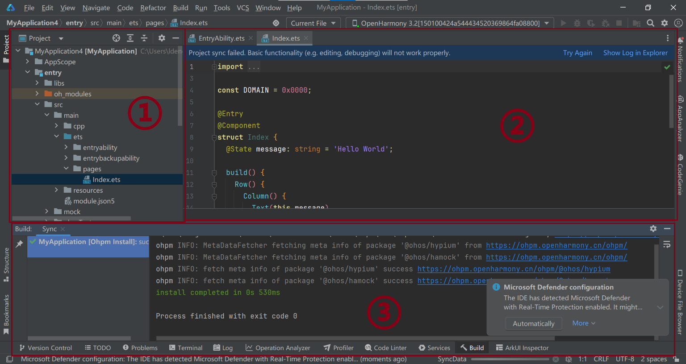
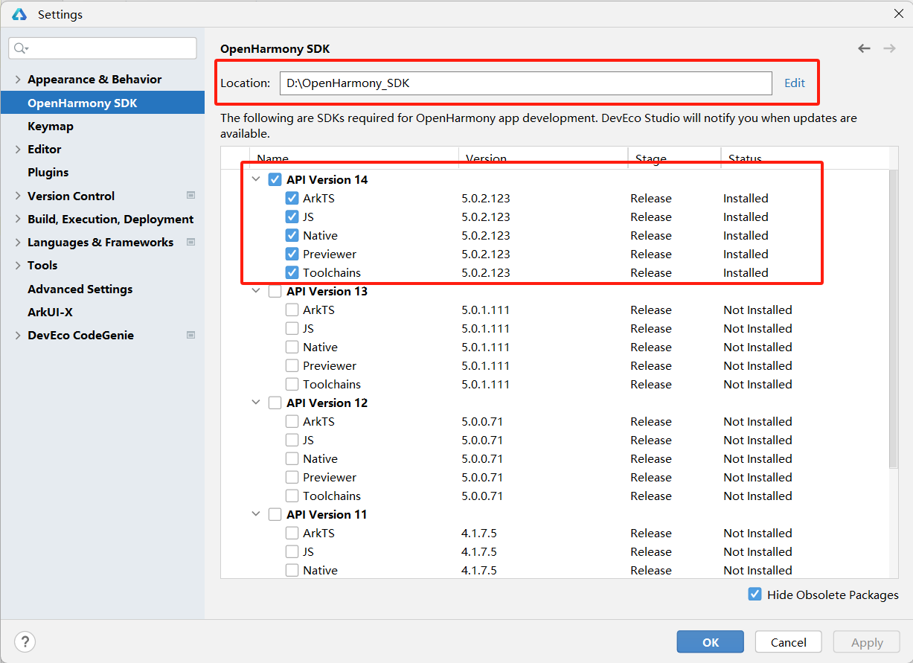
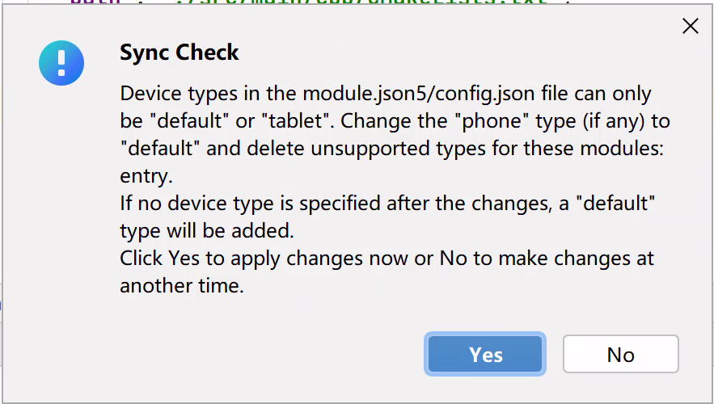

# 移动操作系统与端侧AI推理初探-移动操作系统(part1)

## 实验目的

- 了解一个 “实用” 的操作系统还需要什么？
- 了解移动操作系统应用开发流程，了解移动操作系统与桌面/服务器操作系统的区别。
  - 了解交叉编译等跨架构开发中用到的基本概念。
  - 体验实际的移动应用开发。

- 了解开源鸿蒙整体框架并尝试使用开源鸿蒙。


## 实验环境

- OS:
  - 烧录：Windows 10 / 11
  - 编译：Ubuntu 24.04.4 LTS

- Platform : VMware

## 实验时间安排

> 注：此处为实验发布时的安排计划，请以课程主页和课程群内最新公告为准
>
> 注: 所有的实验所需要的素材都可以在睿客网盘链接：https://rec.ustc.edu.cn/share/dfbc3380-2b3c-11f0-aee2-27696db61006 中找到。
>
> 此次实验只有两周时间，本文档为第一阶段的实验文档。在第一周内，完成本文档的部分任务，可以获得额外的分数，我们由此鼓励大家尽快开始实验，以避免最后时间太短导致的来不及完成/开发板使用冲突。
>
> **虽然本次实验进行了分组，但每个人仍然要独自完成所有实验内容。分组仅为了共用开发板。**

-  5.16晚实验课，讲解实验、检查实验
-  5.23晚实验课，检查实验
-  5.30晚实验课，补检查实验

## 友情提示/为什么要做这个实验？

- **本实验难度并不高，几乎没有代码上的要求，只是让大家了解完整的移动应用开发流程，并在此过程中，体会移动操作系统与我们之前使用的桌面/服务端操作系统的不同。**
- 如果同学们遇到了问题，请先查询在线文档，也欢迎在文档内/群内/私聊助教提问。在线文档地址：[https://docs.qq.com/sheet/DU1JrWXhKdFFpWVNR](https://docs.qq.com/sheet/DU1JrWXhKdFFpWVNR)
  - 为了提供足够的信息，方便助教助教更快更好地解答你的疑问，我们推荐你阅读（由LUG撰写的）[提问指南](https://lug.ustc.edu.cn/wiki/doc/howtoask/)。**当然，这并不是必须的，你可以随时提问，助教都会尽可能提供帮助。**


# 实验内容简介

> 本节提供对本次实验的概览，让大家能更好地理解本次实验要做什么，目标是什么。实验的具体步骤可以参考本文档后面章节。

本次实验中，我们将在提供的 DAYU200 开发板上，运行 OpenHarmony 操作系统，并开发能运行在该开发板上和 OpenHarmony 上的大模型推理应用。为了实现这个目标，需要依次完成以下几个任务：

1. 将 OpenHarmony 系统安装到开发板上并运行。

2. 安装并配置 OpenHarmony 应用的开发环境，成功开发并在开发板上运行一个示例应用。

3. 完成大语言模型推理应用的开发，其中包括：

   * 通过交叉编译，将大模型推理框架（Llama.cpp）编译为能够在开发板上使用的动态链接库。

   * 调用上述库，完成应用，并运行在开发板上。

在实验的第一阶段，我们主要完成前两部分。


# 第一部分 移动操作系统以及润和DAYU200开发板介绍

## 1.1 什么是“实用”的操作系统？

> 以下只是助教自己的理解。和实验好像也不是那么相关，所以大家想跳过也不是不行。O(∩_∩)O

在操作系统理论课中，我们经常接触各种概念模型、设计原则和算法。但当我们走出课堂，进入实际开发或应用场景时，“实用性”（Practicality）就成为了衡量一个操作系统好坏的关键标准之一。那么，什么构成了一个“实用”的操作系统呢？

“实用”并非一个严格的操作系统分类术语（如分时系统、实时系统等），而是更侧重于一个操作系统在现实世界中能否有效、可靠、高效地完成其设计目标，并被用户和开发者方便地使用。一个“实用”的操作系统通常具备以下几个关键特征：

- 易用性 (Usability):
  - 用户易用性： 对于有用户交互界面的系统，界面需要直观、易于学习和操作。
  - 开发者易用性： 需要提供清晰的文档、完善的软件开发工具包（SDK）、调试工具和活跃的开发者社区支持。这对于本次实验尤其重要，我们需要使用OpenHarmony的SDK进行开发。
  - Android Studio(Android); Devco Studio(HarmonyOS/OpenHarmony)
- 性能 (Performance) 与效率 (Efficiency):
  - 系统需要在其目标硬件上表现出可接受的性能。这意味着响应用户操作要及时，执行任务要高效。
  - 对于移动或嵌入式系统，**资源效率**（特别是功耗和内存占用）至关重要，直接关系到电池续航和成本。低延迟与高能效比（适用于IoT、边缘计算）
- 可维护性 (Maintainability) 与生态系统 (Ecosystem):
  - 操作系统需要能够被持续更新和维护，以修复bug、堵塞安全漏洞、适应新的硬件和需求（例如手机不断地更新推送，Windows Update等）。
  - 一个健康的生态系统（包括硬件制造商、软件开发者、用户社区）是操作系统生命力的体现，也是其保持“实用”的关键。
- 安全性 (Security):

  - 必须提供必要的安全机制，保护系统自身和用户数据免受恶意软件、未授权访问等威胁。安全性的重要程度取决于应用场景
总结来说，一个“实用”的操作系统，不仅仅是理论概念的堆砌，更是能够在特定的硬件平台上，稳定、高效、安全地运行，满足用户需求，并为开发者提供便利，从而真正在现实世界中创造价值的软件系统。

在我们本次实验中，我们将使用的OpenHarmony，其目标就是成为面向多种智能设备的“实用”操作系统。我们将通过具体的开发实践，体验其作为开发平台的“实用性”，例如利用其SDK进行交叉编译，并在真实的DAYU200开发板上运行我们集成的AI推理库。
## 1.2 移动操作系统简介

### 1.2.1 什么是移动操作系统
移动操作系统是一种专门为便携式、手持设备（如智能手机、平板电脑、智能手表等）设计的操作系统。与大家更为熟悉的桌面操作系统（如Windows、macOS、Linux发行版如Ubuntu）一样，移动操作系统的核心功能也是管理设备的硬件资源（CPU、内存、存储、网络、传感器等）、提供用户交互界面、以及运行应用程序。

然而，由于移动设备与桌面计算机在硬件形态、使用场景、性能功耗等方面存在显著差异，移动操作系统在设计理念和功能侧重上与桌面操作系统有着明显的不同。

### 1.2.2 目前主流的移动操作系统

目前市场上主流的移动操作系统主要有：

1. Android (Google): 由Google主导开发，基于Linux内核，是目前市场份额最大的移动操作系统。其开放性吸引了众多设备制造商和开发者。

2. iOS(Apple): 由Apple公司为其iPhone、iPad等设备开发的闭源操作系统。以其流畅的用户体验、严格的应用生态和安全性著称。

3. HarmonyOS (华为) / OpenHarmony (开源鸿蒙开放原子基金会): 由华为开发，旨在面向万物互联时代，可部署于手机、平板、智能穿戴、智慧屏、车机等多种智能终端。OpenHarmony是HarmonyOS的开源版本，也是本次实验我们将使用的操作系统。


### 1.2.3 移动操作系统 vs. 桌面操作系统
为了更好地理解移动操作系统的特性，我们将其与大家常用的桌面操作系统进行对比：

| 特性             | 移动操作系统 (如 Android, iOS, OpenHarmony)                                  | 桌面操作系统 (如 Windows, macOS, Ubuntu)                                       |
| :--------------- | :--------------------------------------------------------------------------- | :----------------------------------------------------------------------------- |
| **设计目标** | 优先考虑便携性、低功耗、触控交互、持续连接                                     | 优先考虑强大的计算能力、多任务处理、外设扩展性、精确输入（键鼠）                 |
| **硬件平台** | 通常基于ARM等低功耗架构的SoC（片上系统），资源（CPU、内存、存储）相对受限      | 通常基于x86/x64架构，拥有更强的处理器、更大的内存和存储空间                      |
| **用户交互** | 以触摸屏为主要输入方式，支持手势操作，界面为单窗口或分屏应用优化                 | 以键盘、鼠标为主要输入方式，支持多窗口、复杂的图形用户界面（GUI）                 |
| **电源管理** | 极其重要，采用积极的休眠策略、后台任务限制等机制以延长电池续航                 | 电源管理相对宽松，虽然也在不断优化，但通常连接电源使用，对续航要求不如移动设备苛刻 |
| **应用生态** | 通常依赖官方或第三方应用商店分发应用，应用运行在沙盒（Sandbox）环境中，权限管理严格 | 软件来源多样（安装包、商店、源码编译等），沙盒机制相对不普遍，权限管理模型不同     |
| **连接性** | 高度依赖无线网络（蜂窝数据、Wi-Fi、蓝牙），内置多种传感器（GPS、加速度计等）     | 对有线网络（以太网）支持普遍，无线网络也很常见，但对传感器依赖较少                |
| **系统更新** | 更新通常由设备制造商或运营商推送，有时碎片化问题较严重（Android）               | 更新通常由操作系统供应商直接提供，用户可控性相对较高                             |
| **开发范式** | 常使用特定的SDK（如Android SDK, iOS SDK, OpenHarmony SDK），注重UI框架和生命周期管理 | 开发工具和语言选择更广泛，系统API调用方式和应用模型不同                          |

在本次实验中，我们将会体会到其中部分差异：硬件平台（交叉编译），应用生态(沙盒)，开发范式(SDK)

### 1.3 OpenHarmony
在了解了移动操作系统的一般概念和特性后，现在我们将焦点转向本次实验的主角——OpenHarmony
#### 1.3.1 什么是 OpenHarmony？

OpenHarmony（中文常称为“开源鸿蒙”）是一个由开放原子开源基金会（OpenAtom Foundation）孵化和运营的开源项目。它并非仅仅是传统意义上的手机或平板操作系统，而是一个面向全场景、可分布式部署的智能终端操作系统。简单来说，它的目标是成为驱动未来各种智能设备（从小型物联网设备到功能丰富的智能手机、平板、智慧屏等）的统一基础平台。

#### 1.3.2 OpenHarmony核心理念与愿景

OpenHarmony 旨在打破单一设备的应用边界，其核心设计理念之一是分布式技术。这意味着：

1. 一次开发，多端部署： 开发者编写的应用，理论上可以通过适配层部署到多种不同形态、不同屏幕尺寸的 OpenHarmony 设备上。
2. 硬件互助，资源共享： 不同设备可以组成“超级终端”，互相调用对方的硬件能力（例如，用手机的键盘输入文字到智慧屏，或用平板控制无人机的摄像头）。
3. 无缝流转，协同交互： 应用和数据可以在不同设备间平滑迁移和协同工作，提供一体化的用户体验。

> 虽然OpenHarmony的愿景宏伟，但本次实验中，我们仅会体验其在DAYU200开发板上的单设备部署，不会涉及到分布式部署的特性。（因为工作量可能会很大/(ㄒoㄒ)/~~，并且开发板数量较少）

#### 1.3.3 OpenHarmony关键特性

OpenHarmony技术架构如下所示：


- 分层架构： OpenHarmony 采用了清晰的分层架构，主要包括内核层、系统服务层、框架层和应用层。

  - 内核层 (Kernel Subsystem)： 关键在于其可按需选择内核。对于资源受限的轻量级设备（如内存为 KiB 或 MiB 级别），可选用 LiteOS 内核；对于资源较丰富的标准系统设备（如本次实验使用的 DAYU200 开发板），则可选用 Linux 内核。理解这一点对于后续的交叉编译环境配置非常重要。
  - 系统服务层 (System Service Layer)： 提供一系列核心系统能力和通用的基础服务，如分布式能力、图形、多媒体、安全等。
  - 框架层 (Framework Layer)： 为应用开发提供必要的 API 和框架，包括应用框架、UI 框架（如 ArkUI）等。
  - 应用层 (Application Layer)： 包含系统应用和第三方应用。
- 组件化设计： 系统可以根据硬件的具体能力进行灵活的组件化裁剪和按需加载，使其能够适配各种内存和性能规格的设备。
- 开放源代码： 作为一个开源项目，其源代码对全球开发者开放，便于学习、定制和共同发展生态。

### 1.3.4 OpenHarmony 与 HarmonyOS 的关系：

OpenHarmony 是 HarmonyOS（华为鸿蒙操作系统）的开源基础版本。华为将 HarmonyOS 的基础能力贡献给了开放原子开源基金会，形成了 OpenHarmony 项目。其他厂商或开发者可以基于 OpenHarmony 构建自己的操作系统发行版，HarmonyOS 就是基于 OpenHarmony 的一个面向消费者的商业发行版。

> 类似于Android与AOSP的关系

### 1.3.5 为什么在本次实验中使用 OpenHarmony？

选择 OpenHarmony 作为本次实验平台，主要基于以下考虑：

- 代表性： 它代表了现代操作系统（特别是面向物联网和多设备协同）的一个发展方向。
- 实践平台： 为我们提供了一个真实的、可操作的移动操作系统环境（运行在 DAYU200 开发板上）。
- 开发体验： 允许我们实践移动平台的开发流程，特别是本次实验重点关注的原生 C++ 代码（Native C++）的交叉编译、库集成与调用。
- 可及性： 相关的 SDK、开发工具（DevEco Studio）和文档资源相对完善，便于学生学习和使用。

在接下来的实验环节中，我们将亲自动手，完成 OpenHarmony 系统镜像的烧录、开发环境的搭建，并最终在其上运行我们自己编译的 C++ AI 推理库，从而深入理解在移动操作系统上进行原生开发和集成的过程。

> 其实是为了统一实验平台，单独设计Android实验可能部分同学无法做这个实验。

## 1.3 DAYU200开发板
前面我们介绍了作为软件基础的 OpenHarmony 操作系统，现在我们来认识一下承载这个系统并供我们进行实际操作的硬件平台——DAYU200 开发板。

> **为什么实验要使用开发板？**如同实验目的中提到的，本实验希望大家体会移动操作系统与我们平时使用的桌面操作系统的区别。而操作系统的区别很大程度也是由硬件的区别带来的。可以把开发板当成是**一台拓展性比较强的手机**（或者平板，虽然性能比较差），方便大家体验移动开发流程。

### 1.3.1 DAYU200开发板介绍

> 虽然本节详细介绍了了开发板的各类硬件规格，但本次实验中你需要知道的其实只有：
>
> * 开发板的处理器是RK3568芯片，使用的指令集是**32位的ARM**。（具体而言，是`armeabi-v7a`。）
>   * 大家应该在《组成原理》课上，应该已经知道了不同指令集的区别。ARM是现在移动设备上最流行的指令集。大家使用的手机、智能手表，以及新款 MacBook，使用的都是ARM架构。
> * 开发板的内存（RAM）大小是2GB，存储容量是32GB。

为了能够流畅运行功能相对完整的 OpenHarmony 标准系统，并支持复杂的应用开发与调试，DAYU200 配备了较为强大的硬件资源。其核心规格通常包括：
- 处理器 (SoC): 核心是瑞芯微 (Rockchip) RK3568 芯片。这是一款高性能、低功耗的应用处理器，集成了：
  - CPU: 四核 32 位 ARM Cortex-A55，主频最高可达 2.0GHz。注意这里的 32位 ARM 架构 (arm32 / armeabi)，这决定了我们后续交叉编译的目标平台。
  - GPU: Mali-G52 2EE 图形处理器，支持 OpenGLES 3.2, Vulkan 1.1。
  - NPU (可选): 部分版本集成神经网络处理单元，可提供约 1 TOPS 的 AI 算力，用于硬件加速人工智能应用（本次实验主要使用 CPU 进行推理，但了解 NPU 的存在有助于理解硬件加速潜力）。
- 内存 (RAM): 开发板内存为2GB的 LPDDR4/LPDDR4X 内存。充足的内存对于运行标准系统和我们的 AI 推理任务至关重要。（2GB对于推理较大模型就有点不够，附录中我们会教大家如何创建交换分区）
- 存储 (Storage): 板载 eMMC 闪存作为主要的系统和数据存储介质，开发板容量为 32GB。

同时，开发板还提供了多种接口，可以连接各种外设。（虽然我们实验没有用到，但感兴趣的同学可以自行了解。）

> 更多信息可以查看链接 [润和HH-SCDAYU200开发套件](https://gitee.com/hihope_iot/docs/tree/master/HiHope_DAYU200#https://gitee.com/hihope_iot/docs/blob/master/HiHope_DAYU200/docs/README.md)

### 1.3.2 为什么选择使用DAYU200开发板

- 官方与社区支持: DAYU200 是 OpenHarmony 官方和社区重点支持的开发板之一，有持续的软件版本适配和丰富的文档、教程资源。这意味着我们可以更容易地获取到可运行的 OpenHarmony 标准系统镜像和解决遇到的问题。
- 性能适中: 其硬件配置足以流畅运行 OpenHarmony 标准系统，并能够承载我们本次实验中编译 C++ 代码、运行中小型语言模型（如 Llama.cpp 在 CPU 上推理）的需求。
> 主要是HUAWEI推荐的╮(╯▽╰)╭

### 1.3.2 开发板的使用

在发放的开发板中，有以下物品:

1. DAYU200开发板
2. DAYU200电源适配线
3. 公对公USB数据线(用于烧写)
4. mini USB B数据线(用于串口调试，本实验可以忽略)
   

当开发板开机后,部分开发板运行的是Openharmony4.0版本的mini system（去年同学们遗留下来的），其没有图形化界面，会直接卡在LOGO，这是正常现象；后面实验我们将教大家如何烧录Openharmony5.0版本的全量系统。

当接上电源后，开发板一般会自行启动，如果没有启动请查看开发板上的按钮，根据按钮的功能进行尝试打开。

如下图红框，开发板上有六个按钮，按钮下有对应的名称。第一排的三个按钮（RESET、SELECT、MUTE），本次实验不涉及。第二排的三个按钮类似普通手机侧面的三个按钮，分别是：

* Power：电源键，负责开关机、锁屏、亮屏。
* VOL+/RECOVERY：音量+/恢复模式键，平时负责增加音量，也可引导手机进入恢复模式。（后面文档会说明。）
* VOL-：音量-键。

​    

### 1.3.3 开发板使用规范

开发板的使用采用分组负责人制度。即三人一组，由一人担任负责人并且保管开发板，发放和回收开发板向负责人进行。

<div STYLE="page-break-after: always;"></div>

# 第二部分 将开源鸿蒙系统安装到开发板上

在这一部分，我们将介绍 OpenHarmony 镜像的烧录。为了方便大家体验开发版，助教给大家准备了已经编译好的完整版 OpenHarmony 镜像，可以直接烧录到开发板上。

> 本实验**不要求**大家编译 OpenHarmony 操作系统，是因为完整版的操作系统编译资源开销较大，且需要花费较长时间。（我们在实验一编译了最小版本的 Linux 内核，就需要花费15~30分钟，而 OH 系统在此基础上增加了一系列组件（如GUI和应用支持），完整编译需要上百GB存储空间和数小时的时间。）
>
> 如果大家对编译 OpenHarmony 系统的过程感兴趣，可以参考 OpenHarmony 社区文档：
>
> https://gitee.com/openharmony/docs/blob/master/zh-cn/device-dev/subsystems/subsys-build-all.md
>
> （当然，想实际编译还会遇到无数的坑，助教们去年就踩了很久。^_^）

## 2.1 OpenHarmony 烧录

在实验一中，我们曾经为虚拟机安装了操作系统。当时，安装系统的大致流程为：

1. 将镜像连接到虚拟机（相当于将系统光盘插到电脑里）；
2. 从光盘启动系统，并将系统按设置安装（写入）到虚拟机里。

在大部分个人电脑/服务器上，系统安装流程也是类似的。

然而，对于移动设备而言，以上安装方式是**不可行**的。一方面，移动设备的硬件结构多种多样，难以将系统封装为一个在任何设备上都能启动的镜像。另一方面，移动设备厂商通常也不希望用户能任意更换操作系统，通常也不允许从外部存储设备启动。所以，移动设备更换系统的流程通常更为复杂，且和具体设备相关。

对于我们的开发板，安装系统的方式为，通过开发板制造商提供的软件，直接将系统数据**硬件级传输**到开发板存储设备的对应位置。这种模式在嵌入式开发中很常见，我们称为**烧录（Burning）**。在本节中，我们将介绍 RK3568 开发板的烧录流程。

> [!IMPORTANT]
>
> RK3568 开发板的烧录软件目前**只支持 Windows 系统**，请在 Windows 系统下进行本章节的步骤。

### 2.1.1 软件环境准备

#### 2.1.1.1 下载及解压

在烧录前，需要大家下载以下内容，并解压到你喜欢的文件夹。（本文档以`D:/OHLab/`为例。）

* **DAYU200 烧录工具**
  * 下载地址：https://rec.ustc.edu.cn/share/dfbc3380-2b3c-11f0-aee2-27696db61006 
    * 选择`DAYU200烧写工具及指南.zip`
  * 备用下载链接：[DAYU200 烧录工具 - GitLab](https://git.ustc.edu.cn/KONC/oh_lab/-/raw/main/DAYU200%E7%83%A7%E5%86%99%E5%B7%A5%E5%85%B7%E5%8F%8A%E6%8C%87%E5%8D%97.zip) 

* **Openharmony5.0全量系统镜像**
  * 下载地址：https://rec.ustc.edu.cn/share/dfbc3380-2b3c-11f0-aee2-27696db61006  
    * 选择`OpenHarmony5.0-image.zip`
  * 备用下载链接：https://git.ustc.edu.cn/KONC/oh_lab/-/raw/main/OpenHarmony5.0-image.zip

#### 2.1.1.2 安装USB驱动

在解压后的`烧写工具及指南`文件夹里，进入`windows/`目录，解压其中的`DriverAssitant_v5.1.1.zip`文件至单独文件夹，

然后，双击击解压后的`DriverInstall.exe`打开安装程序，点击下图所示的“驱动安装”按钮：


显示“安装驱动成功”即可，然后可关闭该程序。

> 驱动程序，简称驱动，是规定电脑软件与特定硬件如何交互的程序。现在，主流操作系统安装时通常会自带大量常用硬件的驱动，因此我们不需要手动安装。但当需要与操作系统中没有的硬件交互时，就需要我们手动安装驱动了。

### 2.1.2 开发板的连接

1. 连接开发板

* 按照下图提示连接**电源线**和**USB烧写线**。注意，开发板上有三个 USB插口，请连接到中间那个。（接口旁标注了`USB 3.0 OTG`。）

  * 烧写线另一端连接你的计算机。电源线插入电源插座。（这就不用说了吧！ (∩_∩)）


> 不是说是手机吗，为什么还需要连接电源？大概是为了简化开发板设计吧……

 

### 2.1.3烧录步骤

#### 2.1.3.1. 打开烧写工具 

* 如果你的开发板没有打开，请按开发板上的Power键打开开发板。（显示DAYU图标，或进入系统即可。）

* 双击烧录工具（`烧写工具及指南`文件夹）中 `windows\RKDevTool.exe` 打开烧写工具。

* 如图所示，如果你的连接正确，且开发板电源开启，则开发工具下方状态栏会显示：发现一个MASKROM设备。

  * 如果开发工具状态栏显示“没有发现设备”，则说明连接没有成功。请检查电源线、烧写线是否正确连接。重新拔插烧写线，并尝试长按开发板Power键强制关机，然后再次按Power键开机，等待15秒左右。并检查是否成功。


  

* 导入编译文件镜像包中的 `config.cfg`配置，该配置文件在刚刚解压的系统镜像目录里，路径为 `OpenHarmony\config.cfg`，导入的方法为：（如下面三张图所示）

1. 在烧写工具左侧空白处右键，单击导入配置。


2. 选择`OpenHarmony\config.cfg`文件（注意，开发工具里本身也有一个`config.cfg`，但我们要选择的不是这个，**而是系统镜像解压后目录里的`config.cfg`**。


3. 点击空白栏，逐一配置每个镜像文件对应的路径（也可以双击路径，手动修改路径）。
   * 如，你的镜像解压目录为`D:\OHLab\OpenHarmony`，则第一行应该选择`D:\OHLab\OpenHarmony\MiniLoaderAll.bin`文件，其余各行均应选择相应的img文件。

> **这一步在干什么？**实际上，这一步就是在设置，我们要将哪些数据写入到开发板的哪些位置。例如，第一行代表了我们会将`MiniLoaderAll.bin`写入到开发板地址`0x00000000`处（这虽然看起来是个内存地址，但有可能对应了开发板上某个存储器的空间。开发板启动时，会按厂商设计，从某些对应地址读取启动所需要的数据和代码，因此，正确将系统写入到对应位置，就能成功安装系统。（当然，具体写入规则和镜像生成方式，就要参考厂商的文档啦。在本实验中，配置已经给大家写好啦！）


#### 2.1.3.2. 进入LOADER烧写模式

* 默认烧写工具是 `MASKROM` 模式，烧写工具上状态栏会显示“发现一个MASKROM设备”，我们需要将设备进入`Loader`模式。

* 进入 `LOADER` 烧写模式

  1. 按住 `VOL+/RECOVERY` 按键（图中标注的①号键） 和 `RESET` 按钮（图中标注的②号键）不松开， 此时，烧录工具会显示“没有发现设备” 

  2. 松开 `RESET` 键（②号键）， 烧录工具显示“发现一个 `LOADER` 设备” ， 说明此时已经进入烧写模式，可以松开`VOL+/RECOVERY`键。

     

     

     

* 进行烧录

  当烧录工具显示“发现一个LOADER设备”后，可以点击“执行”按钮，进行烧录。烧录进度会显示在右侧。烧录大概需要几分钟，如果烧写成功， 最后在工具界面右侧会显示“下载完成”。此时，烧写即完成，可以断开烧写线了。（连着也无妨。）

  烧写成功后，开发板会自动启动，并在约30s后，成功打开系统，系统和普通的手机系统类似，但只有很少的几个应用。另外，由于开发板性能较弱，系统可能稍微有些卡顿，这也是正常现象。大家可以自行体验。
  
  

> **什么是MASKROM？什么是LOADER？**可以认为是开发板厂商设计的开发板的不同状态。MASKROM类似一种只读模式，LOADER则是烧录模式。参考：[瑞芯微系列：系统烧录和登录系统 - 知乎](https://zhuanlan.zhihu.com/p/634585861)


# 第三部分 安装应用开发环境并开发简单应用

在前两部分，我们了解了移动操作系统、OpenHarmony 以及实验使用的 DAYU200 开发板，并完成了基础的系统烧录。接下来，我们将安装官网为 OpenHarmony 和 HarmonyOS 提供的应用开发环境 DevEco Studio，并实际体验一个简单的 OH 应用开发流程。这部分包含两个主要步骤：

* 在 Windows 上安装集成开发环境 DevEco Studio。
* 将配置并编译官方的示例应用，并将示例应用运行在开发板上。

## 3.1 在 Windows 上安装 DevEco Studio
DevEco Studio 是 HUAWE 推出的官方集成开发环境（IDE），用于 HarmonyOS 和 OpenHarmony 应用开发。它集成了代码编辑、编译、调试、应用签名、HAP 打包、模拟器/预览器以及 SDK 管理等功能。

> HAP 是 OpenHarmony 和 HarmonyOS 的应用格式，类似 Android 的 APK。

### 3.1.1 下载安装DevEco Studio
* 下载 DevEco Studio
  * 下载地址：https://rec.ustc.edu.cn/share/dfbc3380-2b3c-11f0-aee2-27696db61006
    * 选择`devecostudio-windows-5.0.11.100.zip`
  * 你也可以在官方下载地址下载最新版：https://developer.huawei.com/consumer/cn/deveco-studio/
    * 官方下载地址需要登录华为账号

* 安装DevEco Studio，安装过程较为简单，选择默认配置即可。

> 注意：DevEco Studio安装包体积较大，请确保网络连接稳定。
>
> 安装需要15GB左右空间，请选择合适的安装位置，保证空间足够。
>
> DevEco Studio 中文设置：https://developer.huawei.com/consumer/cn/forum/topic/0204171044047287810
* 安装完毕后，第一次打开 DevEco 时，提示 Import DevEco Studio Settings，此时选择Do not import settings即可。后续需要同意开发协议，单击同意即可。

## 3.2 在 DevEco Studio 上开发应用

本节我们将尝试使用 DevEco 创建第一个项目，并尝试将其运行在开发板上。

> OpenHarmony 和 HarmonyOS 的应用通常使用 [ArkTS语言](https://docs.openharmony.cn/pages/v5.0/zh-cn/application-dev/arkts-utils/arkts-overview.md) 编写，OpenHarmony 和 HarmonyOS 提供的系统 API 也通常都是 ArkTS接口的（正如我们开发 Android 时离不开 Java 语言一样）。ArkTS 是基于 TypeScript 拓展的新语言（而 TypeScript 则是基于 JavaScript 拓展的强类型语言，套娃了）。
>
> 当然，为了减轻大家工作量，**本实验不涉及 ArkTS 具体语法内容**，感兴趣的同学可自行了解。为了尽可能使用大家熟悉的语言，我们的应用会使用 OpenHarmony 提供的 Native C++ 开发模式，该模式允许 ArkTS 和 C++ 互相交互，在 OpenHarmony 上运行 C++ 代码。

### 3.2.1 DevEco Studio的使用：项目创建

1. 通过如下两种方式，打开工程创建向导界面。
  - 如果当前未打开任何工程，可以在DevEco Studio的欢迎页，选择Create Project开始创建一个新NDK工程。

  - 如果已经打开过工程，可以在菜单栏选择File > New > Create Project来创建一个新NDK工程。

    > NDK: Native C++ Develop Kit，本地C++开发组件。总之就是为了让开发板能跑C++的神奇妙妙工具，下一阶段实验会进一步解释这是怎么回事。
2. 根据工程创建向导，选择Native C++工程模板，然后单击Next。（如下图。）

  

3. 在`Configure Your Project`页面可以修改`Project Name`、项目目录和其它选项，然后单击Finish。

   * Project Name 就是项目名，推荐使用**自己的学号**（方便检查）。
   * Save Location 是项目存储位置，大家可选择存放在自己喜欢的目录下。
   * 其它选项默认即可。

创建项目后，会进入项目开发界面，如下图，和其它IDE类似，开发界面主要分为三个部分：

* 项目目录（图中①），显示项目中主要文件。
* 编辑区（图中②），用来写代码。
* 终端区域（图中③），显示各类信息，或者终端等。




### 3.2.2 DevEco Studio的使用：项目预览

DevEco Studio内置了预览器，能预览我们开发的应用，以方便开发者开发，不需要每次修改代码后都实际将应用传输到设备中运行。由于 DevEco Studio 创建的项目本身就是完整可运行的，我们可以直接启动预览，来体验该应用的效果。

为了启动预览，需要：

1. 点击开发界面右上角，“设备”下拉框（绿色三角运行按钮的左侧的下拉框），选择“Previewer”，如下图。


2. 点击运行按钮（绿色三角形），选择`2in1`，点击OK。（这一步在选择设备类型，`phonoe`是手机，`tablet`是平板，`2in1`是两种皆可的，根据选择的不同，显示屏幕的比例会有区别。）

由于编译和渲染预览所需时间较慢，这一步后需要等待约30~60秒。之后，预览会显示在开发界面右侧，如下图：


预览界面类似一个平板屏幕，上面有一行`Hello World`。你可以单击这行字，稍等片刻，内容会变为`Welcome`，如下图：


这就是我们创建的示例应用的功能。如果文字成功改变，你可以单击右上角停止按钮，结束预览。（红色正方形，在运行按钮右侧。）

> 虽然我们不打算讲解 ArkTS 语法，但我们还是愿意稍微解释一下这个点击变换的效果是怎么实现的，以便感兴趣的同学了解。
>
> * 应用的主体逻辑在已经默认打开的`Index.ets`文件中。该文件主要部分是`Row`、`Column`、`Text`几个函数的嵌套，这几个函数定义了应用的界面（一行一列，中间有一段文本，文本内容是`this.message`，也就是`'Hello World'`。）
> * 在`Text(this.message)`下，`.onClick`中定义了，这一行Text被点击后，将会执行的代码。
>   * `this.message = 'Welcome';`一行，将`this.message`赋值为`Welcome`，所以，我们看到的文字改变了。
> * 供感兴趣的同学思考：目前这个改变是单向的，如果我希望将应用效果改为每单击一次，就在`Welcome`和`Hello World`间变换一次，应该如何实现？
>   * 提示：ArkTS当然也有`if`语句，语法和C语言一样。


### 3.2.3 DevEco Studio的使用：将应用运行到开发板上

为了将应用运行在开发板上，我们需要按和[2.1.2 开发板的连接](#2.1.2 开发板的连接)一节中相同方式，将电脑与开发板进行连接。

正确连接后，再次点击右上角设备下拉框，可以看到设备列表中出现`OpenHarmony 3.2[....]`这样的选项（如下图）。该选项则为开发板所对应的设备。


但选择该设备并直接运行时，IDE会提示错误如下：

```
compatibleSdkVersion and releaseType of the app do not match the apiVersion and releaseType on the device.
```

这是因为 DevEco Studio 默认创建的是运行于 HarmonyOS 的项目，而我们的设备运行的是 OpenHarmony。因此，我们需要进行相应设置，将项目编译为 OpenHarmony 应用。

#### 3.2.3.1 安装 OpenHarmony SDK

为了编译 OpenHarmony 项目，我们需要首先安装OpenHarmony SDK。步骤如下：

1. 点击界面左上角`File > Settings`打开设置。
2. 选择右侧 OpenHarmony SDK，在 Location 一栏中，选择希望的 OpenHarmony SDK 安装位置。
   * OpenHarmony SDK大小较大（约5GB），请选择合适的安装位置。
3. 勾选API Version 14中所有的选项，点击`Apply`，等待自动下载完毕并解压到相应目录。

> SDK 是 Software Development Kit，软件开发组件，和前面的NDK一样，你可以理解为，用来编译OpenHarmony软件的妙妙小工具。



#### 3.2.3.2 修改项目配置文件

1. 修改`build-profile.josn5`

   **安装完毕SDK后**，在界面左侧项目目录中，打开**项目根目录下的**`build-profile.json5`，文件开头内容如下所示：

   * 注意，`entry`目录下也有一个`build-profile.json5`，但两者内容不一样（我们接下来也要修改），不要搞混了。

```json
{
  "app": {
    "signingConfigs": [],
    "products": [
      {
        "name": "default",
        "signingConfig": "default",
        "targetSdkVersion": "5.0.5(17)",
        "compatibleSdkVersion": "5.0.5(17)",
        "runtimeOS": "HarmonyOS",
        "buildOption": {
......
```
我们需要将其中第8、9、10三行内容，改为以下4行（注意，数字周围没有双引号。）：

```json
    "compatibleSdkVersion": 14,
    "compileSdkVersion": 14,
    "targetSdkVersion": 14,
    "runtimeOS": "OpenHarmony"
```

修改后的文件如图，这几行分别定义了我们使用的设备操作系统是`OpenHarmony`，用来编译、生成的目标和兼容的SDK版本都是 14。


> 还记得我们上一步安装的SDK版本吗？也是14。这个版本必须和设备系统上的版本一致，你可以认为，这是移动操作系统的“系统调用”的版本。（实际上是API版本，但某种意义上说，移动应用中，系统API的地位和其它系统中系统调用差不多，因为为了安全和隐私性考虑，移动应用没法直接调用大部分系统调用。）

2. 修改`entry/build-profile.json5`

接下来，在左侧界面项目目录里，打开`entry/build-profile.json5`，在第7行`cppFlags`后进行如下修改：

修改前：

```json
    "externalNativeOptions": {
      "path": "./src/main/cpp/CMakeLists.txt",
      "arguments": "",
      "cppFlags": "",
    }
```

修改后：

```json
    "externalNativeOptions": {
      "path": "./src/main/cpp/CMakeLists.txt",
      "arguments": "",
      "cppFlags": "",
      "abiFilters": ["armeabi-v7a","arm64-v8a"]
    }
```

即，添加一行`"abiFilters": ["armeabi-v7a","arm64-v8a"]`。该行定义了我们运行的处理器架构是`armeabi-v7a`和`arm64-v8a`。

> 介绍开发板时，我们提到过，开发板处理器指令集是`armeabi-v7a`，那为什么还要加`arm64-v8a`？因为经过测试，不加这个好像应用跑不起来，我们也不知道原因。╮（╯＿╰）╭

3. 同步项目设置

修改完两个文件后，DevEco应该会出现如下图提示，说明项目没有同步。请点击Sync Now进行同步。


如果没有出现该提示，你也可以点击界面右上角`File`，选择`Sync and Refresh Project`手动同步。

同步过程中可能出现如下`Sync Check`提示，这是因为OpenHarmony应用只支持`default`一种设备类型（而不是前面我们选择过的`phone`、`tablet`、`2in1`几种）。这里点击Yes即可。



等待一段时间，如果没有错误提示，下方显示`Process finished with exit code 0`，则说明项目配置同步成功。

> 同步是为了将正确的项目配置告诉 DevEco，让其能够按照配置正确编译我们的应用。

#### 3.2.3.3 在开发板上运行应用

在配置完上述所有内容后，我们终于可以实际在开发板上运行我们的应用了。和本节开始所述一样，**连接好开发板后**，在右上角下拉框中选择`OpenHarmony`开头的设备如下：


然后，将项目调整为Debug模式，点击上述下拉框左侧的`entry`下拉框，选择开头图标是`H`的选项，如下图：


> 这一步中，上方的entry选项代表`Release`即正式版应用，下方为`Debug`即调试版应用。调试版应用不需要正式签名，只能在开发过程中使用，正式版应用经过编译优化性能更好，也可以发布给他人，但需要登录华为账号后签名才能使用。参见[下一节](#3.2.3.4 对软件进行签名（可选）)的内容。

然后，点击运行按钮（右侧绿色三角形），运行项目。应用会被自动安装到开发板上并运行。（运行中可能提示要求生成`debug signature`，如下，点击OK即可。）


在多次运行应用时，软件可能由于版本不同，导致签名不匹配或者安装出错等，出现类似下方的提示。你可以点击`uninstall and reinstall the modules`来强制卸载开发板上已有的应用版本：


运行成功时，开发板会自动点亮，并自动运行程序，如下。（点击`Hello World`字体，也能成功变为`Welcome`）


#### 3.2.3.4 对软件进行签名（可选）

> 该部分是可选的，也不包含任何分数。移动设备应用通常需要开发者进行“签名”，否则不允许发布和运行，以保证应用安全。这里的“签名”是密码学术语，同学们以后的课程中会学习到。
>
> 签名是为了发布自己的应用，或者使用正式版应用。介绍本步骤是为了让大家了解完整的应用开发流程。没有该需求的同学可以跳过这一步。本步骤不占分数。

1. 点击界面左上角`File > Project Structure` ，打开项目结构界面。

2. 选择左侧`Project`，然后选择上方` Signing Configs`选项卡。

3. 在界面中勾选`Support HarmonyOS` ，此时，下方出现提示并提示`Failed to auto generate signing, please sign in first.`这是因为，如果要发布正式版的应用，需要登录华为账号，通过华为账号生成签名。如果你希望发布你的应用，或者使用Release版本的应用，请点击`Sign in`，在网页中登录。登录、签名成功后，界面类似下图。

   

<div STYLE="page-break-after: always;"></div>

# 第四部分：第一阶段实验内容与检查标准

## 4.1 实验内容

> 如果你一致跟随实验文档的内容完成到这里，那么前三点你已经完成了，你需要做的只有第4点。

1. 将提供的 Openharmony5.0 全量标准系统烧录到开发板中，**体验完整版 OpenHarmony 系统**。(参考[2.1 OpenHarmony烧录](#2.1 OpenHarmony 烧录)。)
2. 安装DevEco Studio，创建第一个项目，并在Previewer中运行。（参考[3.1](#3.1 在 Windows 上安装 DevEco Studio)到[3.2.2](3.2.2 DevEco Studio的使用：项目预览)节。）
3. 并尝试创建名为自己学号的空白Demo（例如PB23011000）在开发板运行。(参考[3.2.3 将应用运行到开发板上](#3.2.3 DevEco Studio的使用：将应用运行到开发板上))
4. 将单击`Hello World`变成`Welcome`改为单击后**变成你的学号**，然后将该应用重新运行到开发板上。
   * 提示：你需要修改`entry/src/main/ets/Index.ets`。修改很简单，你不需要知道ArkTS的语法。
   * 该文件的大体逻辑参考[3.2.2 项目预览](#3.2.2 DevEco Studio的使用：项目预览)最后的介绍。**其实不参考也很简单啦**。
   * 修改完成后，你需要重新参照[3.2.3.3 在开发板上运行应用](#3.2.3.3 在开发板上运行应用) 中的步骤，把应用再次跑到开发板上。


## 4.2 实验评分标准

本次实验共 10 分，第一阶段满分为 4 分（如按时完成检查点，有额外的2分），实验检查要求和评分标准如下：

1. 成功烧录Openharmony5.0 全量标准系统烧录到开发板。（1分）
2. 完成 DevEco Studio 的安装，并在成功在Previewer中运行项目。（1分）
   * **检查点：**在2025年5月16日前完成前两个任务。可额外获得2分（不与阶段2叠加）。
3. 成功将示例应用在开发板上运行（开发板上实现单击后`Hello World`变为`Welcome`）。（1分）
4. 成功将修改后的应用在开发板上运行（开发板上实现单机后`Hello World`变为**你的学号**）。（1分）

> 在5月16日前完成前两个任务，额外获得2分，但不与阶段二分数叠加。
>
> 即，如果你在本周完成阶段一所有任务，你将获得6分。但你仍需要完成完成阶段二所有任务，才能拿到本次实验的满分10分。


