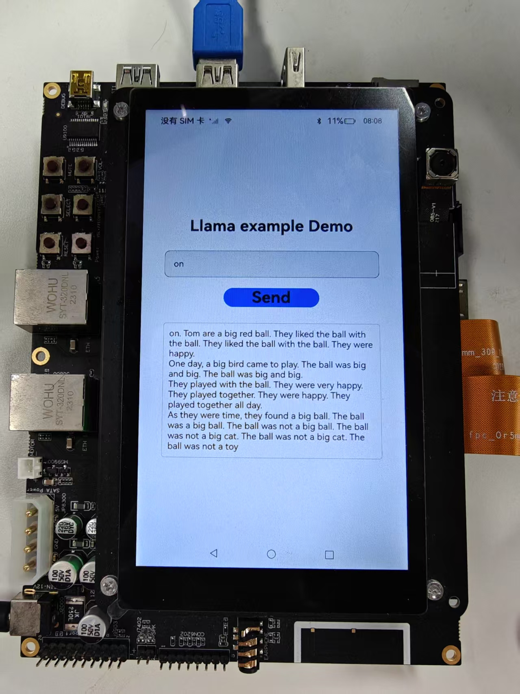

# 移动操作系统与端侧AI推理初探-端侧推理应用实现（Part2）

## 实验目的

- 了解AI的基础概念，了解什么是端侧AI推理
- 学会交叉编译出动态链接库并且在应用开发时使用

## 实验环境

- OS:
  - 交叉编译：Ubuntu 24.04.4 LTS
  - OH 应用开发：Windows
  
- Platform : VMware

## 实验时间安排

> 注：此处为实验发布时的安排计划，请以课程主页和课程群内最新公告为准
>
> 注: 所有的实验所需要的素材都可以在睿客网盘链接：https://rec.ustc.edu.cn/share/dfbc3380-2b3c-11f0-aee2-27696db61006 中找到。
>
> 此次实验只有两周时间，本文档为第二阶段的实验文档，阅读完毕后可以在第一阶段的基础上开始做第二阶段的实验。

-  5.16晚实验课，讲解实验、检查实验
-  5.23晚实验课，检查实验
-  5.30晚实验课，补检查实验

## 友情提示/为什么要做这个实验？

- **本实验难度并不高，几乎没有代码上的要求，只是让大家了解完整的移动应用开发流程，并在此过程中，体会移动操作系统与我们之前使用的桌面/服务端操作系统的不同。**
- 如果同学们遇到了问题，请先查询在线文档，也欢迎在文档内/群内/私聊助教提问。在线文档地址：[https://docs.qq.com/sheet/DU1JrWXhKdFFpWVNR](https://docs.qq.com/sheet/DU1JrWXhKdFFpWVNR)
  - 为了提供足够的信息，方便助教助教更快更好地解答你的疑问，我们推荐你阅读（由LUG撰写的）[提问指南](https://lug.ustc.edu.cn/wiki/doc/howtoask/)。**当然，这并不是必须的，你可以随时提问，助教都会尽可能提供帮助。**


> [!IMPORTANT]
>
> 助教的话：
>
> 本实验虽然没有代码，但涉及到很多背景知识。同学们做实验时难免会遇到不太理解的地方，没关系，按步骤跟着做即可，很多知识/工具，在你未来的学习中还会遇到很多次，你有很多机会慢慢理解。

# 实验内容简介

> 本节提供对本次实验的概览，让大家能更好地理解本次实验要做什么，目标是什么。实验的具体步骤可以参考本文档后面章节。

本次实验中，我们将在提供的 DAYU200 开发板上，运行 OpenHarmony 操作系统，并开发能运行在该开发板上和 OpenHarmony 上的大模型推理应用。为了实现这个目标，需要依次完成以下几个任务：

1. 将 OpenHarmony 系统安装到开发板上并运行。

2. 安装并配置 OpenHarmony 应用的开发环境，成功开发并在开发板上运行一个示例应用。

3. 完成大语言模型推理应用的开发，其中包括：

   * 通过交叉编译，将大模型推理框架（Llama.cpp）编译为能够在开发板上使用的动态链接库。

   * 调用上述库，完成应用，并运行在开发板上。

在上一阶段中，我们已经完成了前两个目标。在这一阶段，我们将学习如何使用第三方库，并通过交叉编译，生成能在开发板上使用的动态链接库。最后，我们将调用编译好的动态链接库，在开发板上实现端侧推理功能。


# 第一部分：第三方库的编译与使用

我们本次实验的目标，是在开发板上实现大模型推理应用。然而，很明显，我们是操作系统课程，大部分同学也没有系统学习过人工智能和大语言模型的相关知识。要求大家在一周内学习并实现大语言模型推理，显然是不现实的。

> 相信很多同学已经使用过了一些主流的大模型（如国内的 DeepSeek、豆包、千问，国外的 ChatGPT、Claude、Gemini等）和使用这些大模型开发的工具和应用（如 Github Copilot 等）。但大家对大模型的原理可能还不太了解。虽然本实验不涉及大模型的具体原理，但我们还是写了一篇简短的介绍，感兴趣的同学可以阅读[附录A](#附录A: 大模型推理与 llama.cpp 简介)。
>
> 大模型系统的优化也是我们课题组近年的研究方向之一，欢迎感兴趣的同学联系[李永坤老师](http://staff.ustc.edu.cn/~ykli/)，加入我们。(●'◡'●)

幸运的是，在计算机领域，我们可以常常可以使用前人已经完成的工作。甚至，对于开源软件，我们还能拿到软件源代码，只要遵守开源协议，我们就能对软件做出修改，增添功能，或者移植到我们想要的平台。

> 在计算机领域，在已经存在的库/软件基础上做改进甚至是被鼓励的。“不重复造轮子”是计算机领域的常被提及的原则。当然，“重复造轮子”本身是很好的学习过程，我们之前的实验也通过重新“制造” Shell、内存分配器，学习了操作系统相关知识。

在本次实验中，我们就将直接使用著名的大模型推理框架 [llama.cpp](https://github.com/ggml-org/llama.cpp/tree/master)，来实现我们的大模型推理功能。不过，在深入研究Llama.cpp之前，让我们首先在熟悉的Ubuntu系统上，学习一下什么是动态链接库，以及如何编译和使用一个像Llama.cpp这样的实际第三方库。


## 1.1 什么是动态链接库 (Dynamic Link Libraries / Shared Libraries)？

在软件开发中，“库 (Library)”是一系列预先编写好的、可重用代码的集合，它们提供了特定的功能，例如数学计算、文件操作、网络通信等。开发者可以在自己的程序中调用这些库提供的功能，而无需从头编写所有代码。

链接库主要有两种形式：静态链接库和动态链接库。

1. 静态链接库 (Static Libraries)：

    - 在程序**编译链接**阶段，静态库的代码会被完整地复制并合并到最终生成的可执行文件中。
    - **优点：** 程序部署简单，因为它不依赖外部库文件；所有代码都在一个文件里。
    - **缺点：**
        - 体积大： 如果多个程序都使用了同一个静态库，那么每个程序都会包含一份库代码的副本，导致总体磁盘占用和内存占用增加。
        - 更新困难： 如果静态库更新了（比如修复了一个bug），所有使用了该库的程序都需要重新编译链接才能使用新版本的库。
    - 在Linux中，静态库通常以 .a (archive) 为后缀。

2. 动态链接库 (Dynamic Link Libraries / Shared Libraries)：

    - 动态库的代码并**不会**在编译时复制到可执行文件中。相反，可执行文件中只包含了对库中函数和变量的引用（或称为“存根”）。
    - 当程序运行时，操作系统会负责在内存中查找、加载所需的动态库，并将程序中的引用指向实际的库代码。
    - **优点：**
        - 代码共享，节省资源： 多个程序可以共享内存中同一份动态库的实例，减少了磁盘占用和物理内存的消耗。
        - 独立更新： 动态库可以独立于使用它的程序进行更新。只要库的接口保持兼容，更新后的库可以被所有依赖它的程序自动使用，无需重新编译这些程序。
        - 模块化： 使得大型软件可以被分解成多个更小、更易于管理的模块。
    - **缺点：**
        - 运行时依赖： 程序运行时必须能够找到并加载其依赖的动态库文件，否则无法运行（可能会出现“找不到.so文件”的错误）。
        - 版本兼容性问题 (DLL Hell / SO Hell)： 如果不同程序依赖同一动态库的不同版本，且这些版本不兼容，可能会导致问题。
    - 在Linux（包括Ubuntu）和OpenHarmony（标准系统）中，动态链接库通常以 .so (shared object) 为后缀。在Windows中，它们则以 .dll (dynamic-link library) 为后缀。

**Llama.cpp 项目的核心部分就可以被编译成一个动态链接库 (libllama.so)，然后其提供的各种示例程序（如 main, Llama-Demo等）会调用这个库来实现具体功能。本次实验，我们将首先在Ubuntu上体验这个过程**

## 1.2 使用 Llama.cpp 体验动态链接库的编译与使用 (Ubuntu环境)
在上一节，我们了解了动态链接库的基本概念。现在，我们将以Llama.cpp为例，在Ubuntu环境下，一步步将其核心代码编译成一个动态链接库。Llama.cpp项目支持使用多种构建系统，其中CMake是一个强大且跨平台的选择，非常适合管理C++项目的编译。

### 1.2.1 Llama.cpp 简介与源代码获取
Llama.cpp 是一个用纯C/C++编写的开源项目，旨在高效地在多种硬件平台（包括CPU）上运行Llama系列以及其他架构的大型语言模型（LLM）。它的主要优势在于性能优化、支持模型量化（减小模型体积和内存占用）以及良好的跨平台兼容性，使其非常适合在资源相对受限的端侧设备上进行LLM推理。

- 通过压缩包下载：
1. 使用`wget`下载Llama.cpp压缩包

    ```sh
    $ cd ~/oslab
    $ wget https://git.ustc.edu.cn/KONC/oh_lab/-/raw/main/llama.cpp.zip
    ```
2. 解压Llama.cpp压缩包,解压后得到llama.cpp文件夹

    ```sh
    $ unzip llama.cpp.zip
    ```

- 第二种方式(通过git下载)：

1. 安装git

    ```sh
    $ sudo apt-get install git
    ```

2. 下载Llama.cpp

    ```sh
    $ git clone https://github.com/ggml-org/llama.cpp.git
    ```
    这会在当前目录下创建一个名为 llama.cpp 的文件夹，其中包含所有源代码。

### 1.2.2 Cmake简介

CMake本身不是一个编译器，而是一个构建系统生成器。它读取名为 `CMakeLists.txt` 的配置文件（由项目开发者编写），并根据其中的指令为你当前的平台和工具链生成实际的构建脚本（例如Linux上的Makefiles或Ninja文件）。然后，你再使用这些生成的脚本来编译项目。

> 我们曾在Lab1中学习过怎么使用makefile文件来进行自动化编译。当我们的项目很复杂时，手写 Makefile 也会变得非常麻烦，而且不方便动态修改。这时候，我们就可以通过编写 `CMakeLists.txt` 来让 CMake 帮我们自动生成 Makefile。（当然，CMake 本身也可能变得很复杂，于是，还有一些简化 CMakeLists 编写的工具，套娃了。）

**优点：**

- 跨平台： 同一份CMakeLists.txt通常可以在多个操作系统和编译器上工作。
- 依赖管理： 能较好地处理项目内和项目间的依赖关系。
- 灵活性： 支持复杂的构建配置和自定义选项。

### 1.2.2 使用Cmake在 Ubuntu 上编译 Llama.cpp 动态链接库 (libllama.so)

我们将采用“out-of-source build”（在源代码目录之外进行构建）的方式，这是一种良好的CMake实践，可以保持源代码目录的整洁。

> 简单说，就是把编译过程的中间文件，和最后生成的结果，都放在单独的目录下。

> 虽然如上一节所言，CMake不仅能生成Makefile，但为了简洁起见，以下都暂时认为，CMake就是用来生成（和调用）Makefile的工具，这也是CMake最常见的用法。

1. 运行CMake配置项目：
    确保您当前位于 llama.cpp 的根目录下。执行以下命令：

    ```Bash
    cmake -S . -B build -DCMAKE_BUILD_TYPE=Release -DLLAMA_BUILD_TESTS=OFF -DLLAMA_BUILD_EXAMPLES=OFF -DLLAMA_CURL=OFF
    ```
    命令的核心是`cmake -S . -B build`，意思是从当前目录（`.`）读取配置（也就是`CMakeLists.txt`文件），在`build`目录下生成一个`Makefile`，剩余的部分规定了一些具体的编译选项。
    具体而言，每个参数的意义是：

    - `-S .`: (Source Directory) 指定CMake的从当前目录（`.`）读取配置，以生成相应的`Makefile`。
    - `-B build`: (Build Directory)  指定CMake生成构建系统文件以及后续编译产物的目录为当前目录下的 `build` 子目录（简单说，把生成结果全部放在`build`目录下）。如果 `build` 目录不存在，CMake 会自动创建它。
    - `-DCMAKE_BUILD_TYPE=Release`: 指定构建类型为Release，会开启优化（例如，为`gcc`添加`-O2`等优化选项），生成的库性能更好。如果需要调试，可以使用Debug。
    - `-DLLAMA_BUILD_TESTS=OFF` 和 `-DLLAMA_BUILD_EXAMPLES=OFF`: 这两个参数是库的编译选项。CMakeLists 允许库作者提供自定义选项，让使用者根据自己的需求进行选择。这两个选项的意思分别是“不编译测试”以及“不编译示例程序”，因为我们当前的目标只是生成`libllama.so`库文件，并且后续会单独编译我们自己的llama-Demo.cpp。
    - `-DLLAMA_CURL=OFF`：也是一个编译选项，意义是不使用`CURL`库。（有时候，库可以根据是否有其它某些库，来提供不同的功能。这里我们为了避免安装更多的依赖，关闭该选项。）
    
    如果配置成功，终端会显示相关信息，并且build目录下会生成`Makefile`（和其他一些文件）。
    


2. 执行编译与安装：
    在build目录下，执行以下命令：

    a. 首先，编译 llama 库目标：

    ```bash 
    cmake --build build -j$(nproc)
    ```
    * `--build build` : 告诉CMake执行目录（即build目录）下的构建脚本。
    * `-j$(nproc)`: (可选) 使用所有可用的CPU核心并行编译，以加快速度。

    > 实际上，`cmake --build build`会让cmake进入`build`目录，然后自动调用`make`。

    b.  然后，执行安装命令：

    此命令会将已编译好的目标（根据CMakeLists.txt中的install规则，包括libllama.so和头文件llama.h）安装到指定的 --prefix 下。
    ```bash 
    cmake --install build --prefix "build/install"
    ```
    * `--install build`: 执行构建目录`build`中的安装规则。
    * `--prefix "build/install"`: 指定安装路径的前缀。因为我们当前在 `llama.cpp` 目录下，这会在 `build/` 内部创建一个名为 `install` 的子目录 (即 `llama.cpp/build/install/`)，并将库文件安装到 `llama.cpp/build/install/lib/`，头文件安装到 `llama.cpp/build/install/include/`。

    > 实际上，`cmake --install build`会让cmake进入`build`目录，然后帮助我们调用`make install`，并添加合适的参数，将编译好的文件复制到指定位置。

3. 查找并验证编译产物：
    编译成功后，libllama.so 文件通常会生成在`llama.cpp/build/install/lib` 目录下。

    ``` Bash
    ls -l install/lib/libllama.so 
    file install/lib/libllama.so
    ```
    file 命令的输出应该类似：`libllama.so: ELF 64-bit LSB shared object, x86-64, version 1 (GNU/Linux), dynamically linked, ...`，表明它是一个为当前Ubuntu x86-64架构编译的动态链接库。

现在，我们已经拥有了在Ubuntu上本地编译好的libllama.so。

> 如果你仔细观察，会发现`build/install`目录下生成了三个子目录，分别是`bin`、`lib`和`include`。实际上，三个目录都是编译后的产物，每个目录存放的内容如下：
>
> `bin`：一些编译好的可执行文件，用于将模型转换为llama.cpp需要的格式等。在调用库时用不到。
>
> `lib`：实际上编译出的动态链接库。编译出的`.so`文件其实不止一个，每个都包含了一些函数，它们相互之间可能还会调用。因此，需要用到所有这些`.so`文件，才能正常使用库。（由于所有需要的库文件都在该目录，下一步中，我们会将把该目录指定为需要查找的存放动态链接库的目录。）
>
> `include`：在写代码时，我们必须要`#include`合适的头文件，来告诉我们可以使用哪些函数。该目录就是存放 llama.cpp 所提供的头文件，这些头文件内定义的函数，与生成的`.so`文件里的函数是对应的。因此，我们可以通过`#include`这些头文件，来使用`.so`文件里的对应函数。

### 1.2.3 在 Ubuntu 上编译 Llama.cpp 示例程序(llama-Demo.cpp)

接下来，我们将编译提供的llama-Demo.cpp文件。这个程序是一个独立的C++应用，它将通过调用我们刚刚编译的libllama.so库来实现加载模型和执行推理的功能。（提供gguf模型文件与prompt，llama-Demo.cpp文件将提供的prompt续写生成一段话）

> 在实际工作流程中，该`llama-Demo.cpp`文件就是由同学们编写的，用来调用llama库的代码。（而llama库则是直接从网上下载的，他人提供的库。）然而，考虑到实验难度，在本次实验中，助教帮大家写好了这个文件。
>
> 同学们可能会问，如果是自己使用时，我怎么知道要怎么调用库中的函数，用哪个函数呢？这就要阅读库所附带的文档了。通常，库作者同时会提供一个库的说明（或者示例程序），通过阅读这些说明，能够学习到库的用法。例如，llama.cpp的示例程序可以在源码中的`examples`目录下找到。助教的`llama-Demo.cpp`就是按照其中的`simple/simple.cpp`修改得到的。

#### 1.2.3.1 下载并编译llama-Demo.cpp
假设我们已经将llama-Demo.cpp放到了一个工作目录，例如`~/oslab/llama-Demo.cpp`。并且，llama.cpp的源代码位于`~/oslab/llama.cpp/`，我们编译好的libllama.so位于`~/oslab/llama.cpp/build/install/lib`，得到的头文件位于``~/oslab/llama.cpp/build/install/include``。

1. 下载llama-Demo.cpp并进入llama-Demo.cpp所在目录：
    ```Bash
    cd ~/oslab/
    wget https://git.ustc.edu.cn/KONC/oh_lab/-/raw/main/llama-Demo.cpp
    ```
2. 执行编译命令： 
    ```Bash
    g++ -o llama-Demo llama-Demo.cpp \
    -I./llama.cpp/build/install/include \
    -L./llama.cpp/build/install/lib \
    -lllama -lggml -lggml-base -lggml-cpu \
    -std=c++17
    ```
    参数解析：
    - `-o llama-Demo`: 指定输出可执行文件的名称为llama-Demo。
    - `-I./llama.cpp/build/install/include`: 指定头文件的搜索路径(相对路径)。
    - `-L./llama.cpp/build/install/lib`: 指定库文件的搜索路径(相对路径)。
    - `-lllama -lggml -lggml-base -lggml-cpu`: (小写L) 告诉链接器链接名为llama,ggml,ggml-base,ggml-cpu的库（即libllama.so等）。（你可以把`-lllama`断句为`-l`和`llama`，虽然它们必须要连着写。意思是链接（link）llama 库。看到这句话的编译器会自动寻找名字为`libllama.so`或`.a`的文件，并从中寻找函数的实现。）
    - `-std=c++17`: 指定C++标准版本为C++17。
    
    > 从这一步的参数中也可以看出，C/C++中使用第三方库需要两类文件：**头文件**和**库文件**。头文件定义了函数的接口，库文件内存放了函数的实现（机器码）。

#### 1.2.3.2 运行llama-Demo

1. 添加环境变量(意味着程序运行时从哪里找到动态链接库)

    ```Bash
    # 注意修改lib的路径
    export LD_LIBRARY_PATH=~/oslab/llama.cpp/build/install/lib:$LD_LIBRARY_PATH
    ```
    - `export`: 用于设置环境变量。
    - `LD_LIBRARY_PATH`: 一个环境变量，用于指定动态链接库的搜索路径。
    - `~/oslab/llama.cpp/build/install/lib`: 指定的库文件路径。指向了我们刚刚生成的库的路径。存放了需要的所有`.so`文件。
    - `:$LD_LIBRARY_PATH`: 保留原有的`LD_LIBRARY_PATH`值。（在环境变量中，我们常常用`:`来连接多个路径。例如，当我们要查找两个路径`./a`和`./b`时，会写成`./a:./b`。这里用冒号连接了原来的`LD_LIBRARY_PATH`，意思是查找完提供的路径，还要查找原来环境变量中的路径。）
      - 为什么还要查找原来的路径呢？实际上任何C/C++程序都会自动链接一些库文件。比如标准库，里面提供了类似`printf`之类的语言自带函数。

2. 使用wget下载模型文件,选择其一即可
    ```Bash
    # Tinystories模型，用于生成一个小故事，大小为668MB
    wget https://git.ustc.edu.cn/KONC/oh_lab/-/raw/main/tinystories2.Q4_K_M.gguf
    # qwen3.0-0.6B模型，用于通用任务,大小为379MB
    wget https://git.ustc.edu.cn/KONC/oh_lab/-/raw/main/Qwen3-0.6B-Q4_K_M.gguf
    ```
    
3. 运行llama-Demo
    ```sh
    # `model.gguf`为模型文件路径，当前假设模型文件与可执行文件在同一目录下，`n_predict`为生成的长度，`prompt`为用户输入的提示，程序会根据提示续写出一段话。
    $ ./llama-Demo -m ./model.gguf [-n n_predict] [prompt]
    ```

如果执行成功应该能看到程序加载模型后，根据提示开始生成文本，这证明了llama-Demo成功调用了动态链接库libllama.so中的功能。示例输出如下所示：
```bash
    $ ./llama-Demo -m ./Qwen3-0.6B-Q4_K_M.gguf -n 128 "I'm a student from USTC, My student ID is PB23011000"
    ... # 各种配置信息
    I'm a student from USTC,My student ID is PB230110001, and I'm a student in the 2023-2024 academic year. I'm interested in studying in the field of Computer Science. I want to know if I can get a scholarship for the 2023-2024 academic year. I need to apply for the scholarship, and I need to provide the following information: my student ID, my name, my major, my academic year, and my current status. Please help me to fill out the application form. I need to know if I can get a scholarship for the 2023-2024 academic
    ... # 性能信息
```

#### 1.2.3.3 llama-Demo.cpp 工作流程

这一节中，我们将简要的介绍`llama-Demo.cpp`的代码。由于AI推理实际上是个涉及多个函数调用的复杂过程，我们并不会非常完整地介绍代码中的每一个细节，同学们也不需要完全理解本节的介绍，只需要知道**这份代码通过调用llama.cpp库中提供的函数，实现了运行下载的GGUF模型，并续写用户提供的提示词的功能**。

你可以在[附录C](#附录C: llama-Demo.cpp代码说明)中找到更细节的说明。

> 如果你还想了解更多，可以参考llama.cpp源码中`include/llama.h`中的注释，`examples/`中的样例程序，以及[llama.cpp 的Github仓库]([ggml-org/llama.cpp: LLM inference in C/C++](https://github.com/ggml-org/llama.cpp))。

llama-Demo.cpp的主要工作流程如下：

- 包含 llama.h 头文件以使用Llama.cpp库的API。
    ```cpp
    #include "llama.h"
    ```
    
    > 整份代码中，所有以小写`llama_`开头的函数，都是`llama.h`中定义的函数。这种统一的命名格式是库作者的良好习惯，能有效避免和其它库的函数出现命名冲突。
    
- 调用`ParseArgs`函数，解析命令行参数，获取模型文件路径、用户提示以及输出的长度设置。
  
    ```cpp
    int main(int argc, char **argv) {
        std::string prompt = "Hello world";
        std::string model_path;
        int n_predict = 128; //  Default number of tokens to predict
        // Parse command line arguments
        ParseArgs(argc, argv, model_path, prompt, n_predict);
        ...
    }
    ```
    
- 加载指定的GGUF模型，并且获取词汇表。其中`LoadModel`函数中，又调用了多个`llama_`的库中函数，实现模型加载，并返回模型指针（`llama_model`类型也是`llama.h`中定义的）。
  
    > GGUF是llama.cpp使用的模型格式。不同框架可能使用不同模型格式。
    
    ```cpp
    int main(int argc, char **argv){
        ...
        // initialize the model
        llama_model* model = LoadModel(model_path);
        //get vocab
        const llama_vocab * vocab = llama_model_get_vocab(model);
        ...
    }
    ```
    
- 对用户提示进行分词 (Tokenization)。
  
    > “tokenization” 通常是大语言模型处理的第一步，和传统NLP的分词不同，它实际上是把文本转成一个个向量组成的列表，每个“词元”(token)对应一个向量。
    >
    > `std::vector`是C++中提供的一种“容器”，你可以认为是长度可以变化的数组，和上面说的向量也不是一回事。
    
    ```cpp
    int main(int argc, char **argv){
        ...
        // tokenize the prompt
        std::vector<llama_token> prompt_tokens = TokenizePrompt(vocab, prompt);
        ...
    }
    ```
    
- 初始化推理上下文 (Context) 和采样器 (Sampler)。
  
    > 也是模型推理中需要的步骤。
    
    ```cpp
    int main(int argc, char **argv){
        ...
        // initialize the context
        int n_prompt = prompt_tokens.size(); // number of prompt
        llama_context * ctx = InitializeContext(model, n_prompt, n_predict);
        // initialize the sampler
        llama_sampler * smpl = InitializeSampler();
        ...
    }
    ```
    
- 执行推理循环，逐个生成词元 (Token)，并将词元转换回文本输出。
  
    > `GenerateTokens`函数里是个循环，每循环一次生成一个词元（token）。我们平时网上用大模型，会发现模型输出是一个个词往外吐的，这并不是网页为了好看做的美化，而是因为大模型真的是一个个词生成输出的。
    
    ```cpp
    int main(int argc, char **argv){
        ...
        // generate tokens
        GenerateTokens(prompt_tokens, ctx, vocab, smpl, n_prompt, n_predict);
        ...
    }
    ```
    
- 打印性能信息并且释放资源。
  
    > 又调用了好多 llama.cpp 中的函数。
    
    ```cpp
    int main(int argc, char **argv) {
        ...
        // print performance
        fprintf(stderr, "\n");
        llama_perf_sampler_print(smpl);
        llama_perf_context_print(ctx);
        fprintf(stderr, "\n");
    
        // free the resources
        llama_sampler_free(smpl);
        llama_free(ctx);
        llama_model_free(model);
    }
    ```


# 第二部分 通过交叉编译跨架构生成库文件

## 2.1 交叉编译的概念

在第一部分，我们在 Ubuntu 内体验了如何使用第三方库编写程序，然而，要在移动设备（在本次实验中，也就是我们的开发板）上使用第三方库，还没有那么简单，我们还需要解决两个关键问题：

1. 移动设备处理器的体系结构与主机不同，编译出来的库无法直接使用。
2. 移动设备应用开发模式（如开发语言）不同，需要跨语言调用。

在这一部分中， 我们将通过**交叉编译**技术解决第一个问题，而第二个问题则留到下一部分讨论。

首先，我们需要理解，为什么处理器体系结构（包括指令集）不同，会给第三方库的使用带来问题。在上一部分中，我们知道，Linux 中第三方库会被编译为`.so`格式的动态链接库。可以想象，为了正常调用，`.so`文件里实际上**存储了库函数执行所需的机器码**（当然，还包括一些其它信息）。不同指令集的机器码不一样，因此，为 `x86_64` 指令集编译的库文件自然没法用于ARM架构的硬件上（即使上面都运行着Linux内核）。

因此，为了让开发板能使用 llama.cpp 库，我们需要用我们的电脑，编译出使用 ARM （具体而言，`armeabi-v7a`）架构的动态库。而这种“在一种体系结构的平台上，编译出另一种体系结构平台上可执行代码”的过程，就被称为**交叉编译**。（例如，从使用`x86_64`的我们的电脑上，编译出使用的`armeabi-v7a`的开发板能执行的动态库。）

> **为什么不在开发板上编译？**
>
> 看了上面的介绍，同学们可能还有疑问。既然主机和开发板架构不同，那我们直接使用开发板编译不就可以了吗？为什么一定要在主机上完成交叉和编译呢？
>
> 实际上，在嵌入式系统和移动设备开发中，交叉编译非常普遍且必要，主要原因包括：
>
> 1. **目标机资源受限**： 像 DAYU200 这样的开发板或许多嵌入式设备，其处理器性能、内存大小、存储空间都远不如桌面PC（例如，有些嵌入式设备只有几MB内存）。在这些设备上直接进行大型项目（如操作系统内核、复杂的 C++ 应用如 Llama.cpp）的编译会非常缓慢，甚至因资源不足而无法完成。
> 2. **目标机缺乏开发环境**： 很多目标设备可能没有安装编译器、链接器、库文件等完整的开发工具链。它们被设计为运行特定应用，而不是进行软件开发。(OpenHarmony中没有开发工具链)
> 3. **开发效率和便利性**： 开发者通常更习惯在功能强大、工具齐全的PC上进行代码编写、调试和项目管理。交叉编译使得开发者可以在熟悉的开发环境中为资源受限或环境不同的目标设备构建软件。
> 4. **特定架构需求：** 有些软件就是为特定非主流架构设计的，开发者可能没有该架构的物理机器用于本地编译。（我开发一个跨平台库，难道还需要把世界上所有存在的架构的计算机都买一台吗？）

## 2.2 准备交叉编译所需的工具（OpenHarmony Native SDK）

本次实验的核心任务之一是交叉编译 C++ 代码库（Llama.cpp）。这个过程需要在 Linux 环境下进行，并且需要一套特定的交叉编译工具链和 OpenHarmony 系统库/头文件（统称为 Native SDK 或 Toolchain）。这套工具运行在您的 Ubuntu 系统上，但其编译产生的目标代码是运行在 DAYU200 (arm32 架构) 上的 OpenHarmony 系统。

1. 使用wget下载OpenHarmony Native SDK

    下载地址：https://git.ustc.edu.cn/KONC/oh_lab/-/raw/main/native-linux-x64-5.0.3.135-Release.zip

  备用地址：https://rec.ustc.edu.cn/share/dfbc3380-2b3c-11f0-aee2-27696db61006 （选择`第二阶段素材 -> native-linux-x64.zip`）

2. 解压，注意解压目录，后续需要使用（我们后续假设解压路径是`~/ohlab/`）
```sh
$ unzip native-linux-x64-5.0.3.135-Release.zip
```

> 这里估计又会有疑问，在3.1步中明明下载过SDK，为什么这里还需要下载SDK?
>
> 最主要原因为Linux和Windows使用的链接库不同，在开发板运行的OpenHarmony的内核是Linux，所以我们需要在Linux上编译出链接库使用，并且我们这里只使用了Native SDK，即编译CPP程序需要的工具，而在3.1步中，我们还下载了编译前端的SDK。


> 还有同学可能会好奇，这个“Native SDK”里，到底**包含了什么**呢？
>
> 实际上，这里的 SDK （也即第一阶段所说的妙妙小工具），包含了一系列编译所需要的工具、库文件、配置等等。例如`gcc`这样的编译器；`make`, `cmake`这样的配置工具；`libstdc++.so`（标准C++库）这样的库文件等。这些工具、文件都是为特定架构生成的，因此与 Ubuntu 中我们用`apt`安装的那些不一样。OH 的 SDK 还包含了用于鸿蒙系统的编译配置，我们下面也会使用到。

## 2.3 交叉编译应用过程

在前面的步骤中，我们了解了交叉编译的概念，并在 Ubuntu 系统上准备了 OpenHarmony Native SDK，其中包含了针对 DAYU200 开发板（arm32架构）的交叉编译工具链和系统库。现在，我们将实践一个简单的交叉编译过程，同样，我们以之后将会使用的 llama.cpp 为例。

### 2.3.1 使用 SDK 中的 CMake 进行交叉编译

#### 2.3.1.1 使用SDK中的`cmake`生成`Makefile`

在第一阶段中，我们演示了使用`cmake`编译 llama.cpp 的过程。实际上，交叉编译的过程几乎一样，我们只需要将编译使用的`cmake`，换成刚刚下载的 `SDK` 中的 `cmake`即可。具体而言，步骤如下：

1. 确认你的 SDK 的路径，以及其中`cmake`的位置。

假设你的 SDK 路径为 `~/ohlab/native-linux-x64-5.0.3.135-Release`，你应该可以在该目录下`./native/build-tools/cmake/bin/`处找到`cmake`程序。例如，运行如下指令（注意替换路径）：

```bash
cd ~/ohlab/native-linux-x64-5.0.3.135-Release
./native/build-tools/cmake/bin/cmake --version
```

可以得到类似输出：

```bash
cmake version 3.28.2

CMake suite maintained and supported by Kitware (kitware.com/cmake).
```

2. 进入你的`llama.cpp`源码路径。

```bash
cd llama.cpp  # 请自行修改路径
```

3. 使用 SDK 中的 `cmake` 编译 `llama.cpp`。

该过程和第一部分类似，只是需要将`cmake`命令，换成前面确认过的，SDK中的`cmake`的路径，并增加一些额外配置。

由于完整路径可能很长，我们可以通过定义环境变量来避免重复书写完整路径，如下：

```bash
# 定义环境变量，注意将改行改成你自己的路径，请使用绝对路径以避免出错。
export OHOS_SDK_ROOT="/home/[username]/ohlab/native-linux-x64-5.0.3.135-Release"

# （可选）使用ls验证环境变量是否设置成功

echo "OpenHarmony SDK Linux Native Root: ${OHOS_SDK_ROOT}"
ls "${OHOS_SDK_ROOT}/build-tools/cmake/bin/cmake" || echo "SDK bundled CMake not found!"
ls "${OHOS_SDK_ROOT}/build/cmake/ohos.toolchain.cmake" || echo "OHOS Toolchain file not found!"

# 使用对应的cmake编译文件（以下是一个命令，'\'在bash中表示命令没写完，下一行可以继续写。这条命令太长了，分行写看起来好看。你想写在同一行也是可以的。注意'\'字符后面不能有空格。）
${OHOS_SDK_ROOT}/build-tools/cmake/bin/cmake \
	-S . \
    -B build-ohos \
    -DCMAKE_BUILD_TYPE=Release \
    -DCMAKE_TOOLCHAIN_FILE=${OHOS_SDK_ROOT}/build/cmake/ohos.toolchain.cmake \
    -DOHOS_ARCH=armeabi-v7a \
    -DCMAKE_CXX_FLAGS="-Wno-c++11-narrowing" \
    -DGGML_NATIVE=OFF \
    -DGGML_OPENMP=OFF \
    -DLLAMA_BUILD_TESTS=OFF \
    -DLLAMA_CURL=OFF
```

这一步和 [1.2.2](#1.2.2 使用Cmake在 Ubuntu 上编译 Llama.cpp 动态链接库 (libllama.so))节第二步类似，但明显，我们命令长了很多，添加了许多选项。

> 回顾一下，1.2.2节的命令是：
>
> `cmake -S . -B build -DCMAKE_BUILD_TYPE=Release -DLLAMA_BUILD_TESTS=OFF -DLLAMA_BUILD_EXAMPLES=OFF -DLLAMA_CURL=OFF`

我们来具体分析一下命令发生了哪些变化：

- `${OHOS_SDK_ROOT}/build-tools/cmake/bin/cmake`: 我们使用了一个完整的路径名（`${OHOS_SDK_ROOT}`会被替换成我们通过`export`定义的变量），指定使用 OpenHarmony SDK 中自带的 CMake 可执行文件，而不是直接使用`cmake`命令。
- `-B build-ohos`: 类似`-B build`，只是这次将编译的中间文件和结果放在`build-ohos`而不是`build`目录下，方便我们查找。
- `-DCMAKE_TOOLCHAIN_FILE=${OHOS_SDK_ROOT}/build/cmake/ohos.toolchain.cmake`: **该参数是交叉编译的核心。**`-DCMAKE_TOOLCHAIN_FILE`会让`cmake`从指定的文件里读取用到的工具的位置（例如编译器`gcc`，和`make`等）。后面的文件是SDK中已经写好的，编译到OpenHarmony的特定配置，它指定了使用 SDK 中的`gcc`进行编译。
- `-DOHOS_ARCH=armeabi-v7a`: 这个参数用于指定目标CPU架构为 `armeabi-v7a` (ARM 32位架构)。上一个参数的文件内会读取该参数。
- `-DCMAKE_CXX_FLAGS="-Wno-c++11-narrowing"`：这个参数为GCC添加了一个编译标志，告诉GCC允许范围缩小的强制类型转换。（这是因为我们目标架构是32位的，llama.cpp没考虑这种情况，存在一些把64位整数转换成32位的情况。不加这个参数会导致编译错误。）
- `-DGGML_NATIVE=OFF`、`-DGGML_OPENMP=OFF`：这俩也是编译选项，我们又关了一些东西，因为开发板上没有特定的依赖库。（我们几乎把所有能关的选项都关了。）

如果命令成功运行，那和之前一样`build-ohos32`下会生成`Makefile`。（和上一阶段类似。）

#### 2.3.1.2 生成并“安装”库文件

这个过程和上一阶段类似，只是把`cmake`换成了`SDK`中的`cmake`罢了。

1. 编译Llama.cpp生成动态链接库与头文件:

   ```sh
   ${OHOS_SDK_ROOT}/build-tools/cmake/bin/cmake  --build build-ohos --config Release -j
   ${OHOS_SDK_ROOT}/build-tools/cmake/bin/cmake --install build-ohos --prefix "build-ohos/install"
   ```

   （注意，这一次，我们把生成的库文件和头文件，安装到了`build-ohos/install`里。）

2. 查找编译产物：

   编译成功后，生成的库文件和可执行文件位于刚刚指定的安装目录里，如：

   - 动态链接库 libllama.so 可能位于：`build-ohos/install/lib`。
   - 头文件可能位于：`build-ohos/install/include`。 请检查这些常见位置。例如：

   ```sh
   # ls -l build-ohos/install/lib
   cmake  libggml-base.so  libggml-cpu.so  libggml.so  libllama.so  libllava_shared.so  libmtmd_shared.so  pkgconfig
   # ls -l build-ohos/install/include
   ggml-alloc.h   ggml-blas.h  ggml-cpp.h  ggml-cuda.h  ggml-kompute.h  ggml-opt.h  ggml-sycl.h    gguf.h       llama.h ggml-backend.h  ggml-cann.h  ggml-cpu.h  ggml.h       ggml-metal.h    ggml-rpc.h  ggml-vulkan.h  llama-cpp.h
   ```

3. 验证编译产物

为了确认我们确实交叉编译出了32位 ARM架构的库文件，我们可以使用 `file` 命令检查生成的 `libllama.so` 文件，确认它的架构：

```bash
# 在Ubuntu宿主机上，使用 file 命令检查生成的 libllama.so 和 main 文件，确认它们的架构：
$ file build-ohos/install/lib/libllama.so
build-ohos/install/lib/libllama.so: ELF 32-bit LSB shared object, ARM, EABI5 version 1 (SYSV), dynamically linked, BuildID[sha1]=9b36a4f7b3365492d0c566681e81b6aebaafcb8d, with debug_info, not stripped
```

输出应明确指出它们是为 `ARM32` 架构（例如上面的`ARM,EABI5`）。

完成这些步骤后，你已经成功将 llama.cpp 交叉编译为可以在目标设备（ 架构为armeabi-v7a 的 OpenHarmony 系统）上运行的库了。**真不容易，恭喜你！**

下一阶段，我们会尝试在应用开发中，使用这个编译好的库。


# 第三部分：将 Llama.cpp 集成到应用中

> 由于我们课程毕竟不是 ArkTS 语言学习或者 OpenHarmony 应用开发。本节还是几乎不需要大家完成代码。以介绍流程和引发大家兴趣为主。

## 3. 1 在 OpenHarmony 应用中调用 C++ 代码

还记得第一阶段中你创建的那个以自己学号命名的 DevEco Studio 中的项目吗？创建项目时，我们选择了 Native C++ 项目，但第一阶段运行时，好像并没有出现什么跟 C++ 有关的内容。

实际上，作为 Native C++ 的模板应用，这个项目中隐藏了在ArkTS中调用C++函数的示例。下面，我们将介绍这个例子，简单了解 OpenHarmony 应用调用 C++ 函数的思路。

> [!NOTE]
>
> 接下来的内容将在 Windows 中进行，请打开DevEco，开启你之前创建的项目。（或新建一个 Native C++项目。）

### 3.1.1 Native C++ 代码结构介绍

>  在上一阶段，我们虽然通过修改项目配置文件，将一个应用运行在了开发板上，但并没有对项目结构做太多介绍。这一节，我们将首先介绍项目的代码结构。

我们可以在DevEco左侧的项目目录中看到项目大体结构。为了简单起见，我们只关注对开发应用最重要的代码部分（其余部分留给感兴趣的同学自行探索吧）。项目主要代码均存放在`entry/src/main`这个目录底下，如图，可以看到，目录下有3个子目录和一个文件。


这些目录和文件主要功能如下：

* `cpp`: 存放项目的 C++ 代码，和编译所需的`CMakeLists.txt`、给ArkTS提供的接口等。
* `ets`: 存放项目的 ArkTS 代码。`ets/pages/Index.ets`可以被认为是项目的入口。
* `resources`: 存放项目的资源文件。
* `module.json5`: 该模块（`entry`）的主要配置。

> **什么是资源文件？**
>
> 移动应用中，为了安全起见（大家都不想其它不经允许，读取你的微信聊天记录吧），每个应用都运行在“沙盒”之中，只能看到自己应用需要的一小部分文件。（联系课上所学的“虚拟内存空间”，你可以认为，移动应用也有一个“虚拟文件空间”。）但应用本身就会用到许多文件，例如作为背景的图片、音效等等。为了方便应用使用这些文件，项目中会指定一个目录，专门存放这些文件，这些文件能被应用看到，称为资源文件。（这里解释其实没那么严谨，大家意会吧^_^）
>
> **什么是模块？**
>
> 一个应用其实可以有多个“模块”组成，每个模块都有自己独立的依赖库等，方便管理。我们的示例应用中只有一个模块`entry`，即应用的入口模块，你可以认为，应用一打开就会进入这个`entry`模块中`Index.ets`所描述的页面。相当于OH应用中的主进程、main函数了。

### 3.1.2 尝试调用 C++ 函数

项目中，其实已经给我们定义好了一个C++函数`Add`，和它的ArkTS接口函数`add`，功能是将两个数字相加。

> 怎么定义的？具体定义在`src/main/cpp/napi_init.cpp`这个文件中，如果你想了解，可以参考[附录D](#附录D: Native C++ 应用中 C++ 函数定义)。

相当于，只要我们在 ArkTS 代码中调用 `add` 函数，应用后台经过一系列神奇转换后，就会调用 C++ 函数 `Add` 执行运算，并返回结果。我们现在就来尝试这一点。

打开`src/ets/pages/Index.ets`，还记得阶段一中你们修改为学号的一行吗？现在，将其修改为：

```typescript
this.message = testNapi.add(2, 3).toString();
```

这里`testNapi.add(2, 3)`会调用C++函数，将两个参数相加，并返回结果`5`，而`toString`将把结果转成字符串。然后，这个字符串被赋值给`this.message`。

然后，我们运行previewer（参考阶段一），再试试应用功能吧。

> 注意，运行Previewer需要使用Release版本，即，将下图下拉框改为图中的选项（上面的entry）：
>
> 

点击"Hello World"，文字变成如下：


这样我们就成功调用了C++函数啦，欢呼~

> 我猜读到这里，大部分同学可能仍然很迷茫，我在哪里，我在干什么，这和C++有什么关系。如果这样，助教表示很抱歉。确实，这次实验涉及的背景知识过多，从 Cmake 到库的使用，从交叉编译到移动应用开发，从 OpenHarmony 到 llama.cpp 。助教已经尽力尝试让大家理解发生了什么了，如果没能做到，我们再次表示抱歉。
>
> 其实这次实验不止是操作系统，更像是一次计算机学科工具的导论，我们希望这次实验能至少激发大家对某一部分的兴趣，或者对某些工具、流程留下一些印象。如果你没有理解，没关系，也不要气馁，这不是你的错，跟着步骤做一遍实验就可以啦。作为计算机系的学生，在未来几年，实验中的很多概念、工具你还会遇到很多次，你有很多机会不断加深对它们的理解。所以，放轻松吧。
>
> 当然，如果理解了其中某些东西，我们也由衷为你感到高兴，祝贺你！
>
> 虽然说了那么多，但实验其实还没有结束，不过后续没有想让大家理解的内容啦。助教们把完整的大模型推理应用写好了（虽然很简陋），大家跟着步骤安装使用就好了。当然，我们还是会尽力尝试解释我们在其中做了什么，感兴趣的同学可以尝试了解。


## 3.2 实现 OpenHarmony 大模型推理应用

本阶段的目的是实现能在开发板上运行的大模型推理应用。即将 llama.cpp 的编译产物集成到 Demo 应用中。

理论上，根据我们两个阶段的所有前置知识，再加上一点点新知识，本阶段的任务是有可能完成的。实践中，因为背景知识过多，代码较为复杂，我们不要求大家理解具体的实现流程。我们会提供实现好的源代码，你只需要把文件夹替换掉，并按第一阶段中的方法，将项目运行到开发板上即可。

### 3.2.1 新建项目并替换代码

1. 新建 Native C++ 项目。（参考 第一阶段 3.2.1 节，项目名自定，请记住项目位置，下一步需要找到该项目。）

2. （在Windows中）打开项目所在目录，删除项目中的 `entry` 文件夹，替换为助教提供的`entry`文件夹。

   `entry`文件夹的下载方式：

   * 下载链接：https://rec.ustc.edu.cn/share/dfbc3380-2b3c-11f0-aee2-27696db61006 （选择 `第二阶段素材 -> entry.zip`）
   * 解压后替换原`entry`文件夹。

### 3.2.2 将交叉编译所需文件复制到项目中

1. 在`entry/libs`文件夹下创建`armeabi-v7a`文件夹。如下图，你可以右键`libs`，选择`New`->`Directory`，然后输入文件夹的名字。
    
2. 将 2.3.1 节中，在Ubuntu里交叉编译好的库文件，复制到`armeabi-v7a`文件夹下。注意，你需要复制`llama.cpp/build-ohos/install/libs`下所有的`.so`文件。
  
3. 类似第一步，在`entry/src/main/cpp`目录下创建`include`文件夹，将3.1.2中编译得到的头文件（.h文件）复制到该文件夹下。注意，你需要复制`llama.cpp/build-ohos/install/include`下的所有文件。
4. 构建应用并且在开发板上运行,上面输入框可以输入提示词，效果如下所示：


> 注意：这里运行只能在开发板上运行，不能使用Previewer运行，因为推理过程使用的是真实的硬件（例如CPU），Previewer模拟的硬件环境无法支持。
> 
> 这里效果很差，原因是我们为了大家的体验，选用了特别小的Tinystory模型，该模型将会生成一个小故事，如果你对如何运行其他可以使用的模型比较感兴趣，查看附录E即可。


### 3.2.3 代码里做了什么？（可选）

助教的`entry`代码中，大致做了以下修改：

1. 编写了ArkTS和C++代码。(`src/main/ets/pages/Index.ets`和`src/main/cpp/napi_init.cpp`两个文件。)
2. 添加了C++、ArkTS互相调用的接口。（`src/main/cpp/types/libentry/Index.d.ts`文件。）
3. 修改了C++部分的编译配置，添加对项目中`llama.cpp`库相关文件的依赖。（`src/main/cpp/CMakeLists.txt`文件。）


# 第四部分：第二阶段实验内容与检查标准

## 4.1 实验内容

1. 使用`cmake`编译`llama.cpp`第三方库，并成功用其编译并运行`llama-Demo.cpp`，能够运行并获得输出。（参考[第一部分](#第一部分：第三方库的编译与使用)。）
2. 交叉编译llama.cpp得到32位的动态链接库`libllama.so,libggml-base.so,libggml-cpu.so,libggml.so,libllama.so,libllava_shared.so`与头文件（参考[第二部分](#第二部分 通过交叉编译跨架构生成库文件)。）
3. 成功在自己的项目中，成功调用C++函数。（参考[3.1节](#3. 1 在 OpenHarmony 应用中调用 C++ 代码)。）
4. 成功在开发板上运行大模型推理应用。（参考[3.2节](#3.2 实现 OpenHarmony 大模型推理应用)。）


## 4.2 实验评分标准

本次实验共 10 分，第二阶段满分为 6 分，实验检查要求和评分标准如下：

1. 成功编译动态链接库，并运行`llama-Demo`，得到输出。（2分）
2. 成功交叉编译，得到`.so`库文件，并用`file`命令验证其架构。（2分）
3. 成功在OpenHarmony应用中调用C++函数，在previewer中，实现点击Hello World变为5的效果。（1分）
4. 成功在开发板上运行大模型推理应用。（1分）


> 第一阶段的奖励分数和该阶段不叠加。即使你第一阶段获得了6分，也需要完成1.和2.，才能获得8分。完成全部实验，才能获得10分。