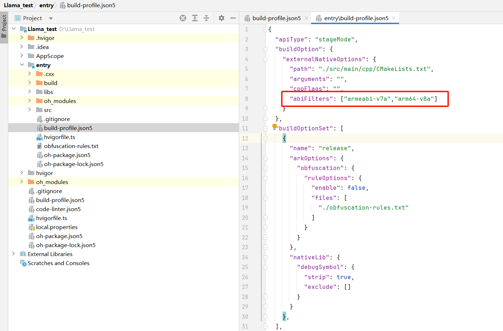
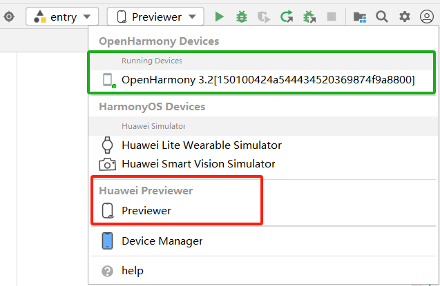

# 移动操作系统与端侧AI推理初探

## 实验目的

- 了解：一个真正 “实用” 的操作系统还需要什么？
- 了解开源鸿蒙整体框架并尝试使用开源鸿蒙
- 了解移动操作系统应用开发流程（Native c++）
- 学会交叉编译出动态链接库并且在应用开发时使用


## 实验环境

- OS:
  - 烧录：Windows 10 / 11
  - 编译：Ubuntu 24.04.4 LTS

- Platform : VMware

## 实验时间安排

> 注：此处为实验发布时的安排计划，请以课程主页和课程群内最新公告为准
> 此次实验只有两周时间

-  5.16晚实验课，讲解实验、检查实验
-  5.23晚实验课，检查实验
-  5.30晚实验课，补检查实验

## 友情提示/为什么要做这个实验？

- **本实验难度不高，目的是让大家了解当前移动操作系统以及移动应用开发方法，并尝试使用AI推理满足功能。**
- 如果同学们遇到了问题，请先查询在线文档。在线文档地址：[https://docs.qq.com/sheet/DU1JrWXhKdFFpWVNR](https://docs.qq.com/sheet/DU1JrWXhKdFFpWVNR)


# 第一部分 移动操作系统以及润和DAYU200开发板介绍

## 1.1 什么是“实用”的操作系统？

在操作系统理论课中，我们经常接触各种概念模型、设计原则和算法。但当我们走出课堂，进入实际开发或应用场景时，“实用性”（Practicality）就成为了衡量一个操作系统好坏的关键标准之一。那么，什么构成了一个“实用”的操作系统呢？

“实用”并非一个严格的操作系统分类术语（如分时系统、实时系统等），而是更侧重于一个操作系统在现实世界中能否有效、可靠、高效地完成其设计目标，并被用户和开发者方便地使用。一个“实用”的操作系统通常具备以下几个关键特征：

- 易用性 (Usability):
  - 用户易用性： 对于有用户交互界面的系统，界面需要直观、易于学习和操作。
  - 开发者易用性： 需要提供清晰的文档、完善的软件开发工具包（SDK）、调试工具和活跃的开发者社区支持。这对于本次实验尤其重要，我们需要使用OpenHarmony的SDK进行开发。
  - Android Studio(Android); Devco Studio(HarmonyOS/OpenHarmony)
- 性能 (Performance) 与效率 (Efficiency):
  - 系统需要在其目标硬件上表现出可接受的性能。这意味着响应用户操作要及时，执行任务要高效。
  - 对于移动或嵌入式系统，**资源效率**（特别是功耗和内存占用）至关重要，直接关系到电池续航和成本。低延迟与高能效比（适用于IoT、边缘计算）
- 可维护性 (Maintainability) 与生态系统 (Ecosystem):
  - 操作系统需要能够被持续更新和维护，以修复bug、堵塞安全漏洞、适应新的硬件和需求（例如手机不断地更新推送，Windows Update等）。
  - 一个健康的生态系统（包括硬件制造商、软件开发者、用户社区）是操作系统生命力的体现，也是其保持“实用”的关键。
- 安全性 (Security):

  - 必须提供必要的安全机制，保护系统自身和用户数据免受恶意软件、未授权访问等威胁。安全性的重要程度取决于应用场景
总结来说，一个“实用”的操作系统，不仅仅是理论概念的堆砌，更是能够在特定的硬件平台上，稳定、高效、安全地运行，满足用户需求，并为开发者提供便利，从而真正在现实世界中创造价值的软件系统。

在我们本次实验中，我们将使用的OpenHarmony，其目标就是成为面向多种智能设备的“实用”操作系统。我们将通过具体的开发实践，体验其作为开发平台的“实用性”，例如利用其SDK进行交叉编译，并在真实的DAYU200开发板上运行我们集成的AI推理库。
## 1.2 移动操作系统简介

### 1.2.1 什么是移动操作系统
移动操作系统是一种专门为便携式、手持设备（如智能手机、平板电脑、智能手表等）设计的操作系统。与大家更为熟悉的桌面操作系统（如Windows、macOS、Linux发行版如Ubuntu）一样，移动操作系统的核心功能也是管理设备的硬件资源（CPU、内存、存储、网络、传感器等）、提供用户交互界面、以及运行应用程序。

然而，由于移动设备与桌面计算机在硬件形态、使用场景、性能功耗等方面存在显著差异，移动操作系统在设计理念和功能侧重上与桌面操作系统有着明显的不同。

### 1.2.2 目前主流的移动操作系统

目前市场上主流的移动操作系统主要有：

1. Android (Google): 由Google主导开发，基于Linux内核，是目前市场份额最大的移动操作系统。其开放性吸引了众多设备制造商和开发者。

2. iOS(Apple): 由Apple公司为其iPhone、iPad等设备开发的闭源操作系统。以其流畅的用户体验、严格的应用生态和安全性著称。

3. HarmonyOS (华为) / OpenHarmony (开源鸿蒙开放原子基金会): 由华为开发，旨在面向万物互联时代，可部署于手机、平板、智能穿戴、智慧屏、车机等多种智能终端。OpenHarmony是HarmonyOS的开源版本，也是本次实验我们将使用的操作系统。


### 1.2.3 移动操作系统 vs. 桌面操作系统
为了更好地理解移动操作系统的特性，我们将其与大家常用的桌面操作系统进行对比：

| 特性             | 移动操作系统 (如 Android, iOS, OpenHarmony)                                  | 桌面操作系统 (如 Windows, macOS, Ubuntu)                                       |
| :--------------- | :--------------------------------------------------------------------------- | :----------------------------------------------------------------------------- |
| **设计目标** | 优先考虑便携性、低功耗、触控交互、持续连接                                     | 优先考虑强大的计算能力、多任务处理、外设扩展性、精确输入（键鼠）                 |
| **硬件平台** | 通常基于ARM等低功耗架构的SoC（片上系统），资源（CPU、内存、存储）相对受限      | 通常基于x86/x64架构，拥有更强的处理器、更大的内存和存储空间                      |
| **用户交互** | 以触摸屏为主要输入方式，支持手势操作，界面为单窗口或分屏应用优化                 | 以键盘、鼠标为主要输入方式，支持多窗口、复杂的图形用户界面（GUI）                 |
| **电源管理** | 极其重要，采用积极的休眠策略、后台任务限制等机制以延长电池续航                 | 电源管理相对宽松，虽然也在不断优化，但通常连接电源使用，对续航要求不如移动设备苛刻 |
| **应用生态** | 通常依赖官方或第三方应用商店分发应用，应用运行在沙盒（Sandbox）环境中，权限管理严格 | 软件来源多样（安装包、商店、源码编译等），沙盒机制相对不普遍，权限管理模型不同     |
| **连接性** | 高度依赖无线网络（蜂窝数据、Wi-Fi、蓝牙），内置多种传感器（GPS、加速度计等）     | 对有线网络（以太网）支持普遍，无线网络也很常见，但对传感器依赖较少                |
| **系统更新** | 更新通常由设备制造商或运营商推送，有时碎片化问题较严重（Android）               | 更新通常由操作系统供应商直接提供，用户可控性相对较高                             |
| **开发范式** | 常使用特定的SDK（如Android SDK, iOS SDK, OpenHarmony SDK），注重UI框架和生命周期管理 | 开发工具和语言选择更广泛，系统API调用方式和应用模型不同                          |

在本次实验中，我们将会体会到其中部分差异：硬件平台（交叉编译），应用生态(沙盒)，开发范式(SDK)

### 1.3 OpenHarmony
在了解了移动操作系统的一般概念和特性后，现在我们将焦点转向本次实验的主角——OpenHarmony
#### 1.3.1 什么是 OpenHarmony？

OpenHarmony（中文常称为“开放鸿蒙”）是一个由开放原子开源基金会（OpenAtom Foundation）孵化和运营的开源项目。它并非仅仅是传统意义上的手机或平板操作系统，而是一个面向全场景、可分布式部署的智能终端操作系统。简单来说，它的目标是成为驱动未来各种智能设备（从小型物联网设备到功能丰富的智能手机、平板、智慧屏等）的统一基础平台。

#### 1.3.2 OpenHarmony核心理念与愿景

OpenHarmony 旨在打破单一设备的应用边界，其核心设计理念之一是分布式技术。这意味着：

1. 一次开发，多端部署： 开发者编写的应用，理论上可以通过适配层部署到多种不同形态、不同屏幕尺寸的 OpenHarmony 设备上。
2. 硬件互助，资源共享： 不同设备可以组成“超级终端”，互相调用对方的硬件能力（例如，用手机的键盘输入文字到智慧屏，或用平板控制无人机的摄像头）。
3. 无缝流转，协同交互： 应用和数据可以在不同设备间平滑迁移和协同工作，提供一体化的用户体验。

> 虽然OpenHarmony的愿景宏伟，但本次实验中，我们仅会体验其在DAYU200开发板上的单设备部署，不会涉及到分布式部署的特性。（因为工作量可能会很大/(ㄒoㄒ)/~~，并且开发板数量较少）

#### 1.3.3 OpenHarmony关键特性

OpenHarmony技术架构如下所示：


- 分层架构： OpenHarmony 采用了清晰的分层架构，主要包括内核层、系统服务层、框架层和应用层。

  - 内核层 (Kernel Subsystem)： 关键在于其可按需选择内核。对于资源受限的轻量级设备（如内存为 KiB 或 MiB 级别），可选用 LiteOS 内核；对于资源较丰富的标准系统设备（如本次实验使用的 DAYU200 开发板），则可选用 Linux 内核。理解这一点对于后续的交叉编译环境配置非常重要。
  - 系统服务层 (System Service Layer)： 提供一系列核心系统能力和通用的基础服务，如分布式能力、图形、多媒体、安全等。
  - 框架层 (Framework Layer)： 为应用开发提供必要的 API 和框架，包括应用框架、UI 框架（如 ArkUI）等。
  - 应用层 (Application Layer)： 包含系统应用和第三方应用。
- 组件化设计： 系统可以根据硬件的具体能力进行灵活的组件化裁剪和按需加载，使其能够适配各种内存和性能规格的设备。
- 开放源代码： 作为一个开源项目，其源代码对全球开发者开放，便于学习、定制和共同发展生态。

### 1.3.4 OpenHarmony 与 HarmonyOS 的关系：

OpenHarmony 是 HarmonyOS（华为鸿蒙操作系统）的开源基础版本。华为将 HarmonyOS 的基础能力贡献给了开放原子开源基金会，形成了 OpenHarmony 项目。其他厂商或开发者可以基于 OpenHarmony 构建自己的操作系统发行版，HarmonyOS 就是基于 OpenHarmony 的一个面向消费者的商业发行版。

> 类似于Android与AOSP的关系

### 1.3.5 为什么在本次实验中使用 OpenHarmony？

选择 OpenHarmony 作为本次实验平台，主要基于以下考虑：

- 代表性： 它代表了现代操作系统（特别是面向物联网和多设备协同）的一个发展方向。
- 实践平台： 为我们提供了一个真实的、可操作的移动操作系统环境（运行在 DAYU200 开发板上）。
- 开发体验： 允许我们实践移动平台的开发流程，特别是本次实验重点关注的原生 C++ 代码（Native C++）的交叉编译、库集成与调用。
- 可及性： 相关的 SDK、开发工具（DevEco Studio）和文档资源相对完善，便于学生学习和使用。

在接下来的实验环节中，我们将亲自动手，完成 OpenHarmony 系统镜像的烧录、开发环境的搭建，并最终在其上运行我们自己编译的 C++ AI 推理库，从而深入理解在移动操作系统上进行原生开发和集成的过程。

> 其实是为了统一实验平台，单独设计Android实验可能部分同学无法做这个实验。

## 1.2 DAYU200开发板
前面我们介绍了作为软件基础的 OpenHarmony 操作系统，现在我们来认识一下承载这个系统并供我们进行实际操作的硬件平台——DAYU200 开发板。
### 1.2.1 DAYU200开发板介绍

为了能够流畅运行功能相对完整的 OpenHarmony 标准系统，并支持复杂的应用开发与调试，DAYU200 配备了较为强大的硬件资源。其核心规格通常包括：
- 处理器 (SoC): 核心是瑞芯微 (Rockchip) RK3568 芯片。这是一款高性能、低功耗的应用处理器，集成了：
  - CPU: 四核 32 位 ARM Cortex-A55，主频最高可达 2.0GHz。注意这里的 32位 ARM 架构 (arm32 / armeabi)，这决定了我们后续交叉编译的目标平台。
  - GPU: Mali-G52 2EE 图形处理器，支持 OpenGLES 3.2, Vulkan 1.1。
  - NPU (可选): 部分版本集成神经网络处理单元，可提供约 1 TOPS 的 AI 算力，用于硬件加速人工智能应用（本次实验主要使用 CPU 进行推理，但了解 NPU 的存在有助于理解硬件加速潜力）。
- 内存 (RAM): 开发板内存为2GB的 LPDDR4/LPDDR4X 内存。充足的内存对于运行标准系统和我们的 AI 推理任务至关重要。（2GB对于推理较大模型就有点不够，附录中我们会教大家如何创建交换分区）
- 存储 (Storage): 板载 eMMC 闪存作为主要的系统和数据存储介质，开发板容量为 32GB。
> 更多信息可以查看链接 [润和HH-SCDAYU200开发套件](https://gitee.com/hihope_iot/docs/tree/master/HiHope_DAYU200#https://gitee.com/hihope_iot/docs/blob/master/HiHope_DAYU200/docs/README.md)

### 1.2.2 为什么选择使用DAYU200开发板
- 官方与社区支持: DAYU200 是 OpenHarmony 官方和社区重点支持的开发板之一，有持续的软件版本适配和丰富的文档、教程资源。这意味着我们可以更容易地获取到可运行的 OpenHarmony 标准系统镜像和解决遇到的问题。
- 性能适中: 其硬件配置足以流畅运行 OpenHarmony 标准系统，并能够承载我们本次实验中编译 C++ 代码、运行中小型语言模型（如 Llama.cpp 在 CPU 上推理）的需求。
> 主要是HUAWEI推荐的╮(╯▽╰)╭


### 1.2.2 开发板的使用

在发放的开发板中，有以下物品:

1. DAYU200开发板
2. DAYU200电源适配线
3. 公对公USB数据线(用于烧写)
4. mini USB B数据线(用于串口调试，本实验可以忽略)
   

当开发板开机后,部分开发板运行的是Openharmony4.0版本的mini system，其没有图形化界面，会直接卡在LOGO，这是正常现象；后面实验我们将教大家如何烧录Openharmony5.0版本的全量系统。

当接上电源后，开发板一般会自行启动，如果没有启动请查看开发板上的按钮，根据按钮的功能进行尝试打开
    

### 1.2.3 开发板使用规范

开发板的使用采用分组负责人制度。即三人一组，由一人担任负责人并且保管开发板，发放和回收开发板向负责人进行。

<div STYLE="page-break-after: always;"></div>

# 第二部分 开源鸿蒙镜像的烧录

在这一部分，我们将介绍 OpenHarmony 镜像的烧录。为了方便大家体验开发版，助教给大家准备了已经编译好的完整版 OpenHarmony 镜像，可以直接烧录到开发板上。

## 2.1 OH烧录

RK3568 开发板的烧录软件目前**只支持 Windows 系统**，请在 Windows 系统下进行本章节的步骤。

### 2.1.1烧录前准备

#### 1.连接开发板

* 按照下图提示连接**电源线**和**USB烧写线**

  

#### 2.下载烧录工具和驱动

* [DAYU200 烧录工具](https://git.ustc.edu.cn/KONC/oh_lab/-/raw/main/DAYU200%E7%83%A7%E5%86%99%E5%B7%A5%E5%85%B7%E5%8F%8A%E6%8C%87%E5%8D%97.zip)
  下载后解压到文件夹即可

#### 3.准备编译镜像

* 下载Openharmony4.0全量系统镜像。镜像下载地址：

  * 推荐链接：https://rec.ustc.edu.cn/share/cee67650-2a59-11f0-8d78-415e39d48777

  * 备用链接：https://git.ustc.edu.cn/KONC/oh_lab/-/raw/main/OpenHarmony5.0-image.zip

### 2.1.2烧录步骤

#### 1. 安装USB驱动

* 双击烧录工具中 `windows\DriverAssitant_v5.1.1\DriverInstall.exe` 打开安装程序，点击下图所示驱动安装按钮: 

  

#### 2. 打开烧写工具 

* 双击烧录工具中 `windows\RKDevTool.exe` 打开烧写工具， 如图所示， 默认是 Maskrom 模式：

  

* 导入编译文件镜像包中的 `config.cfg`配置，路径为 `OpenHarmony\config.cfg`

> 注意导入`config.cfg`配置为必须操作，尤其是后续重新编译镜像后，不能简单的替换文件夹的文件，否则会烧录失败

  1. 右击导入配置

     

  2. 选中配置文件 `OpenHarmony\config.cfg`

     

  3. 点击空白栏，逐一配置对应镜像路径(也可以双击路径，手动修改路径)

     

     

     

#### 3. 进入LOADER烧写模式

* 默认烧写工具是 `Maskrom` 模式

  

* 进入 `LOADER` 烧写模式

  1. 按住 `VOL-/RECOVERY` 按键（图中标注的①号键） 和 `RESET` 按钮（图中标注的②号键）不松开， 烧录工具此时显示“没有发现设备” 

     

     

  2. 松开 `RESET` 键， 烧录工具显示“发现一个 `LOADER` 设备” ， 说明此时已经进入烧写模式

     

  3. 松开按键， 稍等几秒后点击执行进行烧录，如果烧写成功， 在工具界面右侧会显示下载完成

     

### 2.2 OH命令行工具hdc

#### 2.2.1 hdc概述

* `hdc`（OpenHarmony Device Connector）是为开发人员提供的用于设备连接调试的命令行工具，该工具需支持部署在Windows/Linux/Mac等系统上与OpenHarmony设备（或模拟器）进行连接调试通信。简言之，hdc是OpenHarmony提供的用于开发人员调试硬件、应用的命令行工具，用在电脑与开发板之间的交互。适用于OpenHarmony应用、硬件开发及测试人员,是每个开发人员的必备、入门工具。

#### 2.2.2 环境准备

* 支持运行环境：`windows 10、ubuntu 18.04`以上 `64bit` 版本（下面以Windows11为例）

* 安装USB设备驱动：[见烧录部分](####1. 安装USB驱动)

* `hdc`工具下载

  1. 下载安装包[https://git.ustc.edu.cn/KONC/oh_lab/-/raw/main/HDC.zip](https://git.ustc.edu.cn/KONC/oh_lab/-/raw/main/HDC.zip)

  2. 解压缩，并将其中的文件`hdc.exe`和`libusb_shared.dll`，复制到文件夹 `E:\OH\hdc_bin\` 目录下（可自定义目录名）

  3. `hdc` 路径环境配置：在设置中找到高级系统设置，然后按照以下步骤操作。“高级系统设置”→高级→环境设置→系统环境变量中的 path→输入`E:\OH\hdc_bin\` →一路“确定”

     

     

#### 2.2.3 运行hdc

* 打开`cmd`窗口，执行 `hdc shell` 就进入了命令交互界面。
* 你也可以使用 PowerShell 或者其它 Windows 下的 Shell，用同样的方法使用`hdc`。


#### 2.2.4 使用hdc安装应用
在 2.1 节中我们成功为 DAYU200 开发板烧录了 OpenHarmony 5.0 标准系统镜像。启动后您可能会发现，这个初始系统非常“干净”，甚至没有预装“应用市场”或“浏览器”等常用工具。这导致我们暂时无法直接在开发板上访问网络资源或下载其他应用。

本节将介绍如何解决这个问题：使用 hdc (HarmonyOS Device Connector) 工具从你的开发主机（电脑）将预先下载好的 HAP 应用包安装到开发板上。HAP (HarmonyOS Ability Package) 是 OpenHarmony 应用的安装包格式。

1. 下载浏览器 HAP 包：[https://rec.ustc.edu.cn/share/f3d8ecf0-2a5b-11f0-b666-7b853ad445dc](https://rec.ustc.edu.cn/share/f3d8ecf0-2a5b-11f0-b666-7b853ad445dc)
2. 确保您的 DAYU200 开发板已通过 USB Type-C 线连接到电脑,并且2.2.3中可以链接到shell。确认连接正常后，使用 hdc install 命令来安装您下载的 HAP 文件。请将下面命令中的 <您下载的HAP文件路径> 替换为您 实际保存 HAP 文件的完整路径。
```bash
hdc install <您下载的HAP文件路径>

示例：
$ hdc install D:\Downloads\Browser.hap
[Info]App install path:D:\Downloads\Browser.hap, queuesize:0, msg:install bundle successfully.
AppMod finish
```
3. 安装成功后，系统页面会显示应用的Logo，点击即可运行（由于应用需要联网，推荐使用Wifi联网后使用）

通过这种 hdc 侧载安装的方式，我们可以为初始的 OpenHarmony 系统补充必要的工具或部署我们开发的应用程序，即使在没有应用市场的情况下也能进行有效的开发和测试。

<div STYLE="page-break-after: always;"></div>

# 第三部分 安装DevEco Studio部署开发环境

在前两部分，我们了解了移动操作系统、OpenHarmony 以及实验使用的 DAYU200 开发板，并完成了基础的系统烧录和 HAP 包安装。现在，我们需要搭建用于应用程序开发和 Native C++ 代码交叉编译的环境。这部分包含两个主要步骤：在 Windows 上安装集成开发环境 DevEco Studio（主要用于运行官方 Demo 和进行 HAP 应用开发），以及在 Ubuntu 上准备用于交叉编译 C++ 代码的 OpenHarmony Native SDK。

## 3.1 在 Windows 上安装 DevEco Studio
DevEco Studio 是 HUAWE 推出的官方集成开发环境（IDE），用于 HarmonyOS 和 OpenHarmony 应用开发。它集成了代码编辑、编译、调试、应用签名、HAP 打包、模拟器/预览器以及 SDK 管理等功能。

在本实验中的主要用途：

- 运行和体验官方提供的 MindSpore Lite 端侧 AI 推理 Demo。
- 通过Native c++进行AI应用的开发。

### 3.1.1 下载安装DevEco Studio
1. 下载 DevEco Studio:https://developer.huawei.com/consumer/cn/deveco-studio/
2. 安装DevEco Studio，安装过程较为简单，不再展开说明

> 注意：DevEco Studio安装包体积较大，请确保网络连接稳定。
>
> DevEco Studio 中文设置：https://developer.huawei.com/consumer/cn/forum/topic/0204171044047287810
### 3.1.2 DevEco Studio的使用：项目创建
1. 通过如下两种方式，打开工程创建向导界面。
  - 如果当前未打开任何工程，可以在DevEco Studio的欢迎页，选择Create Project开始创建一个新NDK工程。
  - 如果已经打开了工程，可以在菜单栏选择File > New > Create Project来创建一个新NDK工程。
2. 根据工程创建向导，选择Native C++工程模板，然后单击Next。

3. 在`Configure Your Project`页面可以修改`Project Name`与项目目录，然后单击Finish。

4. 项目目录主要文件说明
  - entry：应用模块，编译构建生成一个HAP。
    - src > main > cpp > types：用于存放C++的API接口描述文件
    - src > main > cpp > types > libentry > index.d.ts：描述C++ API接口行为，如接口名、入参、返回参数等。
    - src > main > cpp > CMakeLists.txt：CMake配置文件，提供CMake构建脚本。
    - src > main > cpp > napi_init.cpp：定义C++ API接口的文件。
    - src > main > ets > pages > Index.ets：用于存放页面的ArkTS源码。
    - src > main > resources：用于存放应用所用到的资源文件，如图形、多媒体、模型文件等。
5. 进入项目后，先安装OpenHarmony SDK,点击`File > Settings`找到OpenHarmony SDK，选择OpenHarmony SDK安装位置，勾选API Version 14中所有的选项，点击`Apply`，后续会自动下载并解压到相应目录

6. 登录华为账号用于对项目签名。点击`File > Project Structure > Project > Signing Configs`,界面勾选`Support HarmonyOS` 和 `Automatically generate signing`，等待自动签名完成即可,下图为成功登录后的结果

7. **安装完毕SDK后**,修改项目配置文件`build-profile.json5`,修改内容如下所示(有些选项可能原本配置文件中不存在，直接添加即可)
```text
# 修改前的内容
        "compatibleSdkVersion": "5.0.2(14)",
        "runtimeOS": "HarmonyOS",
# 修改后的内容
        "compatibleSdkVersion": 14,
        "compileSdkVersion": 14,
        "targetSdkVersion": 14,
        "runtimeOS": "OpenHarmony"
```

8. **安装完毕SDK后**,修改项目配置文件`entry/build-profile.json5`,修改内容如下所示
```text
"abiFilters": ["armeabi-v7a","arm64-v8a"]
```

9. 在6和7中，修改配置文件时，在编辑界面有提示需要同步项目文件，直接点击`sync now`即可

> 这里应该会有同学吐槽，为什么这么麻烦，下面将一一解释
>
> 1. 在第五步中，为什么要下载SDK。什么是SDK？
>
>     SDK 是 “**S**oftware **D**evelopment **K**it” 的缩写，中文意思是“软件开发工具包”。你可以把它想象成一个包含了各种工具、零件和说明书的“工具箱”，专门用来帮助开发者为特定的软件平台（比如 OpenHarmony 系统、Android 系统或者 Windows 操作系统）或者特定的硬件设备（比如某种芯片或开发板）创建应用程序。
>
>     DevEco Studio 是一个集成开发环境 (IDE)，它本身提供了一个编写代码、管理项目和组织文件的“工作台”。但是，要让这个“工作台”能够真正用来开发 OpenHarmony 应用，它就需要 OpenHarmony 的“专属工具箱”——也就是 OpenHarmony SDK。
>
> 2. 在第六步中，为什么要登录自己的华为账号？
>
>     用一句话来说，是为了打包Hap包（类似于Apk）。登录华为账号，即可说明这个应用是你开发的，不是其他人冒名顶替的，并且能确定在发布时没有被篡改过（部分同学在安装某些盗版软件的时候应该遇到过这个提示，但是往往选择了“无视风险继续安装”）
>
>
> 3. 在第七步中，为什么要修改这些内容？
>
>     在第六步中修改的配置文件内容主要说明SDK的版本（不同的SDK版本可能适配的API不同，导致编译出现问题）以及运行时的操作系统（默认是Harmony，我们这里使用的是OpenHamrony）。
>
> 4. 在第八步中，为什么要修改这些内容？
> 
>     在第七步中修改的配置文件内容主要说明了ABI的过滤，也就是编译时需要支持的类型，这里我们选择支持32位和64位的ARM架构，因为我们的开发板采用的是ARM架构,并且是32位。（为什么不就写一个32位的，因为IDE不支持╮(╯▽╰)╭）

### 3.1.3 DevEco Studio的使用：项目运行
项目运行主要有两种方式:
- 一种使用模拟器运行,适合纯逻辑代码，即不需要实际硬件运行的项目（这里表明AI推理Demo无法用第一种方式运行）.
- 第二种直接通过开发板运行,适合需要实际硬件运行的项目，其将直接打包Hap包安装到开发板运行。

下图中红色框即为模拟器运行，绿色框即为开发板运行（只有电脑链接开发板时才会显示）


通过3.1.2创建的项目可以通过模拟器运行，**后续提供的Demo无法使用模拟器运行**

1. 选择运行方式（模拟器/开发板）
2. 点击绿色三角形运行按钮，选择显示模型2in1,即可运行项目（项目有两个页面，运行时显示`Hello World`，点击`Hello World`后页面变成`Welcome`，在其背后会计算2+3的值并且输出到日志中），下面为点击`Hello World`后的结果

3. 如果选择通过开发板运行，直接点击开发板上的`Hello World`即可。IDE会将软件安装到开发板上，回到开发板系统主页可以看到

> 由于移动操作系统应用没有终端，不会将输出结果通过`printf`显示到终端上,所以调试一般通过日志得到(Lab2中曾接触过)。

## 3.2  在 Ubuntu 上准备 OpenHarmony Native SDK
本次实验的核心任务之一是交叉编译 C++ 代码库（Llama.cpp）。这个过程需要在 Linux 环境下进行，并且需要一套特定的交叉编译工具链和 OpenHarmony 系统库/头文件（统称为 Native SDK 或 Toolchain）。这套工具运行在您的 Ubuntu 系统上，但其编译产生的目标代码是运行在 DAYU200 (arm32 架构) 上的 OpenHarmony 系统。

1. 使用wget下载OpenHarmony Native SDK

    下载地址:https://git.ustc.edu.cn/KONC/oh_lab/-/raw/main/native-linux-x64-5.0.3.135-Release.zip
  
2. 解压，注意解压目录，后续需要使用
```sh
$ unzip native-linux-x64-5.0.3.135-Release.zip
```

> 这里估计又会有疑问，在3.1步中明明下载过SDK，为什么这里还需要下载SDK?
>
> 最主要原因为Linux和Windows使用的链接库不同，在开发板运行的OpenHarmony的内核是Linux，所以我们需要在Linux上编译出链接库使用，并且我们这里只使用了Native SDK，即编译CPP程序需要的工具，而在3.1步中，我们还下载了编译前端的SDK
## 3.2 交叉编译应用过程

> ❗注意：本部分采用Hello World程序演示步骤，与实验检查要求需要编译的应用不一样，请仔细阅读实验评分标准。

在前面的步骤中，我们已经在 Ubuntu 系统上准备了 OpenHarmony Native SDK，其中包含了针对 DAYU200 开发板（arm32架构）的交叉编译工具链和系统库。现在，我们将深入理解什么是交叉编译，并实践一个简单的交叉编译过程。

### 3.2.0 什么是交叉编译

**编译 (Compilation)** 大家可能比较熟悉，它是指将人类可读的源代码（如 C、C++、Java 代码）转换成计算机处理器能够直接执行的机器码（可执行文件或库文件）的过程。这个过程通常由编译器在本机完成，例如，在你的 x86 架构的 Windows 电脑上用 Visual Studio 编译一个 Windows 程序，或者在你的 x86 架构的 Ubuntu 系统上用 GCC 编译一个 Linux 程序。这种在当前系统架构下编译出可运行于当前系统架构的程序的方式，我们称之为**本地编译 (Native Compilation)**。

**交叉编译 (Cross-Compilation)** 则有所不同。它是指：**在一个特定的硬件架构和操作系统（我们称之为“宿主机”或“Host”）上，编译产生能够运行在另一个不同硬件架构和/或操作系统（我们称之为“目标机”或“Target”）上的可执行代码的过程。**

- **宿主机 (Host)**: 通常是开发者使用的、计算能力较强的计算机，例如我们实验中使用的运行 Ubuntu 24.04 的 x86_64 架构 PC。
- **目标机 (Target)**: 是我们希望最终运行我们程序的设备，例如我们实验中使用的运行 OpenHarmony 的 DAYU200 开发板，其处理器是 ARMv7a(armeabi32) 架构。

### 3.2.1 为什么需要交叉编译
在嵌入式系统和移动设备开发中，交叉编译非常普遍且必要，主要原因包括：

1. 目标机资源受限： 像 DAYU200 这样的开发板或许多嵌入式设备，其处理器性能、内存大小、存储空间都远不如桌面PC。在这些设备上直接进行大型项目（如操作系统内核、复杂的 C++ 应用如 Llama.cpp）的编译会非常缓慢，甚至因资源不足而无法完成。
2. 目标机缺乏开发环境： 很多目标设备可能没有安装编译器、链接器、库文件等完整的开发工具链。它们被设计为运行特定应用，而不是进行软件开发。(OpenHarmony中没有开发工具链)
3. 开发效率和便利性： 开发者通常更习惯在功能强大、工具齐全的PC上进行代码编写、调试和项目管理。交叉编译使得开发者可以在熟悉的开发环境中为资源受限或环境不同的目标设备构建软件。
4. 特定架构需求： 有些软件就是为特定非主流架构设计的，开发者可能没有该架构的物理机器用于本地编译。
### 3.2.2 交叉编译示例：为 DAYU200 编译和使用动态链接库
在此示例中，我们将创建一个简单的动态链接库，并将其放入3.1部分的Demo，编译运行。
环境假设：

- 宿主机1： Vmware上的Ubuntu 24.04 (x86_64)
- 宿主机2： Windows 10/11 (x86_64)
- 目标机： DAYU200 开发板 (arm32)，运行 OpenHarmony 5.0 标准系统
- OpenHarmony Native SDK 路径： ~/native (请根据您的实际解压路径调整)
  - 交叉编译器路径 (示例): ~/native/llvm/bin/armv7-unknown-linux-ohos-clang++
1. 在宿主机1(Ubuntu) 上创建源代码文件：
打开终端，创建一个名为`mylib.cpp`的文件，在该文件中编写一个简单的打印和加法函数如下：

    ```cpp
    // 使用 extern "C" 可以防止 C++ 编译器的名称修饰 (name mangling),
    // 使得这些函数更容易被 C 语言或其他语言调用, 或者在不同 C++ 编译器间保持一致性。
    // 对于纯 C++ 内部使用, 且主程序也用同一编译器编译时, 这并非总是必需, 但作为库导出是一种良好实践。
    extern "C" {
        double minus_numbers_in_lib(double a,double b) {
            return a - b;
        }
    }
    ```
2. 为库创建头文件(mylib.h):

    在同一文件夹创建`mylib.h`，声明库中的函数:

    ```cpp
    #ifndef MYLIB_H
    #define MYLIB_H

    #ifdef __cplusplus
    extern "C" {
    #endif

    // 声明库中导出的函数
    double minus_numbers_in_lib(double a,double b)

    #ifdef __cplusplus
    }
    #endif

    #endif // MYLIB_H
    ```
3. 将源代码交叉编译为动态链接库 (.so 文件):

    执行以下命令将 mylib.cpp 编译成名为 libmylib.so 的动态链接库。
    
    **请务必将命令中的 SDK 路径替换为实际的路径。**
    ```sh
    # 进入源代码所在目录 (如果不在该目录)
    # cd <your_source_code_directory>

    # 执行交叉编译命令
    $ ~/native/llvm/bin/armv7-unknown-linux-ohos-clang++ mylib.cpp -o libmylib.so -shared -fPIC
    ```
    如果命令执行成功，当前目录下会生成一个名为 hello_dayu 的文件。
3. 在宿主机1上验证生成的文件类型：

    我们可以使用`file`命令来查看生成的可执行文件的信息：
    ```sh
    file hello_dayu
    ```
    应该会看到类似如下的输出:
    ```sh
    hello_dayu: ELF 32-bit LSB executable, ARM, EABI5 version 1 (SYSV), statically linked, with debug_info, not stripped
    ```
    注意输出中的 ARM EABI5 version 1，这表明它是一个为 ARM 32位架构编译的可执行文件，并且是为 OpenHarmony 系统准备的。这个文件不能在你的 x86_64 Ubuntu 宿主机上直接运行。如果你尝试运行 (./hello_dayu)，系统会报错（例如 cannot execute binary file: Exec format error）。
4. 将可执行文件从宿主机1下载到宿主机2：即从虚拟机传输文件到Windows。（可以使用虚拟机的增强功能，共享文件夹，睿客网盘，邮箱等方式）

### 3.2.3 交叉编译运行
>  注意，从这一步开始将在宿主机2上操作。

首先，请参照实验文档第二部分的`OH命令行工具hdc`一节下载和配置HDC。

1. 按照上述烧写要求将实验开发板连接到电脑。

2. 打开命令提示符，运行如下指令检查是否成功连接：

   ```sh
   hdc list targets
   ```

   如果出现了设备名字（一串由数字和字母组成的奇怪字符串），则说明连接成功。效果如下：

   

   > 如果你执行后没有出现设备，只显示`[EMPTY]`，请确认镜像烧写是否成功，如果镜像烧写成功，请尝试插拔开发板充电器。

3. 将编译好的程序`hello_dayu`发送到开发板上，执行如下指令：

   ```shell
   hdc file send  [宿主机2上hello_dayu的路径]  /data/local/tmp/
   ```

   注意把上面指令中的路径写上你自己存放`hello`程序的路径，比如`hdc file send  D:\hello  /data/local/tmp/`

4. 执行`hdc shell`进入shell交互模式。

5. 执行`cd /data/local/tmp/`进入hello所在目录（具体目录根据你的hdc file send来确定，比如在第3步中传输到`/data/local/tmp/`,则进入该目录）。

6. 执行`chmod +x hello`为`hello`程序添加执行权限。

7. 执行`./hello`执行程序得到输出`Hello OpenHarmony from DAYU200! (Cross-Compiled)`：

## 3.4 任务目标


## 3.5 任务提示

1. 添加子系统时由于编译选项的原因，OpenHarmony 不允许任何 Warning 的产生，如果编译出现问题，请查看编译日志是否是代码中出现了 warning （在lab2中提供的TODO代码中存在warning，具体为`split_string`函数中`string_dup[MAX_BUF_SIZE]`的定义没有用到，以及最后while判断时缺少`()`）

2. 添加子系统时可能不需要`include`,可以不使用`include`的文件，具体方法自行判断

3. 子系统添加完成后通过`ls`可以查看到可执行文件的名字，通过 `hdc shell` 直接输入该名字即可正常执行

4. 由于shell环境的原因，删除键可能无法使用，属于正常情况

<div STYLE="page-break-after: always;"></div>

# 第四部分：实验内容与检查标准

## 4.1 实验内容

1. 将提供的 Openharmony5.0 全量标准系统烧录到开发板中，**体验完整版 OpenHarmony 系统**。
2. 安装DevEco Studio，并尝试使用提供的Demo


**更具体实验要求请参考 [3.4  任务目标](# 3.4 任务目标) 和 [4.2 实验评分标准](# 4.2 实验评分标准) 。**

## 4.2 实验评分标准

本次实验共 10 分，实验检查要求和评分标准如下：


# 附录

## 1. SCP 命令使用指南

在使用虚拟机时，很常用的一项功能为在虚拟机和宿主机之间传输数据，在虚拟机平台上，我们可以使用平台自带的部分功能，比如共享文件夹，拖拽等功能。或者我们可以使用在线的云存储平台例如邮箱，睿课网盘等传输文件。本节将介绍一个命令行工具用于在宿主机和虚拟机之间传输数据，该工具为Windows和Linux自带工具，无需下载配置即可使用

### 1.1 SCP 介绍

scp 是 secure copy 的缩写, 是 linux 系统下基于 ssh 登陆进行安全的远程文件拷贝命令。在群文件中`实验技巧.PDF`中，我们介绍过如何通过ssh链接到虚拟机，但是没有说如何通过ssh在虚拟机和宿主机之间传输文件。下面的内容基于你已经了解了ssh如何连接虚拟机。

### 1.2 SCP 使用方法

scp可以在linux上使用，也可以在windows的命令行工具(cmd/powershell)中使用，使用`man scp`可以查看scp的具体用法。下面将在Windows上演示如何进行文件传输。

#### 1.2.1 查看虚拟机ip地址(如果使用vlab，可以忽略该步骤)

使用`ip addr`查看ip地址,一般来说，以192.168开头的ip为虚拟机的ip地址。

在命令行(powershell/cmd)中使用`ping 192.168.xx.xx -c 3`可以查看是否可以连接到该地址，即是否可以连接到虚拟机.如果显示连接超时，则输入的ip地址不正确，请再次验证是否是该ip地址。

```shell
# ping 192.168.122.248 -c 3
PING 192.168.122.248 (192.168.122.248) 56(84) bytes of data.
64 bytes from 192.168.122.248: icmp_seq=1 ttl=64 time=0.650 ms
64 bytes from 192.168.122.248: icmp_seq=2 ttl=64 time=0.485 ms
64 bytes from 192.168.122.248: icmp_seq=3 ttl=64 time=0.498 ms

--- 192.168.122.248 ping statistics ---
3 packets transmitted, 3 received, 0% packet loss, time 2055ms
rtt min/avg/max/mdev = 0.485/0.544/0.650/0.074 ms
```

#### 1.2.2 使用scp进行文件传输

假设我们现在有一个文件名为`helloworld.c`,该文件在windows桌面上，那么我们需要先将windows命令行使用`cd`命令到达桌面(Desktop)文件夹，也可以直接在桌面或者你的文件所在的目录右键->`从终端打开`。

如果我们想把该文件传输到虚拟机上的家目录，则使用以下命令

```shell
scp ./helloworld.c user@192.168.xx.xx:~/
```

如果你想要传输一个文件夹（例如文件夹名称为`helloworld`）到家目录下的叫做`sample`文件夹中，则使用以下命令

```shell
scp -r ./helloworld user@192.168.xx.xx:~/sample/
```

反过来，如果我们想要从虚拟机上传输一个文件到宿主机，则将位置反过来即可,例如虚拟机家目录下有一个`helloworld.c`文件，我们想要传输到本地

```shell
scp user@192.168.xx.xx:~/hellowolrd.c ./
```

如果你使用的vlab，则可以不使用ip地址进行传输，直接将上面的`user@192.168.xx.xx`替换为`[用户名]@vlab.ustc.edu.cn `，并且在`scp`命令后添加`-i vlab-vmxxxx.pem `即可。（具体参数见自己的vlab网页显示）。当然如果使用vlab，更推荐使用vlab自带的文件传输功能。


