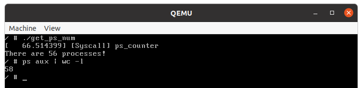

# 实验一：Linux基础与系统调用——添加系统调用(part3)

## 实验目的

- 掌握Linux内核编译方法；
- 掌握使用gdb调试内核的方法及步骤；
- 学习如何添加新的系统调用。

## 实验环境

- 虚拟机：VMware
- 操作系统：Ubuntu 24.04.2 LTS

> 系统的安装形式可以自由选择，双系统，虚拟机都可以，系统版本则推荐使用本文档所用版本。注意：由于Linux各种发行版非常庞杂且存在较大差异，因此本试验在其他Linux发行版可能会存在兼容性问题。如果想使用其他环境（如vlab）或系统（如Arch、WSL等），请根据自己的系统**自行**调整实验步骤以及具体指令，达成实验目标即可，但其中出现的兼容性问题助教**无法**保证能够一定解决。


## 实验时间安排

> 注：此处为实验发布时的安排计划，请以课程主页和课程群内最新公告为准


-  3.28 晚实验课，讲解实验第一部分、第二部分，检查实验 
-  4.4  清明节放假 
-  4.11 晚实验课，讲解实验第三部分，检查实验
-  4.18 晚实验课，检查实验
-  4.25 晚及之后实验课，补检查实验 

> 补检查分数照常给分，但会**记录**此次检查未按时完成，此记录在最后综合分数时作为一种参考（即：最终分数可能会低于当前分数）。

检查时间、地点：周五晚18: 30~22: 00，电三楼406/408。

## 如何提问

- 请同学们先阅读《提问指南》。[原文链接](https://lug.ustc.edu.cn/wiki/doc/howtoask/)
- 提问前，请先**阅读报错信息**、查询在线文档，或百度。[在线文档链接](https://docs.qq.com/sheet/DU1JrWXhKdFFpWVNR)；
- 在向助教提问时，请详细描述问题，并提供相关指令及相关问题的报错截图；
- 在QQ群内提问时，如遇到长时未收到回复的情况，可能是由于消息太多可能会被刷掉，因此建议在在线文档上提问；
- 如果助教的回复成功地帮你解决了问题，请回复“问题已解决”，并将问题及解答更新到在线文档。这有助于他人解决同样的问题。

## 为什么要做这个实验

-  为什么要学会使用Linux？ 
   - Linux的安全性、稳定性更好，性能也更好，配置也更灵活方便，所以常用于服务器和开发环境。实验室和公司的服务器一般也都用Linux；
   - Linux是开源系统，代码修改方便，很多学术成果都基于Linux完成；
   - Windows是闭源系统，代码无法修改，无法进行后续实验。
-  为什么要使用虚拟机？ 
   - 虚拟机对你的电脑影响最低。双系统若配置不正确，可能导致无法进入Windows，而虚拟机自带的快照功能也可以解决部分误操作带来的问题。
   - 本实验并不禁止其他环境的使用，但考虑其他环境（如WSL）变数太大，比如可能存在兼容性或者其他配置问题，会耽误同学们大量时间浪费在实验内容以外的琐事，因此建议各位同学尽量保持与本试验一致或类似的环境。
-  为什么要学会编译Linux内核？ 
   - 这是后续实验的基础。在后续实验中，我们会让大家通过阅读Linux源码、修改Linux源码、编写模块等方式理解一个真实的操作系统是怎么工作的。

## 其他友情提示

- **合理安排时间，强烈不建议在ddl前赶实验**。
- 本课程的实验实践性很强，请各位大胆尝试，适当变通，能完成实验任务即可。
- pdf上文本的复制有时候会丢失或者增加不必要的空格，有时候还会增加不必要的回车，有些指令一行写不下分成两行了，一些同学就漏了第二行。如果出了bug，建议各位先仔细确认自己输入的指令是否正确。要**逐字符**比对。每次输完指令之后，请观察一下指令的输出，检查一下这个输出是不是报错。**请在复制文档上的指令之前先理解一下指令的含义。** 我们在检查实验时会抽查提问指令的含义。
- 如果你想问“为什么PDF的复制容易出现问题”，请参考[此文章](https://type.cyhsu.xyz/2018/09/understanding-pdf-the-digitalized-paper/)。
- 如果同学们遇到了问题，请先查询在线文档。在线文档地址：[链接](https://docs.qq.com/sheet/DU1JrWXhKdFFpWVNR)

<div STYLE="page-break-after: always;"></div>

# 章节零 实验总览


# 章节一：编译、调试Linux内核，并使用你自己的shell

## 1.1 先导知识

### 1.1.1 系统内核启动过程

Linux kernel在自身初始化完成之后，需要能够找到并运行第一个用户程序（此程序通常叫做“init”程序）。用户程序存在于文件系统之中，因此，内核必须找到并挂载一个文件系统才可以成功完成系统的引导过程。

在grub中提供了一个选项“root=”用来指定第一个文件系统，但随着硬件的发展，很多情况下这个文件系统也许是存放在USB设备，SCSI设备等等多种多样的设备之上，如果需要正确引导，USB或者SCSI驱动模块首先需要运行起来，可是不巧的是，这些驱动程序也是存放在文件系统里，因此会形成一个悖论。

为解决此问题，Linux kernel提出了一个RAM disk的解决方案，把一些启动所必须的用户程序和驱动模块放在RAM disk中，这个RAM disk看上去和普通的disk一样，有文件系统，有cache，内核启动时，首先把RAM disk挂载起来，等到init程序和一些必要模块运行起来之后，再切换到真正的文件系统之中。

但是，这种RAM disk的方案（下称initrd）虽然解决了问题但并不完美。 比如，disk有cache机制，对于RAM disk来说，这个cache机制就显得很多余且浪费空间；disk需要文件系统，那文件系统（如ext2等）必须被编译进kernel而不能作为模块来使用。

Linux 2.6 kernel提出了一种新的实现机制，即initramfs。顾名思义，initramfs只是一种RAM filesystem而不是disk。initramfs实际是一个cpio归档，启动所需的用户程序和驱动模块被归档成一个文件。因此，不需要cache，也不需要文件系统。

### 1.1.2 什么是initramfs

initramfs 是一种以 cpio 格式压缩后的 rootfs 文件系统，它通常和 Linux 内核文件一起被打包成boot.img 作为启动镜像。

BootLoader 加载 boot.img，并启动内核之后，内核接着就对 cpio 格式的 initramfs 进行解压，并将解压后得到的 rootfs 加载进内存，最后内核会检查 rootfs 中是否存在 init 可执行文件（该init 文件本质上是一个执行的 shell 脚本），如果存在，就开始执行 init 程序并创建 Linux 系统用户空间 PID 为 1 的进程，然后将磁盘中存放根目录内容的分区真正地挂载到 / 根目录上，最后通过 `exec chroot . /sbin/init` 命令来将 rootfs 中的根目录切换到挂载了实际磁盘分区文件系统中，并执行 /sbin/init 程序来启动系统中的其他进程和服务。

基于ramfs开发的initramfs取代了initrd。

### 1.1.3 什么是initrd

initrd代指内核启动过程中的一个阶段：临时挂载文件系统，加载硬盘的基础驱动，进而过渡到最终的根文件系统。

initrd也是早期基于ramdisk生成的临时根文件系统的名称。现阶段虽然基于initramfs，但是临时根文件系统也依然存在某些发行版称其为initrd。例如，CentOS 临时根文件系统命名为 initramfs-\`uname -r\`.img，Ubuntu 临时根文件系统命名为 initrd-\`uname -r`.img（uname -r是系统内核版本）。

### 1.1.4 QEMU

QEMU是一个开源虚拟机。可以在里面运行Linux甚至Windows等操作系统。

本次实验需要在虚拟机中安装QEMU，并使用该QEMU来运行编译好的Linux内核。这么做的原因如下：

- 在Windows下编译LInux源码十分麻烦，且QEMU在Windows下速度很慢；
- 之后的实验会涉及修改Linux源码。如果直接修改Ubuntu的内核，改完代码重新编译之后需要重启才能完成更改，但带GUI的Ubuntu系统启动速度较慢。另外，操作失误可能导致Ubuntu系统损坏无法运行。

## 1.2 下载、安装

> 为防止表述混乱，本文档指定`~/oslab`为本次实验使用的的目录。同学们也可以根据需要在其他目录中完成本次实验。如果在实验中遇到“找不到`~/oslab`”的报错，请先创建相关目录。

### 1.2.0 安装 qemu 和 Linux 编译依赖库

我们在part2已经让各位同学安装了相关库，如果还未安装，使用包管理器安装以下包：

- qemu-system-x86 (Ubuntu 20.04以上) 或 qemu (Ubuntu 其他版本)
- git
- build-essential （里面包含了make/gcc/g++等，省去了单独安装的麻烦）
- libelf-dev
- xz-utils
- libssl-dev
- bc
- libncurses5-dev
- libncursesw5-dev

为了方便同学们复制粘贴，将所有的依赖放在这里：`qemu-system-x86 git build-essential libelf-dev xz-utils libssl-dev bc libncurses5-dev libncursesw5-dev`

### 1.2.1 下载 Linux 内核源码

- 下载Linux内核源码，保存到`~/oslab/`目录（提示：使用`wget`）。源码地址： 
  - [https://cdn.kernel.org/pub/linux/kernel/v4.x/linux-4.9.263.tar.xz](https://cdn.kernel.org/pub/linux/kernel/v4.x/linux-4.9.263.tar.xz)
  - 备用链接1：[https://git.lug.ustc.edu.cn/cggwz/osexpr/-/raw/main/linux-4.9.263.tar.xz](https://git.lug.ustc.edu.cn/cggwz/osexpr/-/raw/main/linux-4.9.263.tar.xz)
  - 备用链接2（该链接直接使用浏览器下载，希望大家优先使用上面的链接）：[https://rec.ustc.edu.cn/share/fd142c30-e345-11ee-a1e6-d9366df5cc79](https://rec.ustc.edu.cn/share/fd142c30-e345-11ee-a1e6-d9366df5cc79)
- 解压Linux内核源码（提示：使用`tar`。xz格式的解压参数是`Jxvf`，参数区分大小写）。

### 1.2.2 下载 busybox

- 下载busybox源码，保存到`~/oslab/`目录（提示：使用`wget`）。源码地址： 
  - [https://busybox.net/downloads/busybox-1.32.1.tar.bz2](https://busybox.net/downloads/busybox-1.32.1.tar.bz2)
  - 备用链接1：[https://git.lug.ustc.edu.cn/cggwz/osexpr/-/raw/main/busybox-1.32.1.tar.bz2](https://git.lug.ustc.edu.cn/cggwz/osexpr/-/raw/main/busybox-1.32.1.tar.bz2)
  - 备用链接2（该链接直接使用浏览器下载，希望大家优先使用上面的链接）：[https://rec.ustc.edu.cn/share/92eb3b20-e345-11ee-a46a-fd7a50991a4a](https://rec.ustc.edu.cn/share/92eb3b20-e345-11ee-a46a-fd7a50991a4a)
- 解压busybox源码（提示：使用`tar`。bz2格式的解压参数是`jxvf`）。

如果1.2.1和1.2.2执行正确的话，你应该能在`~/oslab/`目录下看到两个子目录，一个叫`linux-4.9.263`，是**Linux内核源码路径**。另一个叫`busybox-1.32.1`，是**busybox源码路径**。

### 1.2.3 编译 Linux 源码

1. 精简配置：将我们提供的`.config`文件下载到Linux内核源码路径（提示：该路径请看1.2.2最后一段的描述，使用`wget`下载）。`.config`文件地址： 

   - [https://git.lug.ustc.edu.cn/cggwz/osexpr/-/raw/main/.config](https://git.lug.ustc.edu.cn/cggwz/osexpr/-/raw/main/.config)
   - 备用链接：[https://git.lug.ustc.edu.cn/gloomy/ustc_os/-/raw/master/term2021/lab1/.config](https://git.lug.ustc.edu.cn/gloomy/ustc_os/-/raw/master/term2021/lab1/.config)

   > 提示：以`.`开头的文件是隐藏文件。如果你下载后找不到它们，请参考[Linux ls命令](https://www.runoob.com/linux/linux-comm-ls.html)。


2. 内核配置：在Linux内核源码路径下运行`make menuconfig`以进行编译设置。本次实验直接选择Save，然后Exit。 

3. 编译：在Linux内核源码路径下运行```make -j $((`nproc`-1))```以编译内核。作为参考，助教台式机CPU为i5-7500(4核4线程)，使用VitrualBox虚拟机，编译用时5min左右。 

   > 提示：
   >
   > 1. `nproc`是个shell内置变量，代表CPU核心数。如果虚拟机分配的cpu数只有1（如Hyper-V默认只分配1核），则需先调整虚拟机分配的核心数。
   > 2. 如果你的指令只有`make -j`，后面没有加上处理器核数，那么编译器会无限开多线程。因为Linux内核编译十分复杂，这会直接吃满你的系统资源，导致系统崩溃。
   > 3. `nproc`前的`` `是反引号，位于键盘左上侧。**不**是enter键旁边那个。

   若干其他问题及其解决方案：

   > 问题1: 编译内核时遇到 make[1]: *** No rule to make target 'debian/canonical-certs.pem', needed by 'certs/x509_certificate_list'. Stop.
   > 解决方案：用文本编辑器(vim 或 gedit)打开 PATH-TO-linux-4.9.263/.config文件, 找到并注释掉包含CONFIG_SYSTEM_TRUSTED_KEY 和 CONFIG_MODULE_SIG_KEY 的两行即可.
   > 解决方案链接： https://unix.stackexchange.com/questions/293642/attempting-to-compile-kernel-yieldsa-certification-error

   > 问题2：make menuconfig时遇到以下错误：Your display is too small to run Menuconfig! It must be at least
   > 19 lines by 80 columns.
   > 解决方案：请阅读报错信息并自行解决该问题。

4. 如果编译成功，我们可以在Linux内核源码路径下的`arch/x86_64/boot/`下看到一个`bzImage`文件，这个文件就是内核镜像文件。 

   > 若怀疑编译/安装有问题，可以先在Linux内核源码路径下运行`make clean`之后从1.2.3.1开始。

### 1.2.4 编译busybox

1. 在busybox的源码路径下运行`make menuconfig`以进行编译设置。修改配置如下：(空格键勾选)

   ```shell
   Settings –>
     Build Options
      [*] Build static binary（no share libs）
   ```

2. 在busybox的源码路径下执行`rm networking/tc.c`指令。

   > 新版本内核相关结构体定义发生改变，导致tc指令安装会失败，本实验我们无需该指令，所以删除它，再进行编译。

3. 编译：在busybox的源码路径下运行``make -j $((`nproc`-1))``以编译busybox。本部分的提示与1.2.3.3相同。

4. 安装：在busybox的源码路径下运行``sudo make install``。

   > 若怀疑编译/安装有问题，可以先在busybox的源码路径下运行`make clean`之后从1.2.4.1开始。

### 1.2.5 制作根文件系统

1. 将工作目录切换为busybox源码目录下的`_install`目录。

2. **使用`sudo`创建**一个名为`dev`的文件夹（提示：参考[Linux mkdir命令](https://www.runoob.com/linux/linux-comm-mkdir.html)）。

3. 使用以下指令创建`dev/ram`和`dev/console`两个设备文件：

   * `sudo mknod dev/console c 5 1`
   * `sudo mknod dev/ram b 1 0 `

5. **使用`sudo`创建**一个名为`init`的文件（提示：参考第一部分2.3.16）。**使用文本编辑器编辑文件**，文件内容如下：

   > 特别提示：这一步**不是**让你在终端里执行这些命令。在复制粘贴时，请注意空格、回车是否正确地保留。
   >
   > 在命令行下启动gedit会在终端里报warning，忽略即可。[参考链接](https://askubuntu.com/questions/798935/set-document-metadata-failed-when-i-run-sudo-gedit)
   
   ```shell
   #!/bin/sh
   echo "INIT SCRIPT"
   mkdir /proc
   mkdir /sys
   mount -t proc none /proc
   mount -t sysfs none /sys
   mkdir /tmp
   mount -t tmpfs none /tmp
   echo -e "\nThis boot took $(cut -d' ' -f1 /proc/uptime) seconds\n"
   exec /bin/sh
   ```
   
6. 赋予`init`执行权限：`sudo chmod +x init`

7. 将x86-busybox下面的内容打包归档成cpio文件，以供Linux内核做initramfs启动执行:

   `find . -print0 | cpio --null -ov --format=newc | gzip -9 > 你们自己指定的cpio文件路径`

   > 注意1：该命令一定要在busybox的 _install 目录下执行。
   >
   > 注意2：每次修改`_install`，都要重新执行该命令。
   >
   > 注意3：请自行指定cpio文件名及其路径。示例：`~/oslab/initramfs-busybox-x64.cpio.gz`
   >
   > 示例指令：`find . -print0 | cpio --null -ov --format=newc | gzip -9 >  ~/oslab/initramfs-busybox-x64.cpio.gz`


### 1.2.6 运行qemu

我们本次实验需要用到的qemu指令格式：
`qemu-system-x86_64 [-s] [-S] [-kernel ImagePath] [-initrd InitPath] [--append Para] [-nographic] `

| 参数              | 含义                                                         |
| ----------------- | ------------------------------------------------------------ |
| -s                | 在1.3.2介绍                                                  |
| -S                | 在1.3.2介绍                                                  |
| -kernel ImagePath | 指定系统镜像的路径为ImagePath。在本次实验中，该路径为1.2.4.4所述的bzImage文件路径。 |
| -initrd InitPath  | 指定initramfs(1.2.5生成的cpio文件)的路径为InitPath。在本次实验中，该路径为1.2.5.7所述的cpio文件路径。 |
| --append Para     | 指定给内核启动赋的参数。                                     |
| -nographic        | 设置无图形化界面启动。                                       |

在`--append`参数中，本次实验需要使用以下子参数：

| 参数          | 含义                                                         |
| ------------- | ------------------------------------------------------------ |
| nokaslr       | 关闭内核地址随机化，便于调试。                               |
| root=/dev/ram | 指定启动的第一个文件系统为ramdisk。我们在1.2.5.3创建了`/dev/ram`这个设备文件。 |
| init=/init    | 指定init进程为/init。我们在1.2.5.4创建了init。               |
| console=ttyS0 | **对于无图形化界面启动**（如WSL），需要使用本参数指定控制台输出位置。 |

这些参数之间以空格分隔。

总结(TL;DR)：

> 运行下述指令前，请注意先<font color=FF0000>**理解指令含义**，**注意换行问题**</font>。
>
> 如果报错找不到文件，请先检查：**是否把pdf的换行和不必要的空格复制进去了？前几步输出的东西是不是在期望的位置上？** 我们不会提示下述指令里哪些空格/换行符是应有的，哪些是不应有的。请自行对着上面的指令含义排查。
> 如果报错Failed to execute /init (error -8)，建议从1.2.5开始重做。若多次重做仍有问题，建议直接删掉解压好的busybox和Linux源码目录，从3.2.4重做。目前已知init文件配置错误、Linux内核编译出现问题都有可能导致本错误。


* 以图形界面，弹出窗口形式运行内核：

  ```shell
  qemu-system-x86_64 -kernel ~/oslab/linux-4.9.263/arch/x86_64/boot/bzImage -initrd ~/oslab/initramfs-busybox-x64.cpio.gz --append "nokaslr root=/dev/ram init=/init"
  ```

* Ubuntu 20.04/20.10 环境下如果出现问题，可执行以下指令:

  ```shell
  qemu-system-x86_64 -kernel ~/oslab/linux-4.9.263/arch/x86/boot/bzImage -initrd ~/oslab/initramfs-busybox-x64.cpio.gz --append "nokaslr root=/dev/ram init=/init"
  ```

* 如不希望qemu以图形界面启动，希望以无界面形式启动（如WSL），输出重定向到当前shell，使用以下命令:

  ```shell
  qemu-system-x86_64 -kernel ~/oslab/linux-4.9.263/arch/x86_64/boot/bzImage -initrd  ~/oslab/initramfs-busybox-x64.cpio.gz --append "nokaslr root=/dev/ram init=/init console=ttyS0 " -nographic
  ```

其他常见问题：

1. 如何检查运行是否正确？

   **弹出的黑色窗口就是qemu**。因为系统内核在启动的时候会输出一些log，所以qemu界面里偶尔会蹦出一两条log是正常的，**<font color=FF0000> 只要这些log不是诸如"kernel panic"之类的报错 </font>**即可。建议尝试输入一条命令，比如在弹出的窗口里面输入`ls`回车，如果能够显示相关的文件列表,即说明运行正确。 

2. 鼠标不见了，该怎么办？

   请观察窗口上方的标题栏，"Press （请自行观察标题栏上的说明） to release grab"

3. 如何关闭qemu？

   对于图形化界面，直接点击右上角的叉就行了。对于非图形化界面，请先按下`Ctrl+A`，松开这两个键之后再按键盘上的`X`键。


## 1.3 使用 gdb调试内核

gdb是一款命令行下常用的调试工具，可以用来打断点、显示变量的内存地址，以及内存地址中的数据等。使用方法是`gdb 可执行文件名`，即可在gdb下调试某二进制文件。

一般在使用gcc等编译器编译程序的时候，编译器不会把调试信息放进可执行文件里，进而导致gdb知道某段内存里有内容，但并不知道这些内容是变量a还是变量b。或者，gdb知道运行了若干机器指令，但不知道这些机器指令对应哪些C语言代码。所以，在使用gdb时需要在编译时加入`-g`选项，如：`gcc -g -o test test.c`来将调试信息加入可执行文件。而Linux内核采取了另一种方式：它把符号表独立成了另一个文件，在调试的时候载入符号表文件就可以达到相同的效果。

* gdb里的常用命令

  ``` shell
  r/run                 				# 开始执行程序
  b/break <location>    				# 在location处添加断点，location可以是代码行数或函数名
  b/break <location> if <condition>   # 在location处添加断点，仅当condition条件满足才中断运行
  c/continue                          # 继续执行到下一个断点或程序结束
  n/next                				# 运行下一行代码，如果遇到函数调用直接跳到调用结束
  s/step                				# 运行下一行代码，如果遇到函数调用则进入函数内部逐行执行
  ni/nexti              				# 类似next，运行下一行汇编代码（一行c代码可能对应多行汇编代码）
  si/stepi              				# 类似step，运行下一行汇编代码
  l/list                  				# 显示当前行代码
  p/print <expression>   				# 查看表达式expression的值
  q                     				# 退出gdb
  ```

### 1.3.1 安装 gdb

使用包管理器安装名为gdb的包即可。

### 1.3.2 启动 gdb server

使用1.2.6所述指令运行qemu。但需要加上`-s`和`-S`两个参数。这两个参数的含义如下：

| 参数 | 含义                                                         |
| ---- | ------------------------------------------------------------ |
| -s   | 启动gdb server调试内核，server端口是1234。若不想使用1234端口，则可以使用`-gdb tcp:xxxx`来取代此选项。 |
| -S   | 若使用本参数，在qemu刚运行时，CPU是停止的。你需要在gdb里面使用c来手动开始运行内核。 |

### 1.3.3 建立连接

**另开**一个终端，运行gdb，然后在gdb界面里运行如下命令：

```shell
target remote:1234   # 建立gdb与gdb server间的连接。这时候我们看到输出带有??，还报了一条warning
					 # 这是因为没有加载符号表，gdb不知道运行的是什么代码。
c                    # 手动开始运行内核。执行完这句后，你应该能发现旁边的qemu开始运行了。
q                    # 退出gdb。
```

### 1.3.4 重新编译Linux内核使其携带调试信息

刚才因为没有加载符号表，所以gdb不知道运行了什么代码。所以我们要重新编译Linux来使其携带调试信息。

1. 进入Linux源码路径。

2. 执行下列语句(这条语句没有回车，注意文档显示时产生的额外换行问题)：
   `./scripts/config -e DEBUG_INFO -e GDB_SCRIPTS -d DEBUG_INFO_REDUCED -d DEBUG_INFO_SPLIT -d DEBUG_INFO_DWARF4`

3. 重新编译内核。``make -j $((`nproc`-1))``

   作为参考，助教台式机CPU为i5-7500(4核4线程)，编译用时8.5min左右。

### 1.3.5 加载符号表、设置断点

1. 重新执行1.3.2.

2. **另开**一个终端，运行gdb，然后在gdb界面里运行如下命令：

   ```shell
   target remote:1234        # 建立gdb与gdb server间的连接。这时候我们看到输出带有??，
   						  # 这是因为没有加载符号表，gdb不知道运行的是什么代码。
   file Linux源码路径/vmlinux # 加载符号表。（不要把左边的东西原封不动地复制过来，这一步可能会有warning，属于正常现象，请忽略）
   n                         # 单步运行。此时可以看到右边不是??，而是具体的函数名了。
   break start_kernel        # 设置断点在start_kernel函数。
   c                         # 运行到断点。
   l                         # 查看断点代码。
   p init_task               # 查看断点处名为"init_task"的变量值。这个变量是个结构体，里面有一大堆成员。
   ```


<div STYLE="page-break-after: always;"></div>

 

# 章节二  编写系统调用实现一个Linux strace

## 2.0 如何阅读Linux源码

因为直接在VSCode、Visual Studio等本地软件中阅读Linux源码会让电脑运行速度变得很慢，所以我们建议使用在线阅读。一个在线阅读站是[https://elixir.bootlin.com/linux/v4.9.263/source](https://elixir.bootlin.com/linux/v4.9.263/source)。左栏可以选择内核源码版本，右边是目录树或代码，右上角有搜索框。下面举例描述一次查阅Linux源码的过程。

假定我们要查询Linux中进程名最长有多长。首先，我们知道进程在内存中的数据结构是结构体 `task_struct`，所以我们首先查找 `task_struct`在哪。搜索发现在 `include/linux/sched.h`。（下面那个从名字来看像个附属模块，所以大概可以确定结构体的声明应该在 `sched.h`。）


进入 `sched.h`查看 `task_struct`的声明。我们不难猜到，进程名应该是个一维char数组。所以我们开始找 `char`数组。看了几十个成员之后，我们找到了 `char comm[TASK_COMM_LEN]`这个东西。右边注释写着 `executable name excluding path`，应该就是这个了。所以它的长度就应该是 `TASK_COMM_LEN`。


于是我们点击一下这个 `TASK_COMM_LEN`，找到这个宏在哪定义。发现定义也在 `sched.h`。点开就能看到宏定义了。至于它的长度到底是多少，留作习题，给大家自己实践查询。


## 2.1 若干名词解释

### 2.1.1 用户空间、内核空间

- **用户空间**：用户空间是操作系统为**用户级应用程序**分配的虚拟内存区域。应用程序（如文本编辑器、浏览器等）在此空间中运行，仅能访问受限的资源和内存。
- **内核空间**：内核空间是操作系统**内核及核心功能**运行的虚拟内存区域，负责硬件管理、进程调度、内存分配等核心任务。

### 2.1.2 系统调用

**系统调用 (System call, Syscall)**是操作系统提供给**用户程序访问内核空间的合法接口**。

系统调用**运行于内核空间，可以被用户空间调用**，是内核空间和用户空间划分的关键所在，它保证了两个空间必要的联系。从用户空间来看，系统调用是一组统一的抽象接口，用户程序**无需考虑接口下面是什么**；从内核空间来看，用户程序不能直接进行敏感操作，所有对内核的操作都必须通过功能受限的接口间接完成，保证了**内核空间的稳定和安全**。

> 我们平时的编程中**为什么没有意识到系统调用的存在**？这是因为应用程序现在一般**通过应用编程接口 (API)来间接使用系统调用**，比如我们如果想要C程序打印内容到终端，只需要使用C的标准库函数API `printf()`就可以了，而不是使用系统调用 `write()` 将内容写到终端的输出文件 (`STDOUT_FILENO`) 中。

### 2.1.3 glibc

glibc是GNU发布的c运行库。glibc是linux系统中最底层的api，几乎其它任何运行库都会依赖于glibc。glibc除了封装linux操作系统所提供的系统服务外，它本身也提供了许多其它一些必要功能服务的实现，其内容包罗万象。glibc内含的档案群分散于系统的目录树中，像支架一般撑起整个操作系统。

`stdio.h`, `malloc.h`, `unistd.h`等都是glibc实现的封装。

## 2.2 系统调用是如何执行的

1. 调用应用程序调用**库函数（API）**
   Linux使用的开源标准C运行库glibc（GNU libc）有一个头文件 `unistd.h`，其中声明了很多**封装好的**系统调用函数，如 `read/write`。这些API会调用实际的系统调用。

2. API将**系统调用号存入**EAX，然后**触发软中断**使系统进入内核空间。
   32位x86机器使用汇编代码 `int $0x80`触发中断。具体如何触发软中断可以去参考Linux的实现源码（如 `arch/x86/entry/entry_32.S`）。因为这部分涉及触发中断的汇编指令，这部分代码是用汇编语言写的。

   > 对于64位x86机器，现在往往使用syscall来触发中断，具体如何触发软中断可以去参考Linux的实现源码(如 `arch/x86/entry/entry_64.S`重点关注该文件的144行和157行两个处理逻辑，第一段为保存用户空间的指针，紧接着 `call do_syscall_64`即为真正开始执行内核态系统调用)

3. 内核的中断处理函数根据系统调用号，调用对应的**内核函数**（也就是课上讲的的系统调用）。前面的 `read/write`，实际上就是调用了内核函数 `sys_read/sys_write` 。(对于64位机器，即进入 `do_syscall_64`函数，该函数在 `arch/x86/entry/common.c`中定义，并且最后使用**syscall_return_slowpath(regs)**函数来返回)

   > 总结：添加系统调用需要**注册中断处理函数和对应的调用号**，内核才能找到这个系统调用，并执行对应的内核函数。

4. 内核函数完成相应功能，将返回值存入EAX，返回到中断处理函数；

   > 注1：系统执行相应功能，调用的是C代码编写的函数，而不是汇编代码，减轻了实现系统调用的负担。系统调用的函数定义在 `include/linux/syscalls.h`中。因为汇编代码到C代码的参数传递是通过栈实现的，所以，所有系统调用的函数前面都使用了 `asmlinkage` 宏，它意味着编译时限制只使用栈来传递参数。如果不这么做，用汇编代码调用C函数时可能会产生异常。
   > 注2：用户空间和内核空间各自的地址是不能直接互相访问的，需要借助函数拷贝来实现数据传递，后面会说明。

5. 中断处理函数返回到API中；

   > 返回前执行**syscall_return_slowpath(regs)**函数，该函数用于处理内核中的状态，参数 `regs`中包含执行的系统调用号(`regs->orig_ax`),以及系统调用返回值(`regs->ax`)。执行该函数的进程的pid可以通过task得到(`task->pid`)

6. API将EAX返回给应用程序。

   > 注：当glibc库没有封装某个系统调用时，我们就没办法通过使用封装好的API来调用该系统调用，而使用 `int $0x80`触发中断又需要进行汇编代码的编写，这两种方法都不适合我们在添加过新系统调用后再编写测试代码去调用。因此我们后面采用的是第三种方法，使用glibc提供的 `syscall`库函数，这个库函数只需要传入调用号和对应内核函数要用到的参数，就可以直接调用我们新写的系统调用。具体详见2.4.1.

## 2.3 添加系统调用的流程

> Linux 4.9的文档 `linux-4.9.263/Documentation/adding-syscalls.txt`中有说明如何添加一个系统调用。本实验文档假设所有同学使用的平台都是x86，采用的是x86平台的系统调用添加方法。其他平台的同学可以参考上述文档给出的其他平台系统调用添加方法。

在实现系统调用之前，要先考虑好添加系统调用的函数原型，确定函数名称、要传入的参数个数和类型、返回值的意义。在实际设计中，还要考虑加入系统调用的必要性。

我们这里以一个统计系统中进程个数的系统调用 `ps_counter(int *num)` 作为演示，num是返回值对应的地址。

> 因为系统调用的返回值表示系统调用的完成状态（0是正常，其他值是异常，代表错误编号），所以不建议用返回值传递信息。

本节的各步是没有严格顺序的，但在编译前都要完成：

### 2.3.1 注册系统调用

内核的汇编代码会在 `arch/x86/include/generated/asm/syscalls_64.h` 中查找调用号。为便于添加系统调用，x86平台提供了一个专门用来注册系统调用的文件 `/arch/x86/entry/syscalls/syscall_64.tbl`。在编译时，脚本 `arch/x86/entry/syscalls/syscalltbl.sh`会被运行，将上述 `syscall_64.tbl`文件中登记过的系统调用都生成到前面的 `syscalls_64.h`文件中。因此我们需要修改 `syscall_64.tbl`。

打开 `linux源码路径/arch/x86/entry/syscalls/syscall_64.tbl` 。

```
# linux-4.9.263/arch/x86/entry/syscalls/syscall_64.tbl
# ... 前面还有，但没展示
329   common   pkey_mprotect     sys_pkey_mprotect
330   common   pkey_alloc        sys_pkey_alloc
331   common   pkey_free         sys_pkey_free
# 以上是系统自带的，不是我写的，下面这个是
332   common  ps_counter         sys_ps_counter
```

这个文件是**x86平台下的系统调用注册表**，记录了很多数字与函数名的映射关系。我们在这个文件中注册系统调用。
每一行从左到右各字段的含义，及填写方法是：

- 系统调用号：请为你的系统调用找一个没有用过的数字作为调用号（记住调用号，后面要用）
- 调用类型：本次实验请选择common（含义为：x86_64和x32都适用）
- 系统调用名xxx
- 内核函数名sys_xxx

> 提示：为保持代码美观，每一列用制表符排得很整齐。但经本人测试，无论你是用制表符还是用空格分隔，无论你用多少空格或制表符，只要你把每一列分开了，无论是否整齐，对这一步的完成都没有影响。

### 2.3.2 声明内核函数原型

打开 `linux-4.9.263/include/linux/syscalls.h`，里面是对于系统调用函数原型的定义，在最后面加上我们创建的新的系统调用函数原型，格式为 `asmlinkage long sys_xxx(...)` 。注意，如果传入了用户空间的地址，需要加入 `__user`宏来说明。

```c
asmlinkage long sys_mlock2(unsigned long start, size_t len, int flags);
asmlinkage long sys_pkey_mprotect(unsigned long start, size_t len,
           unsigned long prot, int pkey);
asmlinkage long sys_pkey_alloc(unsigned long flags, unsigned long init_val);
asmlinkage long sys_pkey_free(int pkey);
//这里是我们新增的系统调用
asmlinkage long sys_ps_counter(int __user * num);

#endif
```

### 2.3.3 实现内核函数

你可以在 `linux-4.9.264/kernel/sys.c` 代码的最后添加你自己的函数，这个文件中有很多已经实现的系统调用的函数作为参考。我们给出了一段示例代码：

```c
SYSCALL_DEFINE1(ps_counter, int __user *, num){
   struct task_struct* task;
   int counter = 0;
   printk("[Syscall] ps_counter\n");
   for_each_process(task){
      counter ++;
   }
   copy_to_user(num, &counter, sizeof(int));
   return 0;
}
```

以下是这段代码的解释：

1. 使用宏 `SYSCALL_DEFINEx`来简化实现的过程 ，其中x代表参数的个数。传入宏的参数为：调用名(不带sys_)、以及每个参数的类型、名称（注意这里输入时为两项）。

   以我们现在的 `sys_ps_counter`为例。因为使用了一个参数，所以定义语句是 `SYSCALL_DEFINE1(ps_counter, int *, num)`。如果该系统调用有两个参数，那就应该是 `SYSCALL_DEFINE2(ps_counter, 参数1的类型, 参数1的名称, 参数2的类型, 参数2的名称)`，以此类推。

   > 无法通过 `SYSCALL_DEFINEx`定义二维数组（如 `char (*p)[50]`）为参数。你可以尝试定义一个，然后结合编译器的报错信息分析该宏的实现原理，并分析不能定义的原因。

2. `printk()`是内核中实现的print函数，和 `printf()`的使用方式相同，`printk()`会将信息写入到内核日志中。尤其地，在qemu下调试内核时，系统日志会直接打印到屏幕上，所以我们可以直接在屏幕上看到 `printk`打印出的内容。`printf()`是使用了C的标准库函数的时候才能使用的，而内核中无法使用标准库函数。你不能 `#include<stdio.h>`，自然不能用 `printf()`。

   > 在使用 `printk`时，行首输出的时间等信息是去不掉的。

3. 为了获取当前的所有进程，我们使用了宏函数 `for_each_process(p)`（定义在 `include/linux/sched.h`中），遍历当前所有任务的信息结构体 `task_struct`（同样定义在 `include/linux/sched.h`中），并将地址赋值给参数 `p`。后面实验内容中我们会进一步用到 `task_struct`中的成员变量来获取更多相关信息，注意我们暂时不讨论多线程的场景，每一个 `task_struct`对应的可以认为就是一个进程。

4. 前面说到，系统调用是在内核空间中执行，所以如果我们要将在内核空间获取的值传递给用户空间，需要使用函数 `copy_to_user(void __user *to, const void *from, unsigned long n)` 来完成从内核空间到用户空间的复制。 其中，`from` 和 `to` 是复制的来源和目标地址，`n`是复制的大小，我们这里就是 `sizeof(int)`。

## 2.4 测试

> 若想使用VS Code调试Linux内核，可以参考此文章：[https://zhuanlan.zhihu.com/p/105069730](https://zhuanlan.zhihu.com/p/105069730)，直接从“VS Code配置”一章阅读即可。实际操作中，你可能还需要在VS Code中安装"C/C++"和"C/C++ Extension Pack"插件。

### 2.4.1 编写测试代码

在你的Linux环境下（不是打开qemu后弹出的那个）编写测试代码。我们在这里命名其为 `get_ps_num.c`。新增的系统调用可以使用 `long int syscall (long int sysno, ...)` 来触发，`sysno`就是我们前面添加的调用号，后面跟着要传入的参数，下面是一个简单的测试代码样例：

```c
#include<stdio.h>
#include<unistd.h>
#include<sys/syscall.h>
int main(void)
{
    int result;
    syscall(332, &result);
    printf("process number is %d\n",result);
    return 0;
}
```

> 提示：
>
> - 这里的测试代码是用户态代码，不是内核态代码，所以可以使用 `printf`。
> - 为使用系统调用号调用系统调用，需要使用 `sys/syscall.h`内的 `syscall` 函数。
> - 我们推荐使用C语言而不是C++，因为C++在下一步(3.4.2)的静态编译时容易出现问题。使用C语言时需要注意C和C++之间的语法差异。

### 2.4.2 编译

使用gcc编译器编译 `get_ps_num.c`。**本次实验需要使用静态编译（`-static`选项）**。要用到的gcc指令原型是：`gcc [-static] [-o outfile] infile`。

> 不使用静态编译会导致在qemu内运行测试程序时报错找不到文件，因为找不到链接库。

### 2.4.3 运行测试程序

1. 将2.4.2编译出的可执行文件 `get_ps_num`放到 `busybox-1.32.1/_install`下面，重新制作initramfs文件（重新执行1.2.5.6的find操作），这样我们才能在qemu中看见编译好的 `get_ps_num`可执行文件。

   > 注意：因为_install文件夹只有root用户才有修改权限，所以复制文件应该在命令行下使用 `sudo`。

2. 重新编译linux源码（重新执行1.2.3.3，无需重新make menuconfig）

3. 运行qemu（重新执行1.2.6，我们在这里不要求使用gdb调试）

4. 在qemu中运行 `get_ps_num`程序 ，得到当前的进程数量（这个进程数量是包括 `get_ps_num`程序本身的，下图中，除了 `get_ps_num`本身外，还有55个进程）。

5. 验证：使用 `ps aux | wc -l` 获取当前进程数。但这个输出的结果与上一步中得到的不同。请自己思考数字不同的原因。

   > 在实际操作中，系统中的进程数量可能不是55。只要与 `ps aux | wc -l`得到的结果匹配即可。



## 2.5 附加知识：正则表达式 & strace命令

> 本部分在后续的实验中会用到，请不要跳过

### 2.5.1 正则表达式

> 参考链接：https://www.runoob.com/regexp/regexp-syntax.html

正则表达式，又称规则表达式、常规表示法（Regular Expression，简写为 regex、regexp 或 RE），是计算机科学领域中对字符串操作的一种逻辑公式。它由事先定义好的特定字符及这些字符的组合构成一个 “规则字符串”，以此来表达对其他字符串的过滤逻辑，通常用于查找、替换符合特定特征的字符串。(如果你使用的IDE是vscode，Ctrl-f后，查找框最后一个选项即使用正则表达式匹配)

基本语法：

| 符号   | 说明                           | 示例                     |
| ------ | ------------------------------ | ------------------------ |
| .      | 匹配任意单个字符（除换行符）   | `a.c` → “abc”、“a1c”     |
| \d     | 匹配数字（等价于 [0-9]）       | `\d\d` → “12”、“99”      |
| \w     | 匹配字母、数字、下划线         | `\w+` → “hello_123”      |
| \s     | 匹配空白字符（空格、制表符等） | `\s+` → 匹配连续空格     |
| ^      | 匹配字符串开头                 | `^abc` → 以 “abc” 开头   |
| $      | 匹配字符串结尾                 | `xyz$` → 以 “xyz” 结尾   |
| ^ /$   | 字符串开始 / 结束              | `^start / end$`          |
| [abc]  | 匹配括号内的任意字符           | `[aeiou]` → 匹配元音字母 |
| [^abc] | 匹配不在括号内的任意字符       | `[^0-9]` → 非数字字符    |

举个栗子🌰：

如果想要找系统调用中含有'read'的，例如('readlinkat','read','readv'等)，则直接使用正则表达式 `read`即可匹配。

如果想要完全匹配，即只想找'read'系统调用，则使用正则表达式 `\bread\b`(\b表示单词边界，更多的语法规则自行google)

如果想要完全匹配'read'或者'write'，即只想过滤这两个系统调用，则可以使用正则表达式 `\bread\b|\bwrite\b`('|'表示选择匹配，只要匹配其中之一即可)

> 本实验将会使用到c语言的正则表达式库 `regex.h`，该库在各个Linux发行版中存在，但是在内核中不存在，所以不能在内核中使用该头文件,使用方法主要分为两个步骤
>
> - 1.编译正则表达式(代码已给出)
>
> ```c
>     if (regcomp(&regex, argv[1], REG_EXTENDED) != 0) {
>        fprintf(stderr, "Invalid regex: %s\n", argv[1]);
>        exit(1);
>    }
> ```
>
> - 2.匹配正则表达式,使用第一步得到的regex，若下面函数执行返回值为0，即 `need_judge`字符串符合pattern，即被匹配到
>
> ```c
> regexec(&regex, need_judge, 0, NULL, 0)
> ```
>
> 后续编译原理课程将会系统学习该工具，上面的例子足够完成本次实验，不再赘述

### 2.5.2 strace命令

> 参考链接：https://www.cnblogs.com/machangwei-8/p/10388883.html
>
> 下载strace使用命令 `sudo apt install strace`

在Linux系统中，strace命令是一个集诊断、调试、统计与一体的工具，可用来追踪调试程序。（其使用ptrace系统调用来实现）

举个栗子🌰：
从其他机器copy了一个程序，但是运行直接报错，没有源码的情况下，怎么判断哪里出错了？（反汇编太麻烦了😭）

使用strace追踪其使用的系统调用流程，可以看到在报错信息的那一行，到底是哪个系统调用，其执行的参数是什么，根据该信息可以进一步查找问题

> 本次实验将添加类似ptrace系统调用，并且完成一个简单的strace程序

## 2.6 任务目标

- 在linux4.9下创建适当的（可以是一个或多个）系统调用。利用新实现的系统调用，实现在Linux4.9下，追踪程序使用哪些系统调用（使用正则表达式过滤），参考命令 `strace`（注意，本实验需要关注后续的 `实验提示`！！！！）:

```shell
$ strace ls
execve("/usr/bin/ls", ["ls"], 0x7ffd025c7530 /* 50 vars */) = 0
brk(NULL)                               = 0x555996f2b000
arch_prctl(0x3001 /* ARCH_??? */, 0x7ffd825cdf80) = -1 EINVAL (Invalid argument)
mmap(NULL, 8192, PROT_READ|PROT_WRITE, MAP_PRIVATE|MAP_ANONYMOUS, -1, 0) = 0x7f48990c4000
access("/etc/ld.so.preload", R_OK)      = -1 ENOENT (No such file or directory)
.......此处省略
close(1)                                = 0
close(2)                                = 0
exit_group(0)                           = ?
+++ exited with 0 +++
```

- 输出的信息需要包括：

  - 进程的PID
  - 需要追踪的系统调用名称
  - 需要追踪的系统调用返回值
- 具体评分规则见3.3。 我们不限制大家创建系统调用的数量、功能，也不限制测试程序的实现。能完成实验内容即可。
- 下面是示例输出（由于是内核态打印的信息，所以前面[]中的数字不定）。

```
$ ./trace "." ls
[  216.310823] 986: syscall execve -> 0
[  216.312476] 986: syscall brk -> 11907072
[  216.312911] 986: syscall brk -> 11910464
[  216.313688] 986: syscall arch_prctl -> 0
[  216.314377] 986: syscall set_tid_address -> 986
[  216.314805] 986: syscall set_robust_list -> 0
[  216.315553] 986: syscall prlimit64 -> 0
[  216.316537] 986: syscall readlinkat -> 12
[  216.316996] 986: syscall getrandom -> -11
....
[  216.331815] 986: syscall close -> 0
[  216.332365] 986: syscall fstat -> 0
[  216.332715] 986: syscall ioctl -> 0
bin      init     proc     sbin     tmp      usr
[  216.334948] 986: syscall write -> 109
dev      linuxrc  root     sys      trace
[  216.336595] 986: syscall write -> 92
$ ./trace "\bfstat\b" ls
[ 5348.862758] 997: syscall fstat -> 0
[ 5348.864303] 997: syscall fstat -> 0
bin      init     proc     sbin     tmp      usr
dev      linuxrc  root     sys      trace
```

## 2.7 任务提示

- 在系统调用的内核函数中，如果要得到当前进程的进程结构体，可以使用`struct task_struct *task = current;`

- 实验需要修改进程结构体 `task_struct`(定义在 `include/linux/sched.h`),需要添加变量（用于判断该进程是否需要被追踪）和数组（用于记录需要追踪的系统调用号）

- 实验需要修改系统调用返回函数 `syscall_return_slowpath`(定义在 `arch/x86/entry/common.c`),当某个系统调用执行完毕后，是否需要打印信息到终端？系统调用号、其返回值，以及进程pid获得方法查看2.2节系统调用的执行流程。

- 修改系统调用返回函数( `syscall_return_slowpath`)时，可能会用到 `trace.c`中提供的系统调用表 `syscall_names`，自行复制到该函数之前即可。

- 实验需要补全 `trace.c`文件，其用于对正则表达式进行判断需要追踪哪些系统调用并传递给内核，不在 `syscall_names`中的系统调用不进行追踪。

- 追踪到的系统调用信息直接在内核打印即可，在内核打印使用什么函数？

- 如果需要将用户空间的变量复制到内核空间(例如解析得到的需要追踪的系统调用号)，用 `copy_from_user(void *to, const void __user *from, unsigned long n)`。

- 内核使用for循环不允许直接定义变量，例如 `for(int i = 0; i < cnt; i++)`,需要先定义i，然后进行使用

- 内核空间对栈内存（如局部变量等）的使用有较大限制。你可能无法在内核态开较长的数组作为局部变量。但本次实验的预期解法不使用很多的内核态栈内存。

- 本次实验无需在内核态动态分配空间，如有需求请自行查询实现方法。

- **如果访问数组越界，会出现很多奇怪的错误（如程序运行时报malloc错误、段错误、输出其他数组的值或一段乱码（注意，烫烫烫是Visual C的特性，Linux下没有烫烫烫）、其他数组的值被改变等）。提问前请先排查是否出现了此类问题。**

- 一些常见错误：

  - 拼写错误，如 `asmlkage`、`commom`、`__uesr`、中文逗号
  - 语法错误，如 `sizeof(16 * int)`
  - C标准问题，如C语言声明结构体、算 `sizeof`时应该用 `struct xxx`而不是直接 `xxx`

  上述错误均可以通过阅读编译器报错信息查出。

<div STYLE="page-break-after: always;"></div>

# 章节三： 检查要求

本部分实验无实验报告。

本部分实验共11分。

## 3.1 第三部分检查要求(5')

现场能启动虚拟机并启动gdb调试，即现场执行1.3.5，共5分。本部分检查中，允许学生对照实验文档操作。

* 你需要能够简要解释符号表的作用。若不能解释，本部分减1分。
* 此外，**为提高检查效率，请自己编写一个【shell脚本】启动qemu（即，使用Part2 1.3所述方法完成本部分1.3.5的第一步）。** 若不能使用脚本启动qemu，本部分减1分。你不需要使用脚本启动或操作gdb。


## 3.2 知识问答 (2')

我们会使用随机数发生器随机地从下面题库中抽三道题，每回答正确一题得一分，满分2分。也就是说，允许答错一题。请按照自己的理解答题，答题时不准念实验文档或念提前准备的答案稿。
下面是题库：

1. 解释 `wc`和 `grep`指令的含义。
2. 解释 `ps aux | grep firefox | wc -l`的含义。
3. `echo aaa | echo bbb | echo ccc`是否适合做shell实验中管道符的检查用例？说明原因。
4. 对于匿名管道，如果写端不关闭，并且不写，读端会怎样？
5. 对于匿名管道，如果读端关闭，但写端仍尝试写入，写端会怎样？
6. 假如使用匿名管道从父进程向子进程传输数据，这时子进程不写数据，为什么子进程要关闭管道的写端？
7. fork之后，是管道从一分为二，变成两根管道了吗？如果不是，复制的是什么？
8. 解释系统调用 `dup2`的作用。
9. 什么是shell内置指令，为什么不能fork一个子进程然后 `exec cd`？
10. 为什么 `ps aux | wc -l`得出的结果比 `get_ps_num`多2？
11. 进程名的最大长度是多少？这个长度在哪定义？
12. strace可以追踪通过fork创建的子进程的系统调用，fork系统调用使用了哪个函数来实现这一行为?(提示：fork使用的函数定义在 `linux/fork.c:copy_procss`中)
13. 找到你的学号的后两位对应的64位机器的系统调用，并说明该系统调用的功能（例如学号为PB23111678，则查看78对应的系统调用）。
14. 在修改内核代码的时候，能用 `printf`调试吗？如果不能，应该用什么调试？
15. `read()、write()、dup2()`都能直接调用。现在我们已经写好了一个名为ps_counter的系统调用。为什么我们不能在测试代码中直接调 `ps_counter()`来调用系统调用？

大家可以自己思考或互相讨论这些题目的答案（但不得在本课程群内公布答案）。助教不会公布这些题目的答案。


## 3.3 “编写系统调用”部分检查标准 (4')

- 你的程序可以追踪系统调用，即可以打印所有系统调用执行信息以及进程pid。本部分共1分。
- 你的程序可以过滤追踪部分系统调用，即可以指定打印部分系统调用执行信息以及进程pid。本部分共1分。
- 你需要在现场阅读Linux源码，展示pid的数据类型是什么（即，透过多层 `typedef`找到真正的pid数据类型）。本部分共1分。
- 你需要流畅地展示你修改了哪些文件的代码，允许对着实验文档描述（即，现场讲解代码）。本部分共1分。若未能完成任何一个功能，则该部分分数无效。